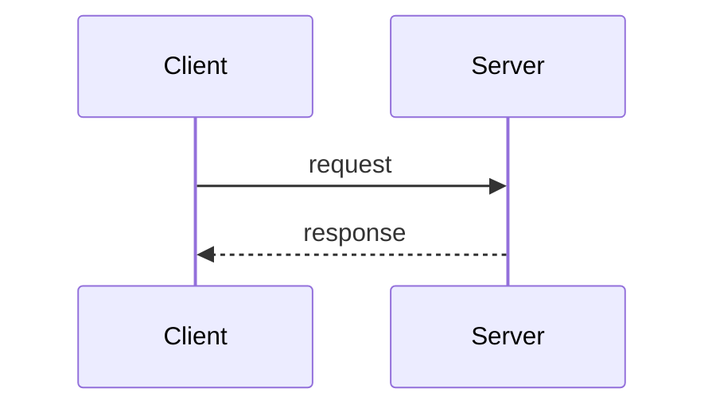

# Contributing to Under The Hood

Thanks for wanting to contribute. This repo is a **pure-markdown knowledge base** — there's no build step, no install, no local server. You edit markdown files, open a PR, CI validates, reviewer merges. That's it.

---

## Golden rules

1. **Short, focused commits.** One logical change per commit. Don't bundle "add topic X" + "fix typo in topic Y" + "update nav" into one commit. Split them.
2. **Imperative subject lines** — "Add Singleton pattern", not "Added Singleton pattern".
3. **Body explains *why*, not *what*.** The diff shows the what.
4. **Every topic follows the template.** See [per-topic format](#per-topic-format) below.
5. **Q&A blocks use `<details>`, callouts use `> [!NOTE]`.** Both render natively on GitHub.

---

## Adding a new topic

### 1. Copy the template
Start from [`docs/_templates/topic-template.md`](docs/_templates/topic-template.md). Copy it into the right phase folder, rename it (`kebab-case.md`):

```
docs/04-system-design-architecture/cqrs.md
```

### 2. Fill it in — in order

| Section | What goes here |
|---|---|
| **Frontmatter** | `tags`, `difficulty` (`easy`/`medium`/`hard`), `status` (`stub`/`in-progress`/`written`) |
| **TL;DR** | 2-3 sentences. The interview-elevator version |
| **Concept Overview** | ~150 words. What it is, when it matters, why it exists |
| **Deep Dive** | The details. Code (Python-first), Mermaid diagrams, comparisons |
| **Trade-offs & Pitfalls** | When to use / when not / common mistakes / rules of thumb |
| **Interview Questions** | 4-6 Q&A blocks. Collapsed by default (see syntax below) |
| **Scenarios** | At least one realistic problem with a worked solution |
| **Related Topics** | Cross-links to connected concepts |
| **References** | Books, articles, official docs |

### 3. Update the phase's `index.md`
Flip the topic's checkbox from `- [ ]` to `- [x]`. That's how the Progress Dashboard computes completion %.

### 4. Open a PR
CI validates links and markdown. Green = ready for review.

---

## Per-topic format

The **full template** lives at [`docs/_templates/topic-template.md`](docs/_templates/topic-template.md). The structure is non-negotiable — consistency across topics is the whole point. Within sections, write as much or as little as the topic warrants.

---

## Q&A syntax — HTML `<details>`, not `???`

GitHub doesn't render MkDocs-style admonitions (`??? question "..."`). We use HTML `<details>` blocks, which collapse/expand natively on GitHub:

```markdown
<details>
<summary><strong>Q1: How does X work?</strong></summary>

Your model answer. Multi-paragraph OK. Code blocks OK. A **blank line above
this paragraph** (right after `<summary>`) is required for markdown inside
to render.

```python
# Code blocks inside <details> work fine
example()
```

</details>
```

Why: the reader can skim question titles, try to answer, then click to reveal. That click is the whole interview-prep mechanic.

---

## Callouts — GitHub Alerts, not `!!!`

GitHub Alerts render as styled callouts on github.com. They fall back to plain blockquotes elsewhere.

```markdown
> [!NOTE]
> General informational note.

> [!TIP]
> Helpful tip or best practice.

> [!IMPORTANT]
> Critical information users must see.

> [!WARNING]
> Heads-up about risky behavior.

> [!CAUTION]
> Strong warning about dangerous behavior.
```

---

## Diagrams — Mermaid

Fenced code blocks with ` ```mermaid ` render inline on GitHub:

````markdown

````

Sequence, flowchart, classDiagram, erDiagram, stateDiagram all work.

---

## Code conventions

- **Python primary.** Examples are Python unless the topic inherently demands another language.
- Use type hints where they clarify intent.
- Prefer idiomatic Python (comprehensions, context managers, f-strings) over style transplanted from other languages.
- Keep examples short. If a full program is needed, link out.

---

## Cross-linking

Use relative paths between files:

```markdown
[Dependency Injection](../dependency-injection.md)
[Circuit Breaker](../../14-resilience-fault-tolerance/index.md)
```

CI's link checker catches broken references before merge.

---

## Commit message examples

Good:

```
Add Circuit Breaker topic to Phase 14

Covers closed/open/half-open states, decision criteria for trip thresholds,
and the distinction from retries. Includes a scenario walking through a
payment-service outage and graceful degradation.
```

Bad:

```
updated stuff
```

---

## Questions or ideas?

Open a GitHub issue. There's a template to guide you.
