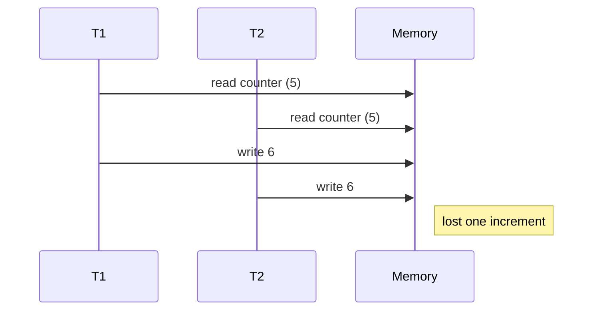

---
tags:
  - phase-1
  - async
  - concurrency
  - threading
  - fundamentals
difficulty: hard
status: written
---

# Async, Concurrency & Threading

> **TL;DR:** Three ways to do many things at once in Python: **asyncio** (one thread, cooperative — best for I/O), **threading** (multiple threads, GIL-limited — fine for I/O), **multiprocessing** (multiple processes, true parallelism — needed for CPU-bound work). Pick by what's bottlenecking you.

## 📖 Concept Overview

**Concurrency** = many tasks making progress in overlapping time. **Parallelism** = many tasks executing literally simultaneously. Concurrency is a structure (how the program is organized); parallelism is an execution mode (do you have multiple cores running your code at once).

Python's GIL (Global Interpreter Lock) lets only one thread execute Python bytecode at a time. So:

- **I/O-bound work** (network, disk) — concurrency is enough; the GIL is released during I/O. `asyncio` and `threading` both work.
- **CPU-bound work** (compute, parsing, image processing) — you need parallelism, which means processes (`multiprocessing`) or non-Python code (NumPy, C extensions).

Pick the right tool:

| Workload | Best fit |
|---|---|
| Many concurrent network calls | `asyncio` |
| A few parallel I/O calls in legacy sync code | `threading` |
| Heavy math / pure-Python computation | `multiprocessing` |
| One slow synchronous library call inside async code | `asyncio.to_thread` |

## 🔍 Deep Dive

### asyncio basics

A single thread runs an **event loop**. Coroutines (`async def`) yield control with `await` whenever they hit I/O. Other coroutines progress while one waits.

```python
import asyncio
import httpx

async def fetch(url, client):
    r = await client.get(url)
    return r.status_code

async def main():
    async with httpx.AsyncClient() as client:
        urls = ["https://example.com"] * 100
        results = await asyncio.gather(*(fetch(u, client) for u in urls))
        print(len(results))

asyncio.run(main())
```

100 concurrent HTTP calls share one thread. The bottleneck is the network, not Python.

### The event loop, visualized

```mermaid
sequenceDiagram
    participant Loop
    participant TaskA
    participant TaskB
    participant Network

    TaskA->>Loop: register, yield (await network)
    Loop->>TaskB: run
    TaskB->>Loop: register, yield (await network)
    Loop->>Loop: idle, waiting
    Network-->>Loop: TaskA's response ready
    Loop->>TaskA: resume
    Network-->>Loop: TaskB's response ready
    Loop->>TaskB: resume
```

### Common asyncio primitives

```python
# Run sequentially
r1 = await fetch("url1")
r2 = await fetch("url2")

# Run concurrently
r1, r2 = await asyncio.gather(fetch("url1"), fetch("url2"))

# Run concurrently, capture exceptions instead of raising
results = await asyncio.gather(*tasks, return_exceptions=True)

# Timeouts
async with asyncio.timeout(5):
    await slow_call()

# Limit concurrency
sem = asyncio.Semaphore(10)
async def limited():
    async with sem:
        await fetch(...)

# Background task
task = asyncio.create_task(background_work())
# ... do other stuff ...
await task

# Wait for first
done, pending = await asyncio.wait(tasks, return_when=asyncio.FIRST_COMPLETED)
```

### Don't block the event loop

A single sync call (`time.sleep`, `requests.get`, big computation) freezes everyone.

```python
# ❌ blocks event loop
async def bad():
    time.sleep(5)  # all coroutines paused for 5s

# ✅ correct
async def good():
    await asyncio.sleep(5)

# ✅ wrap a blocking sync call
async def call_legacy():
    return await asyncio.to_thread(legacy_blocking_func, arg1, arg2)
```

`asyncio.to_thread` runs the callable on a worker thread so the loop keeps spinning.

### Threading

```python
import threading
import requests

def fetch(url):
    return requests.get(url).status_code

threads = [threading.Thread(target=fetch, args=(u,)) for u in urls]
for t in threads: t.start()
for t in threads: t.join()
```

Or with `concurrent.futures`:

```python
from concurrent.futures import ThreadPoolExecutor

with ThreadPoolExecutor(max_workers=20) as ex:
    results = list(ex.map(fetch, urls))
```

The GIL is released during the `requests.get` system call → threads do run concurrently for I/O.

### The GIL — what it does and doesn't

Releases on: I/O (file, network), `time.sleep`, NumPy operations, C extensions that explicitly release it.

Holds during: pure Python code execution. Two threads doing `for i in range(10**8): x += 1` will *not* run faster than one thread.

### Multiprocessing — true parallelism

```python
from concurrent.futures import ProcessPoolExecutor
import math

def heavy(n):
    return sum(math.sqrt(i) for i in range(n))

with ProcessPoolExecutor(max_workers=4) as ex:
    results = list(ex.map(heavy, [10**7] * 4))
```

Each process has its own Python interpreter and its own GIL — actual parallelism on multiple cores. Cost: process startup overhead, args/results must be pickled, no shared memory by default.

### Locks, semaphores, race conditions

```python
import threading
counter = 0
lock = threading.Lock()

def increment():
    global counter
    with lock:               # critical section
        counter += 1         # without lock: race; final value < expected
```

Race condition example without lock:



Async also has races between awaits — but only at await boundaries (predictable), so locks are needed less often.

### Choosing: asyncio vs threading

| | asyncio | threading |
|---|---|---|
| Switching cost | ~µs (no kernel) | ~ms (kernel switch) |
| Max concurrency | 10,000s of coroutines | 100s of threads (kernel limits) |
| Sync libs | Need `to_thread` | Just call them |
| Code style | `async`/`await` everywhere | Looks sequential |
| Race conditions | At `await` only | Anywhere |

asyncio wins for high-fanout I/O. Threading wins for retrofitting concurrency into sync codebases.

## ⚖️ Trade-offs & Pitfalls

- ✅ **Use asyncio for:** web scraping, API gateways, chat servers, anything fanning out to many I/O destinations.
- ✅ **Use threading for:** mixing concurrency into a sync codebase, GUI responsiveness, a few parallel I/O calls.
- ✅ **Use multiprocessing for:** CPU-heavy work, image/video processing, model inference (without a GPU lib).
- 🐛 **Common mistakes:**
    - Calling sync libraries inside async — silently blocks the loop.
    - Forgetting to `await` a coroutine → returns a coroutine object, not the result.
    - Threading a CPU-bound task → no speedup, just contention.
    - Sharing mutable state across processes → use `multiprocessing.Manager` or message passing.
    - Not bounding parallelism → fork bombs, connection storms.
- 💡 **Rules of thumb:**
    - "I/O-bound? async or threads. CPU-bound? processes."
    - Always limit concurrency (semaphore, pool size).
    - Profile *before* parallelizing — sometimes the bottleneck is elsewhere.

## 🎯 Interview Questions

<details>
<summary><strong>Q1: Concurrency vs parallelism?</strong></summary>

Concurrency is *structuring* a program so multiple tasks can be in progress (overlapping in time). Parallelism is *executing* them literally simultaneously on multiple cores. Concurrent code may or may not be parallel; parallel code is necessarily concurrent. Python `threading` is concurrency without parallelism (for Python code) due to the GIL; `multiprocessing` gives both.

</details>
<details>
<summary><strong>Q2: Why doesn't threading speed up CPU-bound Python?</strong></summary>

The GIL serializes Python bytecode execution. Two threads doing pure Python compute fight for the GIL — only one runs at a time. Net result: same throughput as single-threaded plus context-switch overhead. For CPU work, use `multiprocessing`, NumPy/C extensions (which release the GIL), or wait for free-threading Python (PEP 703, in progress).

</details>
<details>
<summary><strong>Q3: When is asyncio faster than threads?</strong></summary>

Two scenarios: (1) Very high concurrency (10k+ tasks) — coroutines are cheap, threads aren't. (2) Tight, switch-heavy I/O — async context switches are µs, kernel thread switches are ms. For modest concurrency (say 50 calls), the difference is small; pick by code style.

</details>
<details>
<summary><strong>Q4: How would you fix code that blocks the event loop?</strong></summary>

Identify the blocking call (sync HTTP, file I/O, big compute). Then either: replace with the async version (`httpx` instead of `requests`), wrap in `asyncio.to_thread` (offloads to a worker thread), or move CPU work to a `ProcessPoolExecutor` via `loop.run_in_executor`.

</details>
<details>
<summary><strong>Q5: What's a race condition? Give an example.</strong></summary>

Two or more concurrent operations whose interleaving determines the outcome — and the interleaving isn't controlled. Classic: two threads each read `counter`, both add 1, both write — counter went up by 1 instead of 2. Fix with a lock around the read-modify-write, or use atomic primitives, or design out shared mutable state.

</details>
<details>
<summary><strong>Q6: How do you cancel an asyncio task safely?</strong></summary>

Call `task.cancel()` — this raises `CancelledError` inside the task at its next `await`. Always handle it in `try/except` to clean up resources, then re-raise. Use `asyncio.shield(task)` to protect critical work from cancellation. Always `await task` after cancellation to actually wait for cleanup.

</details>
<details>
<summary><strong>Q7: Will Python ever remove the GIL?</strong></summary>

Work in progress. PEP 703 (Free-threaded CPython) is being rolled out (3.13 has experimental support, becoming default later). For now, the GIL is here. Workarounds: multiprocessing, async, GIL-releasing C extensions.

</details>

## 🏗️ Scenarios

### Scenario: Background job that fans out to 1000 webhook URLs

**Situation:** When an order ships, you must POST to up to 1000 customer webhook URLs. Sequential is slow (~30s for 1000). The current code uses `requests` in a loop.

**Constraints:** Total time < 5s. Don't overwhelm the network. Don't crash on slow webhooks.

**Approach:** Async with `httpx.AsyncClient`, bounded concurrency via semaphore, per-call timeout, log failures but continue.

**Solution:**

```python
import asyncio
import httpx

async def post_webhook(client, url, payload, sem):
    async with sem:
        try:
            async with asyncio.timeout(3):
                r = await client.post(url, json=payload)
                return url, r.status_code
        except Exception as e:
            return url, f"error: {e}"

async def fanout(urls, payload):
    sem = asyncio.Semaphore(50)  # cap parallel in-flight at 50
    async with httpx.AsyncClient() as client:
        tasks = [post_webhook(client, u, payload, sem) for u in urls]
        return await asyncio.gather(*tasks, return_exceptions=False)

# usage
results = asyncio.run(fanout(urls, {"order_id": 123}))
errors = [(u, r) for u, r in results if not isinstance(r, int) or r >= 500]
```

**Trade-offs:** ~5s for 1000 webhooks (limited by slowest within-bound batches). Bounded concurrency protects you from connection-pool exhaustion. Per-call timeout means a single hung URL doesn't block others. Failures captured as data, not exceptions — pipeline doesn't crash.

### Scenario: Image-thumbnail batch processor

**Situation:** Generate thumbnails for 10,000 uploaded images each night. Pillow operations are pure Python with C extensions (some GIL-released, some not). Need to use all 8 cores.

**Approach:** `ProcessPoolExecutor` — each worker is its own Python process, so all cores are used.

**Solution:**

```python
from concurrent.futures import ProcessPoolExecutor, as_completed
from PIL import Image

def make_thumb(path):
    img = Image.open(path)
    img.thumbnail((200, 200))
    out = path.replace(".jpg", "_thumb.jpg")
    img.save(out)
    return out

def run(paths):
    with ProcessPoolExecutor(max_workers=8) as ex:
        futures = {ex.submit(make_thumb, p): p for p in paths}
        for fut in as_completed(futures):
            try:
                print("done:", fut.result())
            except Exception as e:
                print("failed:", futures[fut], e)
```

**Trade-offs:** True parallelism (~8x for embarrassingly parallel work). Pickling cost for paths and results — negligible here. If shared in-memory state were needed, you'd reach for `multiprocessing.Manager` or refactor to message passing.

## 🔗 Related Topics

- [Concurrency & Async Systems](../06-concurrency-async/index.md) — broader Phase 6 coverage
- [Resilience](../14-resilience-fault-tolerance/index.md) — timeouts, retries, backpressure
- [Memory Management](memory-management.md) — process memory cost
- [Functional Programming](functional-programming.md) — immutability simplifies concurrency

## 📚 References

- *Using Asyncio in Python* — Caleb Hattingh
- [`asyncio` docs](https://docs.python.org/3/library/asyncio.html)
- [PEP 703 — Making the GIL optional](https://peps.python.org/pep-0703/)
- *Python Concurrency with asyncio* — Matthew Fowler
