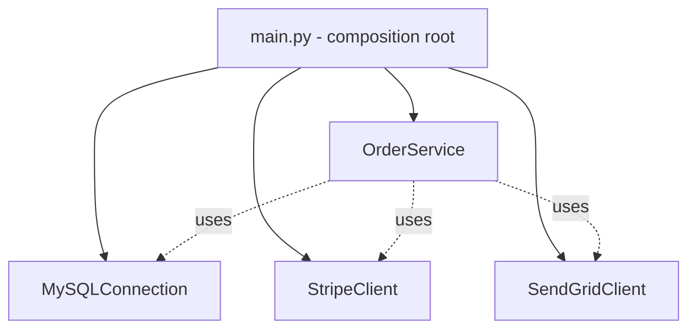

---
tags:
  - phase-1
  - dependency-injection
  - solid
  - fundamentals
difficulty: medium
status: written
---

# Dependency Injection

> **TL;DR:** Pass dependencies into an object instead of letting it construct them. Result: the object becomes testable, swappable, and decoupled from concrete implementations. DI is the practical application of SOLID's "D" — depend on abstractions.

## 📖 Concept Overview

A class that constructs its own dependencies (`self.db = MySQLConnection(...)`) is **tightly coupled** to those dependencies. You can't substitute a fake in tests, you can't swap to Postgres without editing the class, and any caller pays for the coupling.

**Dependency Injection** flips control: the caller (or a framework) provides the dependencies. The class declares what it needs; someone else decides which concrete object satisfies the need.

Three flavors:

1. **Constructor injection** (most common) — pass deps to `__init__`.
2. **Setter injection** — assign via setter method after construction.
3. **Interface injection** — call a method on the dependency to register itself. Rare in Python.

DI containers (Spring, .NET DI, `dependency-injector`) automate wiring. Python often uses a lighter touch: hand-rolled DI or framework-specific DI like FastAPI's `Depends`.

## 🔍 Deep Dive

### Without DI (the problem)

```python
class OrderService:
    def __init__(self):
        self.db = MySQLConnection(host="prod-db", ...)
        self.payment = StripeClient(api_key="...")
        self.email = SendGridClient(api_key="...")

    def place_order(self, order):
        self.db.save(order)
        self.payment.charge(order.total)
        self.email.send_receipt(order)
```

Problems:

- Tests need a real MySQL, a real Stripe, a real SendGrid.
- Hardcoded credentials leak into the class.
- Swapping providers means editing this file.

### With constructor DI (the fix)

```python
class OrderService:
    def __init__(self, db: Database, payment: PaymentProvider, email: EmailSender):
        self.db = db
        self.payment = payment
        self.email = email

    def place_order(self, order):
        self.db.save(order)
        self.payment.charge(order.total)
        self.email.send_receipt(order)
```

Tests:

```python
service = OrderService(FakeDB(), FakePayment(), CapturingEmail())
service.place_order(order)
assert email.captured_recipient == "alice@x.com"
```

Production wiring (the **composition root** — usually `main.py` or `app.py`):

```python
def build_app():
    db = MySQLConnection(...)
    payment = StripeClient(api_key=os.environ["STRIPE_KEY"])
    email = SendGridClient(api_key=os.environ["SENDGRID_KEY"])
    return OrderService(db, payment, email)
```

Wiring lives in *one* place. The class graph is now a tree of pure constructors.

### Visualizing dependency direction



Dependencies flow inward; the inner class knows nothing about the outer wiring.

### FastAPI's `Depends`

FastAPI ships with a tiny DI container:

```python
from fastapi import FastAPI, Depends

def get_db():
    db = SessionLocal()
    try:
        yield db
    finally:
        db.close()

def get_user_repo(db = Depends(get_db)) -> UserRepo:
    return UserRepo(db)

app = FastAPI()

@app.get("/users/{user_id}")
def read_user(user_id: str, repo: UserRepo = Depends(get_user_repo)):
    return repo.get(user_id)
```

Endpoints declare what they need; FastAPI builds the graph per request. Tests override:

```python
app.dependency_overrides[get_db] = lambda: FakeDB()
```

### DI containers

Heavier-weight option for large apps:

```python
# dependency-injector library
from dependency_injector import containers, providers

class Container(containers.DeclarativeContainer):
    config = providers.Configuration()
    db = providers.Singleton(MySQLConnection, host=config.db.host)
    payment = providers.Factory(StripeClient, api_key=config.stripe.key)
    order_service = providers.Factory(
        OrderService,
        db=db,
        payment=payment,
    )

c = Container()
c.config.from_yaml("config.yaml")
service = c.order_service()
```

Containers solve: lifecycle management (singleton vs per-call), config loading, autowiring. For small apps, a hand-rolled `build_app()` is simpler.

### Service Locator anti-pattern

```python
# ❌ Service Locator hides dependencies
class OrderService:
    def __init__(self):
        self.db = ServiceLocator.get("db")  # what does this need? mystery
```

The class no longer declares its needs in its signature. Tests have to set up the locator. DI is preferred because dependencies are *visible*.

## ⚖️ Trade-offs & Pitfalls

- ✅ **Use when:** the dependency has multiple implementations (real + fake), is expensive (share instance), or comes from external config.
- ❌ **Avoid when:** the dependency is a stable utility with no configuration (e.g., `import json`).
- 🐛 **Common mistakes:**
    - Constructors with 8 dependencies → the class is too big (SRP violation).
    - "DI" via setters that may or may not be called → use constructor DI.
    - Frameworks that inject magically — debugging is harder. Prefer explicit DI.
    - Wiring spread across the codebase. Keep the composition root in *one* place.
- 💡 **Rules of thumb:**
    - Inject *interfaces*, not concrete classes (typing.Protocol or ABC).
    - 3 dependencies is fine, 8 is a smell.
    - Composition root at the top of `main.py`. Everything else just receives.

## 🎯 Trade-off table: hand-rolled vs DI container

| | Hand-rolled DI | DI container |
|---|---|---|
| Setup cost | Zero | Learning curve, library |
| Magic level | None | Some |
| Lifecycle management | Manual | Built-in (singleton, factory, scoped) |
| Best for | Small/medium apps | Large apps with deep graphs |
| Pythonic | ✅ | Less so |

## 🎯 Interview Questions

<details>
<summary><strong>Q1: What problem does DI solve?</strong></summary>

Tight coupling between a class and its dependencies. Without DI, classes construct their own deps — making them un-testable (can't substitute fakes), un-swappable (can't change implementations), and harder to configure (deps' config leaks in). DI moves construction *out* so the class only declares what it needs.

</details>
<details>
<summary><strong>Q2: DI vs Service Locator — both let you swap implementations?</strong></summary>

DI: dependencies appear in the class's constructor signature — visible. Service Locator: the class asks a global registry, hiding the dependency. Visibility matters: with DI you can read a class and immediately know its surface area. Service Locator makes refactoring and testing harder.

</details>
<details>
<summary><strong>Q3: Why is constructor injection preferred over setter injection?</strong></summary>

Constructor injection makes dependencies *required* — the object can't exist in an invalid state. Setter injection allows half-built objects (`new Foo(); foo.set_db(...) — oops, forgot one`). Constructor also makes the dependency list explicit in one place.

</details>
<details>
<summary><strong>Q4: How does FastAPI's `Depends` differ from a heavyweight DI container?</strong></summary>

FastAPI's `Depends` is request-scoped, declarative, and tied to the framework's request lifecycle. It's a tiny container with one convention. A general DI container (like `dependency-injector`) handles broader lifecycles (singletons across the app), config loading, and isn't tied to a web framework. For most FastAPI apps, `Depends` is enough.

</details>
<details>
<summary><strong>Q5: What's a 'composition root' and why does it matter?</strong></summary>

The single place where the application wires its object graph — typically `main.py` or `app.py`. Centralizing wiring there means: one file shows your architecture, swap a dependency by changing one line, no class deeper in the codebase needs to know how dependencies are constructed. Don't let `new`/constructor calls for major dependencies leak into the deeper code.

</details>

## 🏗️ Scenarios

### Scenario: Making a tightly coupled service testable

**Situation:** You inherited a `BillingService` that does:

```python
class BillingService:
    def __init__(self):
        self.stripe = stripe.Client(os.environ["STRIPE_KEY"])
        self.db = psycopg2.connect(os.environ["DATABASE_URL"])
        self.smtp = smtplib.SMTP(os.environ["SMTP_HOST"])
```

You can't run a unit test without a real Stripe key, a real DB, and a real SMTP server. The team avoids touching it.

**Constraints:** Refactor must be small, not break existing callers, and unlock unit tests.

**Approach:** Constructor DI. Existing callers can still use a `BillingService.from_env()` factory.

**Solution:**

```python
from typing import Protocol
from dataclasses import dataclass

class StripeAPI(Protocol):
    def charge(self, cents: int, token: str) -> str: ...

class DBConnection(Protocol):
    def execute(self, sql: str, *args): ...

class EmailSender(Protocol):
    def send(self, to: str, subject: str, body: str): ...

class BillingService:
    def __init__(self, stripe: StripeAPI, db: DBConnection, email: EmailSender):
        self.stripe = stripe
        self.db = db
        self.email = email

    @classmethod
    def from_env(cls):
        # backward-compatible factory; existing callers still work
        return cls(
            stripe=stripe.Client(os.environ["STRIPE_KEY"]),
            db=psycopg2.connect(os.environ["DATABASE_URL"]),
            email=SMTPSender(os.environ["SMTP_HOST"]),
        )
```

Tests:

```python
def test_charge_persists_then_emails():
    fake_stripe = FakeStripe()
    fake_db = InMemoryDB()
    captured = CapturingEmail()
    svc = BillingService(fake_stripe, fake_db, captured)

    svc.charge_user("u1", 1000)

    assert fake_db.last_insert == ("u1", 1000)
    assert captured.last_subject == "Receipt"
```

**Trade-offs:** Existing callers (`BillingService()`) need to migrate to `BillingService.from_env()` — one-line change. Tests no longer need network. New code uses constructor DI directly.

## 🔗 Related Topics

- [OOP & SOLID](oop-solid.md) — DIP underpins DI
- [Factory Pattern](design-patterns/factory.md) — often used together
- [Singleton](design-patterns/singleton.md) — DI is usually the better choice
- [Testing Frameworks](testing-frameworks.md) — DI makes testing trivial

## 📚 References

- *Dependency Injection: Principles, Practices, and Patterns* — Mark Seemann
- [FastAPI Dependencies](https://fastapi.tiangolo.com/tutorial/dependencies/)
- [`python-dependency-injector`](https://python-dependency-injector.ets-labs.org/)
- "Inversion of Control Containers and the Dependency Injection pattern" — Martin Fowler
