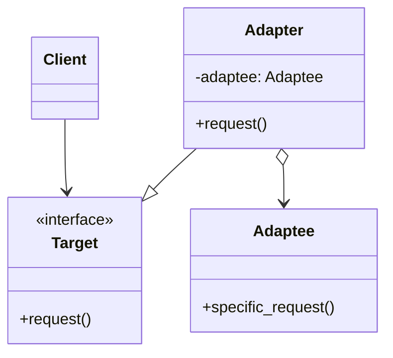

---
tags:
  - phase-1
  - design-patterns
  - structural
difficulty: easy
status: written
---

# Adapter Pattern

> **TL;DR:** Convert one interface into another that clients expect. The classic use: integrate a third-party library whose API doesn't match your codebase's conventions, without changing either side.

## 📖 Concept Overview

Adapter (a.k.a. Wrapper) is a translation layer. The client code expects interface `A`. You have an existing component with interface `B`. The Adapter implements `A` and delegates to `B`, doing whatever conversion is needed.

Two flavors:

- **Object Adapter** (composition) — wraps the adaptee. The Pythonic default.
- **Class Adapter** (multiple inheritance) — inherits from both. Less common.

## 🔍 Deep Dive

### Structure



### Example — wrapping a third-party SDK

Your codebase expects all storage backends to implement:

```python
from abc import ABC, abstractmethod

class Storage(ABC):
    @abstractmethod
    def put(self, key: str, data: bytes) -> None: ...
    @abstractmethod
    def get(self, key: str) -> bytes: ...
```

But the new analytics SDK exposes a different shape:

```python
class AnalyticsSDK:
    def upload_blob(self, name, payload, metadata=None): ...
    def download_blob(self, name): ...
```

Adapter:

```python
class AnalyticsStorageAdapter(Storage):
    def __init__(self, sdk: AnalyticsSDK):
        self._sdk = sdk

    def put(self, key, data):
        self._sdk.upload_blob(name=key, payload=data, metadata={})

    def get(self, key):
        return self._sdk.download_blob(name=key)
```

Now `AnalyticsSDK` slots into any code that takes a `Storage`. The SDK is unaware; your code is unaware.

### Two-way adapter

Sometimes both sides need translation:

```python
class TwoWayAdapter(NewInterface, OldInterface):
    """Lets old code see NewThing, and new code see OldThing."""
```

Multiple inheritance gets tricky — keep it rare.

### Adapter vs Wrapper class with extra methods

If you only need the new methods on top of the old ones, you might be reaching for a [Decorator](decorator.md) instead. Decoder: same interface, new behavior. Adapter: different interface, same behavior.

## ⚖️ Trade-offs & Pitfalls

- ✅ **Use when:** integrating with code you can't change (third-party libs, legacy code, generated stubs).
- ❌ **Avoid when:** you control both sides — change the interface directly.
- 🐛 **Common mistakes:**
    - Adapter does more than translation (adds business logic). Keep it dumb.
    - Adapter swallows errors silently. Translate them too — or re-raise.
    - Forgetting to map the *full* interface; calls hit `AttributeError` in production.
- 💡 **Rules of thumb:**
    - One adapter per direction. Don't conflate two directions in one class.
    - Adapter belongs at the *boundary* of your domain, not deep inside it.

## 🎯 Interview Questions

??? question "Q1: Adapter vs Decorator vs Proxy — they all wrap. What's different?"
    All three wrap a wrapped object and forward calls. Differences are in *intent*:
    - **Adapter** changes the *interface* (different shape).
    - **Decorator** keeps the interface, *adds behavior*.
    - **Proxy** keeps the interface, *controls access* (lazy load, auth, caching).
    Same UML, different purposes — interview answers should focus on intent.

??? question "Q2: When would you use class adapter (inheritance) over object adapter (composition)?"
    Almost never in modern code. Class adapter requires multiple inheritance and ties you to the adaptee's class hierarchy — fragile if the adaptee changes. Object adapter (composition) is more flexible: works with any subclass of the adaptee, can swap adaptees at runtime.

??? question "Q3: Where should adapters live in a Clean Architecture / Hexagonal layout?"
    At the edges — the "infrastructure" or "adapters" layer. The domain core defines the interface (port); the adapter implements it for a specific technology (database, message broker, third-party SDK). This is literally where Hexagonal Architecture gets the name "ports & adapters."

??? question "Q4: How do you test code that uses an Adapter?"
    Mock the adaptee at the boundary, assert the adapter translates correctly. The clients of the adapter need only a stub Storage implementation — they don't know about the SDK. Two test layers: adapter tests (verify translation) and client tests (use a fake conforming to the port).

??? question "Q5: Adapter for protocol mismatch (e.g., sync wrapping async)?"
    Yes — common case. Wrapping a sync library to expose an async interface, you'd typically use `asyncio.to_thread` to avoid blocking the event loop. Wrapping async with sync requires running an event loop — usually `asyncio.run` per call (slow) or sharing a background loop (complex).

## 🏗️ Scenarios

### Scenario: Migrating from one payment provider to two

**Situation:** Your codebase calls Stripe directly. Finance wants to add PayPal as a backup. The Stripe API and PayPal API have different signatures and error models.

**Constraints:** Don't rewrite checkout logic. Switching between providers should be a config change.

**Approach:** Define a `PaymentProvider` interface. Adapt both Stripe and PayPal to it. Inject the chosen adapter.

**Solution:**

```python
from abc import ABC, abstractmethod
from dataclasses import dataclass

@dataclass
class ChargeResult:
    transaction_id: str
    success: bool
    error_message: str | None = None

class PaymentProvider(ABC):
    @abstractmethod
    def charge(self, cents: int, token: str) -> ChargeResult: ...

# --- Adapters wrap third-party SDKs ---

class StripeAdapter(PaymentProvider):
    def __init__(self, sdk):
        self._sdk = sdk
    def charge(self, cents, token):
        try:
            tx = self._sdk.Charge.create(amount=cents, source=token)
            return ChargeResult(tx.id, True)
        except self._sdk.error.CardError as e:
            return ChargeResult("", False, str(e))

class PayPalAdapter(PaymentProvider):
    def __init__(self, sdk):
        self._sdk = sdk
    def charge(self, cents, token):
        resp = self._sdk.execute_payment(
            amount={"total": cents / 100, "currency": "USD"},
            payer_id=token,
        )
        if resp["state"] == "approved":
            return ChargeResult(resp["id"], True)
        return ChargeResult("", False, resp.get("error_description"))

# --- Domain code knows only the interface ---
def checkout(cart, provider: PaymentProvider):
    return provider.charge(cart.total_cents, cart.payment_token)
```

**Trade-offs:** Each adapter handles its provider's quirks (different error types, different argument shapes). Adding a third provider = one new adapter, no edits to `checkout`. Cost: an extra layer of indirection — worth it for the testability and provider-independence.

## 🔗 Related Topics

- [Decorator](decorator.md) — same wrap, adds behavior
- [Proxy](proxy.md) — same wrap, controls access
- [Hexagonal Architecture](../../04-system-design-architecture/index.md) — adapters as a structural layer

## 📚 References

- *Design Patterns* (GoF) — pp. 139–150
- *Clean Architecture* — Robert C. Martin (Ports & Adapters chapter)
