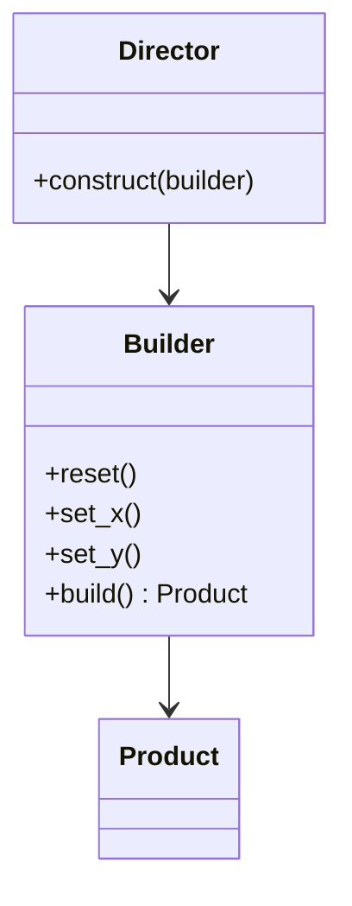

---
tags:
  - phase-1
  - design-patterns
  - creational
difficulty: easy
status: written
---

# Builder Pattern

> **TL;DR:** Construct complex objects step by step. Useful when an object has many optional parameters or when construction has multiple distinct stages. In Python, often replaced by keyword arguments + `dataclass` defaults — but Builder shines for fluent APIs and multi-stage construction.

## 📖 Concept Overview

Builder separates *how* an object is built from *what* it ends up being. The builder exposes a sequence of methods (`with_x`, `with_y`, `add_z`, `build()`) that incrementally configure the result. This avoids:

- Constructors with 15 parameters.
- "Telescoping constructors" (`__init__(a)`, `__init__(a, b)`, `__init__(a, b, c)`).
- Constructing an object in an invalid intermediate state.

The pattern shines when construction is multi-step or when validation must happen at the end.

## 🔍 Deep Dive

### Structure



### Implementation 1 — Fluent builder

```python
from dataclasses import dataclass, field

@dataclass
class HTTPRequest:
    method: str
    url: str
    headers: dict = field(default_factory=dict)
    params: dict = field(default_factory=dict)
    body: bytes | None = None
    timeout: float = 30.0

class HTTPRequestBuilder:
    def __init__(self):
        self._method = "GET"
        self._url = ""
        self._headers = {}
        self._params = {}
        self._body = None
        self._timeout = 30.0

    def method(self, m):    self._method = m;    return self
    def url(self, u):       self._url = u;       return self
    def header(self, k, v): self._headers[k] = v; return self
    def param(self, k, v):  self._params[k] = v;  return self
    def body(self, b):      self._body = b;      return self
    def timeout(self, t):   self._timeout = t;   return self

    def build(self) -> HTTPRequest:
        if not self._url:
            raise ValueError("url is required")
        return HTTPRequest(self._method, self._url, dict(self._headers),
                           dict(self._params), self._body, self._timeout)

req = (HTTPRequestBuilder()
       .method("POST")
       .url("https://api.example.com/users")
       .header("Content-Type", "application/json")
       .body(b'{"name": "alice"}')
       .timeout(10.0)
       .build())
```

The fluent chain reads like a sentence. Validation happens once in `build()`.

### Implementation 2 — Director coordinates

```python
class APIRequestDirector:
    """Knows how to build common request shapes."""

    def json_post(self, url: str, payload: dict) -> HTTPRequest:
        import json
        return (HTTPRequestBuilder()
                .method("POST")
                .url(url)
                .header("Content-Type", "application/json")
                .body(json.dumps(payload).encode())
                .build())

    def authenticated_get(self, url: str, token: str) -> HTTPRequest:
        return (HTTPRequestBuilder()
                .method("GET")
                .url(url)
                .header("Authorization", f"Bearer {token}")
                .build())
```

Director encodes recipes; Builder remains generic.

### Implementation 3 — Pythonic alternative: dataclass + kwargs

For most cases, you don't need a Builder:

```python
@dataclass
class HTTPRequest:
    url: str
    method: str = "GET"
    headers: dict = field(default_factory=dict)
    timeout: float = 30.0

req = HTTPRequest(url="...", method="POST", timeout=10.0)
```

Reach for Builder when:

- You want a **fluent API** (test setups, query DSLs).
- Construction has **multiple stages** with intermediate validation.
- You want to **enforce required fields** at the type level (each `.with_x()` returns a different builder type — type-state pattern).

### Type-state Builder (advanced)

```python
class _UnsetUrl: ...
class _SetUrl: ...

class HTTPRequestBuilder[State]:
    def url(self, u) -> "HTTPRequestBuilder[_SetUrl]":
        self._url = u
        return self  # type: ignore

    def build(self: "HTTPRequestBuilder[_SetUrl]") -> HTTPRequest:
        ...
```

Type checker now refuses to call `build()` until `url()` was called. Powerful but verbose; rare in Python.

## ⚖️ Trade-offs & Pitfalls

- ✅ **Use when:** many optional params, multi-stage construction, fluent DSL desired (test data builders, query builders).
- ❌ **Avoid when:** the object is simple and dataclass + kwargs do the job.
- 🐛 **Common mistakes:**
    - Mutating the builder after `build()` and expecting the built object to change. Builders should produce immutable snapshots.
    - Builders that allow `build()` in invalid states. Validate *in* `build()`, not after.
    - Forgetting to `return self` — kills the fluent chain.
- 💡 **Rules of thumb:**
    - Always end the chain with `build()`.
    - Make the built object immutable (`frozen=True`).
    - One Builder per Product type.

## 🎯 Interview Questions

<details>
<summary><strong>Q1: When does Python's keyword-arguments not replace Builder?</strong></summary>

Three cases: (1) Multi-stage construction where intermediate state matters and validation runs incrementally. (2) Fluent DSLs where the chain itself is the point (SQL builders, test fixtures). (3) Type-state encoding where types track which fields are set. For "object with 10 optional params," dataclass beats Builder.

</details>
<details>
<summary><strong>Q2: Builder vs Factory?</strong></summary>

Factory: produces objects in *one step* — caller picks the kind, factory returns it. Builder: produces objects across *many steps* — caller incrementally configures, then materializes. Factory hides which class is instantiated; Builder hides the construction algorithm.

</details>
<details>
<summary><strong>Q3: Why is `return self` important in fluent Builders?</strong></summary>

Without it, the chain breaks: `builder.url("...").method(...)` becomes `None.method(...)` → AttributeError. Every configuration method returns `self` so calls can be chained.

</details>
<details>
<summary><strong>Q4: How does Builder support immutability?</strong></summary>

Builder collects mutable state internally; `build()` produces an immutable snapshot. The Builder can be reused or discarded; the built object never changes. This separates "configuration-time" mutability from "use-time" immutability — which is exactly what most domain objects want.

</details>
<details>
<summary><strong>Q5: Common Python libraries that use Builder?</strong></summary>

SQLAlchemy's query API: `session.query(User).filter(...).order_by(...).limit(10).all()`. Pandas method chaining. `httpx.Client` configuration. Django's QuerySet. All build up state through chained method calls and materialize on a terminal operation.

</details>

## 🏗️ Scenarios

### Scenario: Test-data builder for integration tests

**Situation:** Your test suite creates `User` objects everywhere with slightly different fields. Tests are full of `User(id="...", email="...", role="...", verified=..., ...)` boilerplate, much of it irrelevant to the test.

**Constraints:** Tests should communicate intent: "a verified admin user" not "a user with these 12 fields set." Defaults should be sane and consistent across tests.

**Approach:** Builder with sensible defaults; tests override only what matters.

**Solution:**

```python
from dataclasses import dataclass, field
from uuid import uuid4

@dataclass(frozen=True)
class User:
    id: str
    email: str
    role: str
    verified: bool
    created_at: str
    settings: dict

class UserBuilder:
    def __init__(self):
        self._id = str(uuid4())
        self._email = f"user-{uuid4().hex[:6]}@example.com"
        self._role = "member"
        self._verified = True
        self._created_at = "2024-01-01T00:00:00Z"
        self._settings = {}

    def id(self, v):       self._id = v; return self
    def email(self, v):    self._email = v; return self
    def role(self, v):     self._role = v; return self
    def unverified(self):  self._verified = False; return self
    def admin(self):       self._role = "admin"; return self
    def setting(self, k, v): self._settings[k] = v; return self

    def build(self):
        return User(self._id, self._email, self._role, self._verified,
                    self._created_at, dict(self._settings))

# Tests
def test_admin_can_delete():
    user = UserBuilder().admin().build()
    ...

def test_unverified_blocked():
    user = UserBuilder().unverified().build()
    ...
```

**Trade-offs:** Tests express intent, not data. Adding a new `User` field = update `UserBuilder` once; tests don't change. Cost: maintaining the builder. Worth it for test suites with >50 user-related tests.

## 🔗 Related Topics

- [Factory](factory.md) — one-step alternative
- [Singleton](singleton.md) — Director might be a singleton
- [Functional Programming](../functional-programming.md) — immutability rationale

## 📚 References

- *Design Patterns* (GoF) — pp. 97–106
- *Effective Java, 3rd ed.* — Item 2: "Consider a builder when faced with many constructor parameters"
