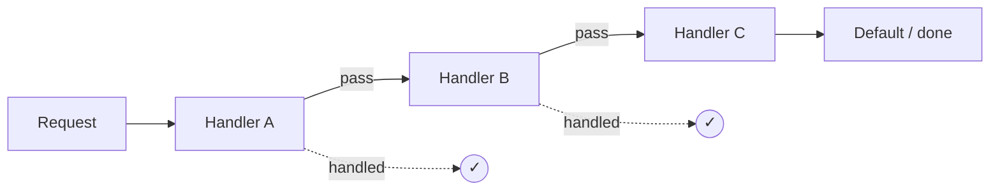

---
tags:
  - phase-1
  - design-patterns
  - behavioral
difficulty: medium
status: written
---

# Chain of Responsibility

> **TL;DR:** Pass a request through a chain of handlers; each decides to handle it, transform it, or pass it along. Decouples sender from receiver. Powers middleware stacks, validation pipelines, and event filters.

## 📖 Concept Overview

Chain of Responsibility (CoR) lets you build a pipeline of handlers without the sender knowing which handler will deal with the request. Each handler:

- Examines the request.
- Either handles it (and optionally stops), or passes it to the next handler.
- May modify the request before passing.

Two flavors:

- **Pure CoR** — first matching handler stops the chain.
- **Pipeline** — every handler runs in sequence (every middleware layer in a web framework).

The two are nearly identical in code; the difference is whether handlers can short-circuit.

## 🔍 Deep Dive

### Structure



### Implementation 1 — Linked handler classes (textbook)

```python
from abc import ABC, abstractmethod
from typing import Optional

class SupportHandler(ABC):
    def __init__(self):
        self._next: Optional["SupportHandler"] = None

    def set_next(self, h: "SupportHandler") -> "SupportHandler":
        self._next = h
        return h  # for chaining

    def handle(self, request: dict):
        if self._next:
            return self._next.handle(request)

class TierOne(SupportHandler):
    def handle(self, request):
        if request["level"] == "low":
            return f"Tier 1 resolved: {request['issue']}"
        return super().handle(request)

class TierTwo(SupportHandler):
    def handle(self, request):
        if request["level"] == "medium":
            return f"Tier 2 resolved: {request['issue']}"
        return super().handle(request)

class TierThree(SupportHandler):
    def handle(self, request):
        return f"Tier 3 resolved: {request['issue']}"

# wire up
chain = TierOne()
chain.set_next(TierTwo()).set_next(TierThree())

print(chain.handle({"level": "low", "issue": "password reset"}))
# Tier 1 resolved: password reset
print(chain.handle({"level": "medium", "issue": "billing"}))
# Tier 2 resolved: billing
```

### Implementation 2 — Function pipeline (Pythonic middleware)

```python
from typing import Callable

Handler = Callable[[dict, Callable], dict]

def pipeline(*handlers: Handler):
    def chain(request):
        idx = 0
        def next_handler(req):
            nonlocal idx
            if idx >= len(handlers):
                return req
            h = handlers[idx]
            idx += 1
            return h(req, next_handler)
        return next_handler(request)
    return chain

def auth(request, next):
    if not request.get("token"):
        return {"error": "401 unauthorized"}
    return next(request)

def log(request, next):
    print(f"-> {request['path']}")
    response = next(request)
    print(f"<- {response}")
    return response

def route(request, next):
    return {"status": 200, "body": f"hello {request['path']}"}

app = pipeline(log, auth, route)
print(app({"path": "/users", "token": "abc"}))
```

This is exactly how Express, Django middleware, FastAPI middleware, and ASGI work — CoR with `next()`.

### Implementation 3 — Validation pipeline (every step runs)

```python
class ValidationError(Exception): ...

def validate(value, *checks):
    for check in checks:
        check(value)  # raises ValidationError on failure

def not_empty(v):
    if not v: raise ValidationError("must not be empty")

def max_len(n):
    def check(v):
        if len(v) > n: raise ValidationError(f"max {n} chars")
    return check

def matches(pattern):
    import re
    def check(v):
        if not re.match(pattern, v): raise ValidationError(f"must match {pattern}")
    return check

validate("alice@x.com", not_empty, max_len(50), matches(r".+@.+"))
```

Every check runs (or stops on the first exception).

## ⚖️ Trade-offs & Pitfalls

- ✅ **Use when:** processing has multiple stages, the order of stages matters, or stages should be reorderable/skippable independently (middleware, validation chains, filter pipelines).
- ❌ **Avoid when:** there's a fixed two-step process — direct calls are clearer.
- 🐛 **Common mistakes:**
    - Forgetting to call `next()` in middleware → request silently dies.
    - Handlers with hidden order dependencies → reordering breaks things subtly.
    - Chains so long the request's journey is hard to trace → log every hop.
- 💡 **Rules of thumb:**
    - Make the chain explicit at one place (a list, a config) so the order is visible.
    - Each handler should be small and named for its responsibility.
    - For middleware, `next()` is the convention; stick with it.

## 🎯 Interview Questions

<details>
<summary><strong>Q1: CoR vs Decorator — both are about composition?</strong></summary>

Both wrap handlers around a core. Difference: **Decorator** wraps *one* object to add behavior to *every* call; the call site is fixed. **CoR** routes a request through a *sequence*, and any handler can short-circuit, transform, or skip. Decorators stack on a single target; CoR is a pipeline whose order and members are explicit.

</details>
<details>
<summary><strong>Q2: How does Express/FastAPI middleware implement CoR?</strong></summary>

Each middleware receives `(request, next)` and decides whether to call `next` (pass to the next layer), short-circuit (return a response directly), or transform the request before passing. Order of registration = order of execution. Authentication runs early; logging often wraps around (logs request and response).

</details>
<details>
<summary><strong>Q3: When would 'first match wins' be wrong?</strong></summary>

When all handlers must contribute. Validation, security checks, audit logs — every layer must run. Use a pipeline where each handler can fail (raise), but none short-circuits success.

</details>
<details>
<summary><strong>Q4: How do you debug a long CoR chain in production?</strong></summary>

(1) Log entry/exit per handler with a request/correlation ID. (2) Make the chain configuration visible (e.g., `app.middleware()` registration list). (3) Add a `dry_run` mode that logs which handler would have processed without executing. (4) Distributed tracing (OpenTelemetry spans per handler).

</details>
<details>
<summary><strong>Q5: How does CoR relate to event-driven architectures?</strong></summary>

CoR is in-process and ordered; events (Observer / pub-sub) are typically broadcast and unordered. CoR handlers know they're in a sequence and may transform the request. Event subscribers are independent and don't know about each other. CoR is "pipeline"; events are "broadcast."

</details>

## 🏗️ Scenarios

### Scenario: Request-processing middleware for an internal API

**Situation:** New internal API needs: request ID injection, auth check, rate limiting, request logging, body parsing, the route handler, response logging, error catching.

**Constraints:** Different routes need different middleware (public health checks skip auth). Adding/removing middleware should be one line.

**Approach:** Function-pipeline CoR, registered as a list per route group.

**Solution:**

```python
from typing import Callable
import time, uuid

def with_request_id(req, next):
    req["request_id"] = str(uuid.uuid4())
    return next(req)

def with_logging(req, next):
    print(f"[{req['request_id']}] -> {req['path']}")
    t0 = time.perf_counter()
    try:
        resp = next(req)
        print(f"[{req['request_id']}] <- {resp.get('status')} ({(time.perf_counter()-t0)*1000:.1f}ms)")
        return resp
    except Exception as e:
        print(f"[{req['request_id']}] !! {e}")
        return {"status": 500, "body": "internal error"}

def require_auth(req, next):
    if not req.get("auth_token"):
        return {"status": 401, "body": "missing token"}
    return next(req)

def rate_limit(per_minute: int):
    bucket = {"count": 0, "ts": time.time()}
    def middleware(req, next):
        now = time.time()
        if now - bucket["ts"] > 60:
            bucket["count"] = 0; bucket["ts"] = now
        bucket["count"] += 1
        if bucket["count"] > per_minute:
            return {"status": 429, "body": "rate limited"}
        return next(req)
    return middleware

def make_app(handler, middlewares):
    def chain(req, idx=0):
        if idx >= len(middlewares):
            return handler(req)
        return middlewares[idx](req, lambda r: chain(r, idx+1))
    return lambda req: chain(req, 0)

# Per-route-group composition
def get_user(req): return {"status": 200, "body": f"user {req['path']}"}
def health(req):   return {"status": 200, "body": "ok"}

protected = make_app(get_user, [with_request_id, with_logging, require_auth, rate_limit(60)])
public    = make_app(health,   [with_request_id, with_logging])
```

**Trade-offs:** Order is explicit and grep-able. Each middleware is independently testable and reusable. Cost: one indirection per layer. Worth it everywhere middleware patterns appear.

## 🔗 Related Topics

- [Decorator](decorator.md) — single-target wrapping
- [Observer](observer.md) — broadcast (no order, no transform)
- [API Gateway](../../16-api-lifecycle/index.md) — middleware at the network edge

## 📚 References

- *Design Patterns* (GoF) — pp. 223–232
- [PEP 3333 — WSGI](https://peps.python.org/pep-3333/) — CoR for HTTP
- [ASGI middleware](https://asgi.readthedocs.io/en/latest/specs/main.html)
