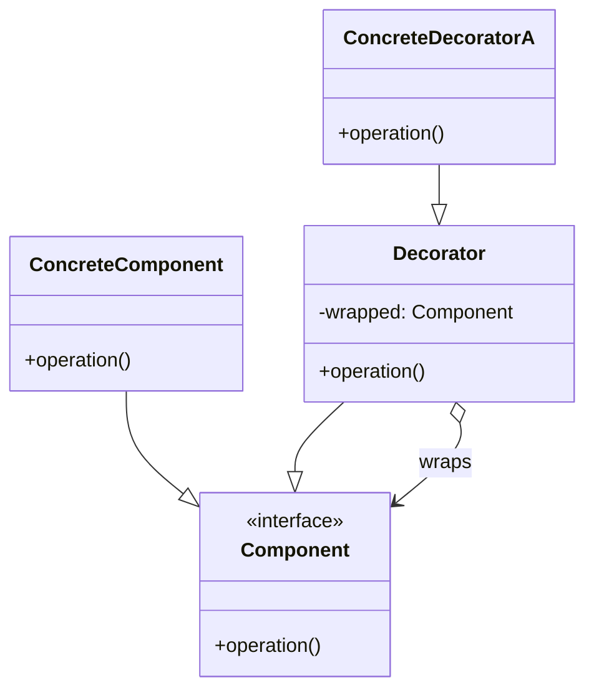
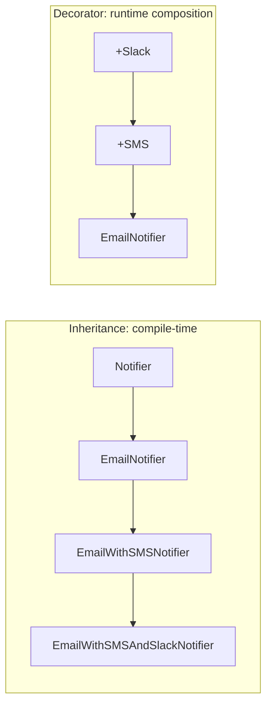

---
tags:
  - phase-1
  - design-patterns
  - structural
difficulty: medium
status: written
---

# Decorator Pattern

> **TL;DR:** Wrap an object to add behavior without changing its class. In Python, the `@decorator` syntax is a built-in language feature for the function-level case. The pattern itself is broader: any wrapper that adds responsibility while preserving the wrapped object's interface.

## 📖 Concept Overview

Decorator dynamically adds responsibilities to objects. The decorator implements the same interface as the wrapped object, forwards calls to it, and adds before/after behavior. Decorators stack — wrap a wrapper around a wrapper.

Two contexts in Python:

1. **Function/method decorators** — the `@` syntax. Adds cross-cutting concerns (logging, caching, retries, auth) without polluting the function body.
2. **Class decorators** — wrap an instance to add behavior. The classic GoF version.

## 🔍 Deep Dive

### Structure



### Implementation 1 — Class-based wrapping

```python
from abc import ABC, abstractmethod

class Notifier(ABC):
    @abstractmethod
    def send(self, msg: str): ...

class EmailNotifier(Notifier):
    def send(self, msg): print(f"email: {msg}")

class NotifierDecorator(Notifier):
    def __init__(self, wrapped: Notifier):
        self._wrapped = wrapped

    def send(self, msg):
        self._wrapped.send(msg)

class SMSDecorator(NotifierDecorator):
    def send(self, msg):
        super().send(msg)
        print(f"sms: {msg}")

class SlackDecorator(NotifierDecorator):
    def send(self, msg):
        super().send(msg)
        print(f"slack: {msg}")

n = SlackDecorator(SMSDecorator(EmailNotifier()))
n.send("server down")
# email: server down
# sms: server down
# slack: server down
```

Each decorator adds one responsibility. Stacking gives a multi-channel notifier without modifying `EmailNotifier`.

### Implementation 2 — Function decorator

```python
import functools, time

def timed(fn):
    @functools.wraps(fn)
    def wrapper(*args, **kwargs):
        t0 = time.perf_counter()
        result = fn(*args, **kwargs)
        elapsed = time.perf_counter() - t0
        print(f"{fn.__name__} took {elapsed*1000:.1f}ms")
        return result
    return wrapper

@timed
def slow():
    time.sleep(0.1)
    return 42

slow()  # slow took 100.x ms
```

`@timed` is just `slow = timed(slow)`. The `@functools.wraps` preserves the wrapped function's name and docstring.

### Implementation 3 — Parameterized decorator

```python
def retry(times: int):
    def decorator(fn):
        @functools.wraps(fn)
        def wrapper(*args, **kwargs):
            for attempt in range(times):
                try:
                    return fn(*args, **kwargs)
                except Exception:
                    if attempt == times - 1:
                        raise
        return wrapper
    return decorator

@retry(times=3)
def flaky_call(): ...
```

Three levels of nesting because `@retry(3)` first calls `retry(3)` to get the actual decorator, then applies it.

### Implementation 4 — Class as decorator

```python
class Counted:
    def __init__(self, fn):
        self.fn = fn
        self.calls = 0
        functools.update_wrapper(self, fn)

    def __call__(self, *args, **kwargs):
        self.calls += 1
        return self.fn(*args, **kwargs)

@Counted
def hello():
    print("hi")

hello(); hello(); hello()
print(hello.calls)  # 3
```

Useful when the decorator needs state.

### Decorator vs Inheritance



Inheritance: every combination is a separate class. Decorator: combinations composed at runtime.

## ⚖️ Trade-offs & Pitfalls

- ✅ **Use when:** behavior is opt-in, composable, and orthogonal to the core (logging, caching, auth, retries, rate-limiting).
- ❌ **Avoid when:** the "decorator" radically changes behavior — that's a different object pretending to be the same thing.
- 🐛 **Common mistakes:**
    - Forgetting `@functools.wraps` → debugging nightmare (`fn.__name__` shows `wrapper`).
    - Decorators with side effects at import time (e.g., registering routes) make order matter.
    - Stacking order matters: `@cached @retried` is not the same as `@retried @cached`.
- 💡 **Rules of thumb:**
    - Each decorator does *one* thing.
    - Outermost decorator is applied last; it sees the call first.
    - For class-based decorators, check that the wrapped object's full interface is forwarded (or use `__getattr__` to forward unknown methods).

## 🎯 Interview Questions

<details>
<summary><strong>Q1: What does `@functools.wraps` do and why is it important?</strong></summary>

Copies the wrapped function's metadata (name, docstring, module, annotations) to the wrapper. Without it, introspection tools (debuggers, doc generators, `help()`) all see `wrapper` instead of the real function. Test runners may also fail to discover decorated tests.

</details>
<details>
<summary><strong>Q2: What's the difference between Decorator and Adapter?</strong></summary>

Both wrap an object. **Adapter** changes the *interface* — it bridges incompatibility (caller wants method `read()`, wrapped object has `download()`). **Decorator** keeps the *interface identical* and adds behavior. Adapter is structural translation; Decorator is structural augmentation.

</details>
<details>
<summary><strong>Q3: Decorator vs Subclassing?</strong></summary>

Subclassing is static: you commit at compile/definition time. Decorator is runtime: you stack any combination of responsibilities. Decorator avoids the combinatorial explosion of subclasses for every feature combination. Subclassing is fine when there's one obvious extension axis.

</details>
<details>
<summary><strong>Q4: How would you implement a decorator that respects async functions?</strong></summary>

Detect with `inspect.iscoroutinefunction` and return a coroutine wrapper:
```python
import inspect, functools
def timed(fn):
    if inspect.iscoroutinefunction(fn):
        @functools.wraps(fn)
        async def aw(*a, **kw):
            t0 = time.perf_counter()
            r = await fn(*a, **kw)
            print(time.perf_counter() - t0)
            return r
        return aw
    # sync version...
```

</details>
<details>
<summary><strong>Q5: What order do stacked decorators apply?</strong></summary>

`@a` `@b` `def f(): ...` is equivalent to `f = a(b(f))`. So `b` wraps `f` first, then `a` wraps the result. At call time: `a` runs first (outermost), delegates to `b`, which delegates to `f`. Mnemonic: top decorators are outermost.

</details>

## 🏗️ Scenarios

### Scenario: Cross-cutting concerns on API endpoints

**Situation:** Your FastAPI service has 50 endpoints. Each needs logging, request tracing, and rate limiting. You don't want to write `start_timer(); try: ...` in 50 places.

**Constraints:** Adding/removing a concern should be a one-line change per endpoint. Some endpoints opt out of certain concerns.

**Approach:** Each concern becomes a decorator. Apply selectively per endpoint.

**Solution:**

```python
import functools, time, uuid

def traced(fn):
    @functools.wraps(fn)
    async def wrapper(*args, **kwargs):
        trace_id = str(uuid.uuid4())
        print(f"[{trace_id}] {fn.__name__} start")
        try:
            return await fn(*args, **kwargs)
        finally:
            print(f"[{trace_id}] {fn.__name__} end")
    return wrapper

def rate_limited(per_minute: int):
    def decorator(fn):
        bucket = {"count": 0, "window_start": time.time()}
        @functools.wraps(fn)
        async def wrapper(*args, **kwargs):
            now = time.time()
            if now - bucket["window_start"] > 60:
                bucket["count"] = 0
                bucket["window_start"] = now
            bucket["count"] += 1
            if bucket["count"] > per_minute:
                raise RuntimeError("rate limit exceeded")
            return await fn(*args, **kwargs)
        return wrapper
    return decorator

@traced
@rate_limited(per_minute=100)
async def get_user(user_id: str): ...
```

**Trade-offs:** Each concern is a small module. Endpoints stay focused on their actual logic. Order matters — `@traced` is outer (every call gets a trace, even rate-limited rejections).

## 🔗 Related Topics

- [Adapter](adapter.md) — same wrapping shape, different intent
- [Proxy](proxy.md) — wraps to *control access*, not to add behavior
- [Strategy](strategy.md) — replaces algorithm; Decorator augments it

## 📚 References

- *Design Patterns* (GoF) — pp. 175–184
- [PEP 318 — Decorators for functions](https://peps.python.org/pep-0318/)
- [`functools.wraps`](https://docs.python.org/3/library/functools.html#functools.wraps)
