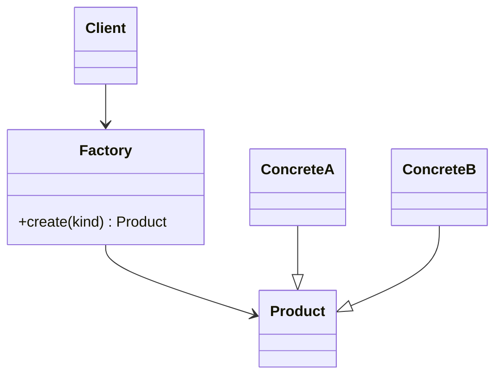

---
tags:
  - phase-1
  - design-patterns
  - creational
difficulty: easy
status: written
---

# Factory Pattern

> **TL;DR:** Centralize object creation behind a function or class so callers don't need to know which concrete type they're getting. Useful when the choice depends on configuration, input data, or feature flags.

## 📖 Concept Overview

A factory is any code whose job is to produce instances of other classes. The two GoF variants:

- **Factory Method** — a method on a base class that subclasses override to produce different objects.
- **Abstract Factory** — an object whose methods produce families of related objects.

In Python, a plain function is usually all you need. The pattern matters less for the syntax and more for the discipline: **separate construction from use** so callers can stay unaware of concrete types.

## 🔍 Deep Dive

### Structure



### Implementation 1 — Function factory (most Pythonic)

```python
from abc import ABC, abstractmethod

class Notifier(ABC):
    @abstractmethod
    def send(self, msg: str): ...

class EmailNotifier(Notifier):
    def send(self, msg): print(f"email: {msg}")

class SMSNotifier(Notifier):
    def send(self, msg): print(f"sms: {msg}")

class SlackNotifier(Notifier):
    def send(self, msg): print(f"slack: {msg}")

NOTIFIERS = {
    "email": EmailNotifier,
    "sms": SMSNotifier,
    "slack": SlackNotifier,
}

def make_notifier(kind: str) -> Notifier:
    try:
        return NOTIFIERS[kind]()
    except KeyError:
        raise ValueError(f"Unknown notifier: {kind}")
```

Adding a channel = add to the dict. No `if/elif` chain.

### Implementation 2 — Factory Method (subclass per family)

```python
class Dialog(ABC):
    def render(self):
        button = self.create_button()  # factory method
        button.render()

    @abstractmethod
    def create_button(self): ...

class WindowsDialog(Dialog):
    def create_button(self): return WindowsButton()

class MacDialog(Dialog):
    def create_button(self): return MacButton()
```

The base class defines the algorithm; subclasses customize one creation step.

### Implementation 3 — Abstract Factory (families of related objects)

```python
class UIFactory(ABC):
    @abstractmethod
    def create_button(self): ...
    @abstractmethod
    def create_checkbox(self): ...

class WindowsFactory(UIFactory):
    def create_button(self): return WindowsButton()
    def create_checkbox(self): return WindowsCheckbox()

class MacFactory(UIFactory):
    def create_button(self): return MacButton()
    def create_checkbox(self): return MacCheckbox()

def build_ui(factory: UIFactory):
    return factory.create_button(), factory.create_checkbox()
```

The factory ensures consistency — you don't accidentally pair a Mac button with a Windows checkbox.

### Implementation 4 — `__init_subclass__` registry (auto-register)

```python
class Storage:
    _registry: dict[str, type] = {}

    def __init_subclass__(cls, *, kind: str, **kw):
        super().__init_subclass__(**kw)
        cls._registry[kind] = cls

    @classmethod
    def make(cls, kind: str, **kw):
        return cls._registry[kind](**kw)

class S3Storage(Storage, kind="s3"):
    def __init__(self, bucket): self.bucket = bucket

class GCSStorage(Storage, kind="gcs"):
    def __init__(self, bucket): self.bucket = bucket

s = Storage.make("s3", bucket="my-bucket")
```

Subclasses register themselves. No central dict to maintain.

## ⚖️ Trade-offs & Pitfalls

- ✅ **Use when:** the concrete type depends on runtime input, you want to swap implementations easily (testing, feature flags), or construction has setup steps callers shouldn't repeat.
- ❌ **Avoid when:** there's only one implementation and no foreseeable need for more — direct instantiation is clearer.
- 🐛 **Common mistakes:**
    - Factory that returns `None` for unknown kinds — raise an exception instead.
    - Factory whose internals leak (returns a tuple of `(impl, config, helper)`) — encapsulate.
    - Adding "factory" to a class name doesn't make it one. The pattern is about *separation of construction from use*.
- 💡 **Rules of thumb:**
    - In Python, prefer a plain function unless you need polymorphism on the factory itself.
    - Type-hint the return as the abstract base type, not the concrete one.

## 🎯 Interview Questions

<details>
<summary><strong>Q1: Factory Method vs Abstract Factory — what's the difference?</strong></summary>

**Factory Method** is one method (often abstract) that subclasses override to produce one kind of object. **Abstract Factory** is an object whose methods produce a *family* of related objects, ensuring consistency across them. Factory Method = single-product polymorphism; Abstract Factory = product-family polymorphism.

</details>
<details>
<summary><strong>Q2: When does a Factory help vs hurt?</strong></summary>

Helps when: choice depends on config/input, multiple implementations exist, construction is non-trivial. Hurts when: there's one implementation forever, or the factory becomes a god-object knowing every concrete type (then you've just moved the coupling). Use it to *reduce* `if isinstance` chains, not to add ceremony around `Foo()`.

</details>
<details>
<summary><strong>Q3: How does dependency injection relate to factories?</strong></summary>

DI containers are essentially factories with extra features (lifetime management, autowiring). Both centralize construction. Difference: a factory is invoked explicitly by the caller (`make_notifier("email")`); DI hands the instance in implicitly. They compose well — DI containers often *use* factory functions as providers.

</details>
<details>
<summary><strong>Q4: What's wrong with this factory?</strong></summary>

```python
def make(kind):
    if kind == "a": return A()
    elif kind == "b": return B()
    # ...
```
Open/Closed violation: adding kind "c" requires editing this function. Replace with a registry dict or auto-registration via `__init_subclass__`. Also: silently returns `None` for unknown kinds — should raise `ValueError`.

</details>
<details>
<summary><strong>Q5: Are class methods the same as static factory methods?</strong></summary>

Close, but `@classmethod` receives `cls` (so it's polymorphic over subclasses) and `@staticmethod` doesn't. Pythonic factory methods are usually `@classmethod` named `from_*`: `Date.from_string("2024-01-01")`, `User.from_dict(...)`. They give you alternative constructors without overloading `__init__`.

</details>

## 🏗️ Scenarios

### Scenario: Multi-cloud storage layer

**Situation:** Your service writes files to either S3 (prod) or local disk (tests, dev). Customers on dedicated tiers run on GCS. Adding more backends is expected.

**Constraints:** Adding a new backend shouldn't require touching call sites. Config-driven selection.

**Approach:** Factory function dispatched on a config string, registry of providers, abstract base for the storage interface.

**Solution:**

```python
from abc import ABC, abstractmethod

class Storage(ABC):
    @abstractmethod
    def put(self, key: str, data: bytes): ...
    @abstractmethod
    def get(self, key: str) -> bytes: ...

class S3Storage(Storage):
    def __init__(self, bucket): self.bucket = bucket
    def put(self, key, data): ...
    def get(self, key): ...

class LocalStorage(Storage):
    def __init__(self, path): self.path = path
    def put(self, key, data): ...
    def get(self, key): ...

_REGISTRY = {"s3": S3Storage, "local": LocalStorage}

def make_storage(config: dict) -> Storage:
    backend = config["backend"]
    cls = _REGISTRY[backend]
    return cls(**{k: v for k, v in config.items() if k != "backend"})

# usage
storage = make_storage({"backend": "s3", "bucket": "my-bucket"})
storage.put("file.txt", b"hello")
```

**Trade-offs:** Tests inject `LocalStorage` via config — no mocking needed. Adding GCS = new class + one registry line. Callers depend only on the `Storage` interface.

## 🔗 Related Topics

- [Singleton](singleton.md) — sometimes a factory caches and returns the same instance
- [Builder](builder.md) — for objects with many construction parameters
- [Strategy](strategy.md) — Strategy *uses* factories to pick the algorithm
- [Dependency Injection](../dependency-injection.md)

## 📚 References

- *Design Patterns* (GoF) — pp. 87–116
- [`__init_subclass__` PEP 487](https://peps.python.org/pep-0487/)
