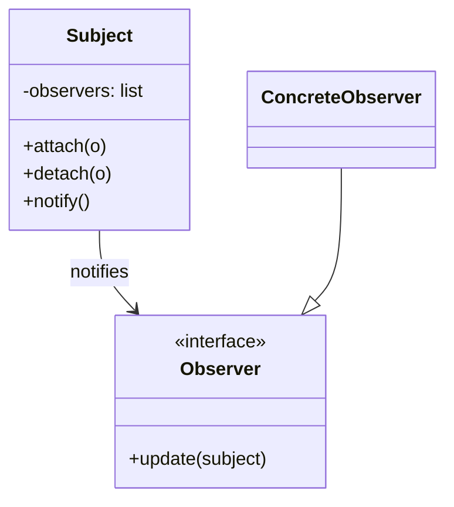

---
tags:
  - phase-1
  - design-patterns
  - behavioral
difficulty: medium
status: written
---

# Observer Pattern

> **TL;DR:** A subject maintains a list of observers and notifies them of state changes. The subject doesn't know what observers do; observers don't know about each other. Foundation for event-driven architectures, pub/sub, and reactive UIs.

## 📖 Concept Overview

Observer decouples *what changed* from *who reacts*. The Subject (a.k.a. Publisher / Observable) holds the state and a list of subscribers. When state changes, the Subject calls each subscriber's notify method. Subscribers can be added or removed at runtime.

This is the in-process cousin of [pub/sub messaging](../../12-data-pipelines-messaging/index.md). Same idea, smaller scope. UI frameworks, event emitters, ORMs (signals), and reactive libraries all use this pattern.

## 🔍 Deep Dive

### Structure



### Implementation 1 — Classic class-based

```python
from abc import ABC, abstractmethod

class Observer(ABC):
    @abstractmethod
    def update(self, subject): ...

class Subject:
    def __init__(self):
        self._observers: list[Observer] = []
        self._state = None

    def attach(self, o: Observer): self._observers.append(o)
    def detach(self, o: Observer): self._observers.remove(o)

    def _notify(self):
        for o in self._observers:
            o.update(self)

    @property
    def state(self): return self._state
    @state.setter
    def state(self, v):
        self._state = v
        self._notify()

class Logger(Observer):
    def update(self, subject):
        print(f"state changed to {subject.state}")

class Persister(Observer):
    def update(self, subject):
        print(f"persisting {subject.state}")

s = Subject()
s.attach(Logger())
s.attach(Persister())
s.state = "READY"
# state changed to READY
# persisting READY
```

### Implementation 2 — Callback-based (Pythonic)

Observers don't need to be objects — callables work fine.

```python
from typing import Callable

class EventEmitter:
    def __init__(self):
        self._handlers: dict[str, list[Callable]] = {}

    def on(self, event: str, handler: Callable):
        self._handlers.setdefault(event, []).append(handler)

    def emit(self, event: str, *args, **kwargs):
        for h in self._handlers.get(event, []):
            h(*args, **kwargs)

bus = EventEmitter()
bus.on("user.created", lambda u: print(f"welcome {u}"))
bus.on("user.created", lambda u: print(f"audit log: {u}"))
bus.emit("user.created", "alice")
```

### Implementation 3 — Weak references (avoid leaks)

If observers outlive their natural lifetime because the subject holds them, use `weakref`:

```python
import weakref

class Subject:
    def __init__(self):
        self._observers = weakref.WeakSet()

    def attach(self, o): self._observers.add(o)
    def notify(self):
        for o in self._observers:
            o.update(self)
```

When the observer is garbage-collected elsewhere, it disappears from the set automatically.

### Synchronous vs asynchronous

Default: synchronous. The setter blocks until every observer finishes.

For long-running observers, queue notifications:

```python
import asyncio

class AsyncSubject:
    def __init__(self):
        self._observers = []

    async def notify(self):
        await asyncio.gather(*(o(self) for o in self._observers))
```

Or post to a message queue and let workers handle it (full pub/sub).

## ⚖️ Trade-offs & Pitfalls

- ✅ **Use when:** multiple parts of the system need to react to a change without the source knowing about them.
- ❌ **Avoid when:** the relationship is fixed and 1:1 — direct calls are clearer.
- 🐛 **Common mistakes:**
    - Memory leaks: subjects hold strong refs to observers indefinitely. Use `weakref` or explicit `detach`.
    - Notification order is undefined; don't rely on it.
    - Observers that throw can break notification of later observers — wrap in try/except or use a robust dispatcher.
    - Cascading updates: observer A updates subject B, which notifies observer C, which updates A → infinite loop.
- 💡 **Rules of thumb:**
    - Keep observer logic *cheap* and *non-throwing*. Heavy work → push to a queue.
    - Document the events your subject emits. They're a public API.
    - Async observers don't slow down the producer.

## 🎯 Interview Questions

??? question "Q1: Observer vs Pub/Sub?"
    Observer is in-process: subject and observers share memory and call each other directly. Pub/Sub is typically distributed, mediated by a broker (Kafka, Redis, RabbitMQ). Pub/Sub publishers and subscribers don't know each other at all — they only know the broker and the topic. Observer is the design pattern; Pub/Sub is its distributed-system cousin.

??? question "Q2: What problems does Observer cause and how do you mitigate?"
    Hidden coupling — adding an observer changes runtime behavior in ways not visible at the call site. Mitigations: explicit event names (not method names), document emitted events as a contract, log every event in dev, avoid cyclic notifications (subject A → observer → subject B → observer A).

??? function "Q3: Push vs Pull notification?"
    **Push:** subject sends the data with the notification (`observer.update(new_value)`). **Pull:** subject sends only "something changed"; observer asks for what it needs (`observer.update(self); ... self.subject.get_state()`). Push is simpler; Pull is flexible (observers fetch only what they care about). GoF's textbook example is Pull.

??? question "Q4: How would you make Observer thread-safe?"
    Lock around `attach`/`detach`/`notify` so the observer list isn't mutated mid-iteration. Or copy the list before iterating: `for o in list(self._observers): o.update(self)`. Better: use `concurrent.futures` to dispatch notifications and let observers run independently.

??? question "Q5: How does Observer differ from Mediator?"
    Observer broadcasts change events from one source to many listeners (1:N). Mediator coordinates communication between many peers via a hub (N:N). Observer is one-way (subject → observer); Mediator is bidirectional through the hub.

## 🏗️ Scenarios

### Scenario: Domain events in an order service

**Situation:** When an order is paid, multiple things must happen: ship the package, send a receipt, update analytics, notify the warehouse. Today these are inline in the `pay()` method. Adding a 5th reaction means editing `pay()` again.

**Constraints:** Reactions must not block the API response. Some reactions can fail without rolling back others.

**Approach:** Order emits a `paid` event. Listeners register interest. Reactions run async (in-process for v1; later swap to a real queue).

**Solution:**

```python
import asyncio
from collections import defaultdict
from typing import Callable, Awaitable

class EventBus:
    def __init__(self):
        self._handlers: dict[str, list[Callable[..., Awaitable]]] = defaultdict(list)

    def on(self, event: str):
        def decorator(fn):
            self._handlers[event].append(fn)
            return fn
        return decorator

    async def emit(self, event: str, **payload):
        await asyncio.gather(
            *(self._safe_call(h, payload) for h in self._handlers[event]),
            return_exceptions=False,
        )

    async def _safe_call(self, h, payload):
        try:
            await h(**payload)
        except Exception as e:
            print(f"handler {h.__name__} failed: {e}")  # log + continue

bus = EventBus()

@bus.on("order.paid")
async def ship(order_id, **_):
    ...  # call shipping service

@bus.on("order.paid")
async def email_receipt(order_id, **_):
    ...  # send email

@bus.on("order.paid")
async def notify_warehouse(order_id, **_):
    ...

async def pay(order_id):
    # ... charge card, persist order ...
    await bus.emit("order.paid", order_id=order_id)
```

**Trade-offs:** New reactions = new `@bus.on` function, no edit to `pay`. Failures isolated per handler. v1 is in-process; when scale demands, swap `EventBus` for a real broker (Kafka/RabbitMQ) — the API stays the same.

## 🔗 Related Topics

- [Pub/Sub & Messaging](../../12-data-pipelines-messaging/index.md) — distributed Observer
- [Mediator](#) — N:N coordination
- [Chain of Responsibility](chain-of-responsibility.md) — sequential, not broadcast
- [Async & Concurrency](../async-concurrency.md) — async observers

## 📚 References

- *Design Patterns* (GoF) — pp. 293–303
- [Django signals](https://docs.djangoproject.com/en/stable/topics/signals/) — Observer in production
- [Node.js EventEmitter](https://nodejs.org/api/events.html)
