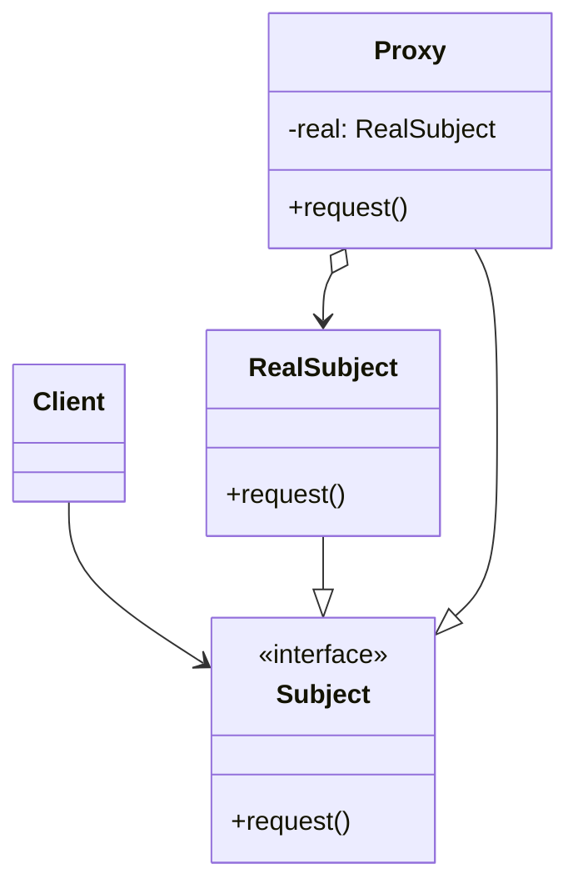

---
tags:
  - phase-1
  - design-patterns
  - structural
difficulty: medium
status: written
---

# Proxy Pattern

> **TL;DR:** A surrogate that controls access to another object. Same interface as the real subject, but adds gatekeeping: lazy load, caching, access checks, logging, remote calls.

## 📖 Concept Overview

A Proxy stands in for a *real subject*. It implements the same interface, so clients can't tell the difference. The proxy decides when (or whether) to delegate. Common variants:

| Variant | Purpose |
|---|---|
| Virtual proxy | Defer expensive object creation until first use |
| Protection proxy | Check permissions before delegating |
| Remote proxy | Local stand-in for an object on another machine (RPC stub) |
| Caching proxy | Memoize results |
| Smart reference | Add accounting (refcount, lock) around delegation |

Proxy and [Decorator](decorator.md) have identical structure — the difference is intent. Proxy *controls access*; Decorator *adds behavior*.

## 🔍 Deep Dive

### Structure



### Virtual proxy — lazy loading

```python
class HighResImage:
    def __init__(self, path: str):
        self.path = path
        self._data = self._load()  # expensive

    def _load(self):
        print(f"loading {self.path}...")
        return f"<image bytes for {self.path}>"

    def display(self):
        print(self._data)

class ImageProxy:
    def __init__(self, path: str):
        self.path = path
        self._real: HighResImage | None = None

    def display(self):
        if self._real is None:
            self._real = HighResImage(self.path)  # load on first use
        self._real.display()

img = ImageProxy("bird.jpg")
# nothing loaded yet
img.display()  # loads + displays
img.display()  # uses cached real subject
```

### Protection proxy — access control

```python
class Document:
    def __init__(self, content): self.content = content
    def read(self): return self.content
    def write(self, text): self.content = text

class ProtectedDocument:
    def __init__(self, doc: Document, user_role: str):
        self._doc = doc
        self._role = user_role

    def read(self):
        return self._doc.read()  # all roles can read

    def write(self, text):
        if self._role != "editor":
            raise PermissionError("only editors can write")
        self._doc.write(text)
```

### Caching proxy

```python
class SlowService:
    def fetch(self, key): ...  # expensive call

class CachingProxy:
    def __init__(self, service: SlowService):
        self._service = service
        self._cache: dict = {}

    def fetch(self, key):
        if key not in self._cache:
            self._cache[key] = self._service.fetch(key)
        return self._cache[key]
```

In Python, `functools.lru_cache` covers most of this — you don't need a class.

### Remote proxy — RPC stub

```python
class UserServiceProxy:
    def __init__(self, base_url: str):
        self._base = base_url

    def get_user(self, user_id: str):
        # The proxy hides HTTP from callers
        import httpx
        r = httpx.get(f"{self._base}/users/{user_id}")
        return r.json()
```

The client thinks it's calling a local object; under the hood it's a network request.

### `__getattr__` for transparent proxying

Want to forward *every* method without writing each one?

```python
class LoggingProxy:
    def __init__(self, target):
        self._target = target

    def __getattr__(self, name):
        attr = getattr(self._target, name)
        if callable(attr):
            def wrapped(*args, **kwargs):
                print(f"calling {name}({args}, {kwargs})")
                return attr(*args, **kwargs)
            return wrapped
        return attr
```

`__getattr__` is called only when normal attribute lookup fails — perfect for transparent forwarding.

## ⚖️ Trade-offs & Pitfalls

- ✅ **Use when:** the real object is expensive (lazy load), security-sensitive (protection), remote (network stub), or hot (cache).
- ❌ **Avoid when:** there's no actual gatekeeping — adding a proxy "just in case" is dead weight.
- 🐛 **Common mistakes:**
    - Cache proxy without invalidation strategy → stale reads forever.
    - Proxy hides expensive operations → callers misjudge cost (e.g., `getattr` → silent network call).
    - Mixing Proxy with business logic → it becomes a god-object.
- 💡 **Rules of thumb:**
    - One concern per proxy. Stack them like Decorators if needed.
    - Make laziness/caching explicit when callers need to know latency characteristics.

## 🎯 Interview Questions

??? question "Q1: Proxy vs Decorator — same shape, what's different?"
    Both wrap and forward. **Decorator** adds behavior to enrich the wrapped object (logging, retries). **Proxy** controls access to it (lazy load, auth check, remote call, caching). Intent matters, not structure. A logging Decorator and a logging Proxy can look identical — the question is whether you're augmenting or gatekeeping.

??? question "Q2: When is a remote Proxy a leaky abstraction?"
    When callers don't know they're paying network cost. A `user.email` access that quietly hits a remote service can ruin a tight loop. Mitigations: explicit method names (`fetch_email()` not property), batch APIs, preload patterns, latency budgets per call.

??? question "Q3: Protection proxy vs middleware?"
    Protection proxy operates at the object level (per method). Middleware operates at the request boundary (per HTTP request). For coarse access control, middleware. For fine-grained control across many call sites, a proxy keeps the logic in one place.

??? question "Q4: How does Python's `__getattr__` enable transparent proxies?"
    `__getattr__(self, name)` is invoked when normal lookup fails. By forwarding to a wrapped object inside it, you proxy every attribute without explicitly listing them. Combined with `__setattr__` for writes, you get a full transparent proxy. Trade-off: IDE autocomplete and static type checkers can't see the proxied attributes.

??? question "Q5: Virtual proxy vs lazy property?"
    `@property` lazy-init is a one-attribute version: compute once, cache, return. Virtual proxy wraps the *whole object*: the surrogate IS the contact point until the heavy real subject is needed. Use `@property` for one-attribute lazy values; virtual proxy when even *constructing* the real object is expensive.

## 🏗️ Scenarios

### Scenario: Caching API client for an external service

**Situation:** Your service hits a third-party currency-conversion API. Rates change once an hour, but your code calls `get_rate("USD", "EUR")` thousands of times per minute. Each call is 100ms.

**Constraints:** Stale rates older than 1 hour are unacceptable. Don't change call sites.

**Approach:** Caching proxy in front of the real client. Same interface, TTL-based cache.

**Solution:**

```python
import time
from typing import Protocol

class ExchangeRateClient(Protocol):
    def get_rate(self, base: str, quote: str) -> float: ...

class RealExchangeClient:
    def get_rate(self, base, quote):
        # 100ms HTTP call
        ...

class CachingExchangeProxy:
    def __init__(self, real: ExchangeRateClient, ttl_seconds: int = 3600):
        self._real = real
        self._ttl = ttl_seconds
        self._cache: dict[tuple[str, str], tuple[float, float]] = {}

    def get_rate(self, base, quote):
        key = (base, quote)
        cached = self._cache.get(key)
        now = time.time()
        if cached and now - cached[1] < self._ttl:
            return cached[0]
        rate = self._real.get_rate(base, quote)
        self._cache[key] = (rate, now)
        return rate

# Wire-up: callers see ExchangeRateClient; they get the proxy
client: ExchangeRateClient = CachingExchangeProxy(RealExchangeClient())
```

**Trade-offs:** Up to 1 hour of staleness — acceptable per business rules. Massive latency win (100ms → ~0ms per call after first). Memory grows with unique pairs (bounded; ~100 currencies). For multi-process services, swap the dict for Redis to share the cache.

## 🔗 Related Topics

- [Decorator](decorator.md) — same shape, augments behavior
- [Adapter](adapter.md) — same shape, translates interface
- [Caching strategies](../../17-caching-optimization/index.md)

## 📚 References

- *Design Patterns* (GoF) — pp. 207–217
- [`functools.cached_property`](https://docs.python.org/3/library/functools.html#functools.cached_property)
