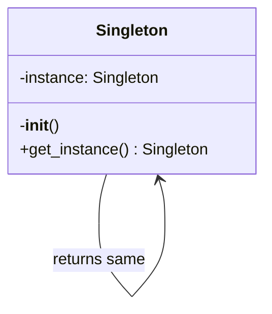

---
tags:
  - phase-1
  - design-patterns
  - creational
difficulty: easy
status: written
---

# Singleton Pattern

> **TL;DR:** Ensure a class has only one instance and provide a global access point. In Python, **just use a module** — modules are singletons by default. Reach for the explicit pattern only when you need lazy initialization, controlled lifecycle, or polymorphism.

## 📖 Concept Overview

Singleton restricts a class to a single instance, shared everywhere. Classic uses: a database connection pool, a config object, a logger, a feature-flag client. The pattern carries baggage — it's essentially a global, with all the testability problems globals bring. Most modern guidance: **use Singleton sparingly**; consider [dependency injection](../dependency-injection.md) instead.

## 🔍 Deep Dive

### Structure



### Implementation 1 — Module as singleton (most Pythonic)

```python
# config.py
DATABASE_URL = "postgres://..."
DEBUG = False

def get_setting(key: str):
    return globals().get(key)
```

```python
# anywhere.py
import config
print(config.DATABASE_URL)  # always the same module object
```

Modules are imported once, cached in `sys.modules`, shared across importers. Done.

### Implementation 2 — `__new__` override

```python
class Settings:
    _instance = None

    def __new__(cls):
        if cls._instance is None:
            cls._instance = super().__new__(cls)
            cls._instance._init()
        return cls._instance

    def _init(self):
        self.values = {}

s1 = Settings()
s2 = Settings()
assert s1 is s2  # True
```

### Implementation 3 — Decorator

```python
def singleton(cls):
    instances = {}
    def get_instance(*args, **kwargs):
        if cls not in instances:
            instances[cls] = cls(*args, **kwargs)
        return instances[cls]
    return get_instance

@singleton
class Cache:
    def __init__(self):
        self.data = {}
```

### Implementation 4 — Metaclass (heavy-handed)

```python
class SingletonMeta(type):
    _instances = {}
    def __call__(cls, *args, **kwargs):
        if cls not in cls._instances:
            cls._instances[cls] = super().__call__(*args, **kwargs)
        return cls._instances[cls]

class Logger(metaclass=SingletonMeta):
    pass
```

Most teams find metaclass-based singletons too magic.

### Thread safety

Naive `__new__` has a race: two threads can both see `_instance is None`. Fix with a lock:

```python
import threading

class Settings:
    _instance = None
    _lock = threading.Lock()

    def __new__(cls):
        if cls._instance is None:
            with cls._lock:
                if cls._instance is None:  # double-checked
                    cls._instance = super().__new__(cls)
        return cls._instance
```

The double-check avoids locking on every access after initialization.

## ⚖️ Trade-offs & Pitfalls

- ✅ **Use when:** truly need a single shared resource (connection pool, logger), the resource has expensive setup, or external libraries require it.
- ❌ **Avoid when:** you can pass the dependency in (use [DI](../dependency-injection.md) instead). Singletons hide dependencies and complicate testing.
- 🐛 **Common mistakes:**
    - Using Singleton because "global is convenient" — it's a global with a fancy name.
    - Forgetting thread safety in multi-threaded contexts.
    - Singletons that hold mutable state become a hidden coupling between unrelated modules.
- 💡 **Rules of thumb:**
    - In Python, prefer a module-level value or a passed-in dependency.
    - If you must singleton, use the decorator form — least magic.
    - Always provide a way to **reset** in tests (`Settings._instance = None`).

## 🎯 Interview Questions

<details>
<summary><strong>Q1: What problems does Singleton solve, and what new ones does it create?</strong></summary>

Solves: enforce a single instance for a shared resource, provide global access. Creates: hidden global state (callers can't see the dependency in their signatures), tests pollute each other (singleton state survives), tight coupling (any code can grab it), inheritance is awkward (subclass instances would each be singletons of themselves).

</details>
<details>
<summary><strong>Q2: Why is `import` already a Singleton mechanism in Python?</strong></summary>

`sys.modules` caches modules after first import. Subsequent `import config` returns the same module object globally. So a module with module-level state IS a singleton — you don't need a class for it.

</details>
<details>
<summary><strong>Q3: How would you make a Singleton thread-safe?</strong></summary>

Double-checked locking: check, lock, check again, create. The outer check avoids lock contention on the hot path; the inner check prevents two threads both creating an instance during the brief window between first-check and acquiring the lock. Or use `threading.Lock` to protect creation, or initialize at module load time so creation happens during the import lock.

</details>
<details>
<summary><strong>Q4: Why do testers hate Singletons?</strong></summary>

State leaks between tests: test A mutates the singleton; test B sees the mutated state. You can't easily inject a fake. You can't run tests in parallel safely. Workaround: provide a `reset()` classmethod and call it in `setUp`/`tearDown`, or refactor to DI.

</details>
<details>
<summary><strong>Q5: Singleton vs Borg pattern?</strong></summary>

Singleton enforces *one instance*. Borg (a Python idiom) enforces *shared state* across many instances by setting `__dict__` to a class-level dict. Borg is friendlier to inheritance and identity checks (`s1 is s2` is False but `s1.__dict__ is s2.__dict__` is True). Both solve "shared state"; Borg is less common today.

</details>

## 🏗️ Scenarios

### Scenario: Connection pool for an analytics DB

**Situation:** A FastAPI app makes BigQuery calls. BigQuery client setup is expensive (~500ms auth handshake). You need to share one client across all request handlers.

**Constraints:** Tests must use a fake client. Multiple uvicorn workers each have their own process.

**Approach:** Module-level cached factory, injected via FastAPI's `Depends`. This gives you Singleton-per-process *and* testability.

**Solution:**

```python
# bq_client.py
from functools import lru_cache
from google.cloud import bigquery

@lru_cache(maxsize=1)
def get_bq_client() -> bigquery.Client:
    return bigquery.Client()
```

```python
# main.py
from fastapi import FastAPI, Depends
from bq_client import get_bq_client

app = FastAPI()

@app.get("/rows")
def rows(client = Depends(get_bq_client)):
    return [dict(r) for r in client.query("SELECT 1").result()]
```

In tests:

```python
app.dependency_overrides[get_bq_client] = lambda: FakeBQ()
```

**Trade-offs:** One client per uvicorn worker (acceptable — that's what BQ recommends). `Depends` makes the dependency *visible* to callers, unlike a hidden import. `lru_cache` provides thread-safe lazy init.

## 🔗 Related Topics

- [Dependency Injection](../dependency-injection.md) — usually a better choice
- [Factory Pattern](factory.md) — controls creation without being a singleton

## 📚 References

- *Design Patterns* (GoF) — pp. 127–134
- [Python `functools.lru_cache`](https://docs.python.org/3/library/functools.html#functools.lru_cache)
- "Singletons are pathological liars" — Misko Hevery
