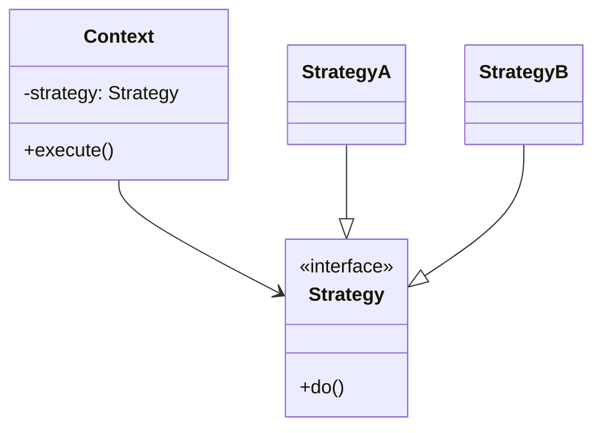

---
tags:
  - phase-1
  - design-patterns
  - behavioral
difficulty: easy
status: written
---

# Strategy Pattern

> **TL;DR:** Define a family of algorithms, encapsulate each, make them swappable. The client picks the algorithm at runtime by injecting a strategy object. In Python, that "object" can simply be a function.

## 📖 Concept Overview

Strategy is OCP (Open/Closed) in pattern form. Instead of branching on a "kind" inside the class, you delegate to a strategy object that holds the variant behavior. Adding a new variant = new strategy class (or function). No edits to existing code.

Common uses: payment processing (Stripe vs PayPal), pricing rules (tiered, flat, dynamic), compression algorithms, sort orders, validation rules.

## 🔍 Deep Dive

### Structure



### Implementation 1 — Class-based (textbook)

```python
from abc import ABC, abstractmethod

class ShippingStrategy(ABC):
    @abstractmethod
    def cost(self, weight_kg: float) -> float: ...

class StandardShipping(ShippingStrategy):
    def cost(self, weight_kg): return 5.0 + weight_kg * 1.5

class ExpressShipping(ShippingStrategy):
    def cost(self, weight_kg): return 12.0 + weight_kg * 3.0

class FreeShipping(ShippingStrategy):
    def cost(self, weight_kg): return 0.0

class Order:
    def __init__(self, weight_kg: float, shipping: ShippingStrategy):
        self.weight_kg = weight_kg
        self.shipping = shipping

    def total(self) -> float:
        return self.shipping.cost(self.weight_kg)

# usage
order = Order(2.5, ExpressShipping())
print(order.total())  # 19.5
```

### Implementation 2 — Function strategy (Pythonic)

Functions are first-class. Skip the class hierarchy:

```python
def standard(weight_kg): return 5.0 + weight_kg * 1.5
def express(weight_kg):  return 12.0 + weight_kg * 3.0
def free(_):             return 0.0

class Order:
    def __init__(self, weight_kg: float, shipping):
        self.weight_kg = weight_kg
        self.shipping = shipping

    def total(self):
        return self.shipping(self.weight_kg)

order = Order(2.5, express)
```

Less ceremony, same flexibility. Use the class form when the strategy has its own state or multiple methods.

### Implementation 3 — Strategy + Factory

Pair Strategy with a [Factory](factory.md) when the choice is data-driven:

```python
STRATEGIES = {
    "standard": standard,
    "express": express,
    "free": free,
}

def get_shipping(kind: str):
    return STRATEGIES[kind]

order = Order(2.5, get_shipping("express"))
```

### Why not just `if/elif`?

```python
# ❌ Closed to extension
def total(weight_kg, kind):
    if kind == "standard": return 5.0 + weight_kg * 1.5
    elif kind == "express": return 12.0 + weight_kg * 3.0
    elif kind == "free": return 0.0
```

Adding a new option forces editing this function (OCP violation). Tests for one branch can break others. Switch to Strategy when you expect more variants.

## ⚖️ Trade-offs & Pitfalls

- ✅ **Use when:** you have multiple algorithms for one task, the choice varies at runtime, or you want each variant independently testable.
- ❌ **Avoid when:** there are exactly two options unlikely to grow — a boolean parameter is fine.
- 🐛 **Common mistakes:**
    - Strategy classes that need access to the context's internals → Either pass needed data into `do()` or make the context-strategy coupling explicit.
    - Forgetting to inject — hardcoding `self.shipping = StandardShipping()` defeats the pattern.
- 💡 **Rules of thumb:**
    - Strategies with no state → use plain functions.
    - Strategies with state or multiple methods → use classes.
    - The strategy interface should stay narrow (one method when possible).

## 🎯 Interview Questions

??? question "Q1: When would you choose Strategy over inheritance?"
    When the variation is *behavioral* (an algorithm) rather than *structural* (an entity type). Inheritance bundles state + behavior; Strategy isolates behavior so you can swap it without touching the entity. Strategy also avoids inheritance's brittleness — adding a variant doesn't require subclassing the host class.

??? question "Q2: Strategy vs State pattern?"
    Both have an object delegating to a polymorphic helper. Difference: **Strategy** is chosen *externally* and is typically stable for the object's lifetime. **State** transitions internally based on events; the object swaps its own state in response to inputs. Strategy is "what algorithm should I use?"; State is "what mode am I in?".

??? question "Q3: Is `sorted(items, key=...)` an example of Strategy?"
    Yes — `key` is a strategy function that customizes how items are compared. `cmp_to_key` likewise. Built-in Pythonic Strategy.

??? question "Q4: How do you test a class that uses Strategy?"
    Pass in fake/stub strategies. The class becomes trivially unit-testable without mocking — you control the strategy's return value directly. This is one of Strategy's biggest wins.

??? question "Q5: Strategy and Open/Closed Principle?"
    Strategy IS OCP applied. The host class is *closed* — you don't edit it to add behavior. The strategy interface is *open* — anyone can implement it for new variants. Adding a new shipping option = new function/class, no host changes.

## 🏗️ Scenarios

### Scenario: Discount engine for an e-commerce checkout

**Situation:** Pricing team adds new promo types every campaign: percentage off, fixed amount, BOGO, tiered (5% over $100). The current `apply_discount` function is 200 lines of `if/elif`.

**Constraints:** Can't break existing carts. New promos must be A/B-testable. QA wants to test each rule in isolation.

**Approach:** Each promo becomes a strategy. Carts hold a list of strategies and apply them in order. New promo = new class, registered by name.

**Solution:**

```python
from abc import ABC, abstractmethod
from dataclasses import dataclass

@dataclass
class Cart:
    subtotal: float
    items: list

class Discount(ABC):
    @abstractmethod
    def apply(self, cart: Cart) -> float:
        """Return amount to subtract from subtotal."""

class PercentageOff(Discount):
    def __init__(self, pct: float): self.pct = pct
    def apply(self, cart): return cart.subtotal * self.pct

class FixedOff(Discount):
    def __init__(self, amt: float): self.amt = amt
    def apply(self, cart): return min(self.amt, cart.subtotal)

class TieredDiscount(Discount):
    def __init__(self, threshold: float, pct: float):
        self.threshold, self.pct = threshold, pct
    def apply(self, cart):
        return cart.subtotal * self.pct if cart.subtotal >= self.threshold else 0

def checkout(cart: Cart, discounts: list[Discount]) -> float:
    total_off = sum(d.apply(cart) for d in discounts)
    return max(0, cart.subtotal - total_off)
```

**Trade-offs:** Each discount is isolated (independently testable), composable (stack multiple), and feature-flag-friendly (turn one on/off at the registration layer). Slight cost: more files. Worth it once you have >3 discount types.

## 🔗 Related Topics

- [Factory Pattern](factory.md) — picks which strategy to use
- [OOP & SOLID](../oop-solid.md) — OCP made concrete
- [Decorator](decorator.md) — chains *modifications*; Strategy *replaces* the algorithm

## 📚 References

- *Design Patterns* (GoF) — pp. 315–323
- *Head First Design Patterns* — Strategy is the opening example
