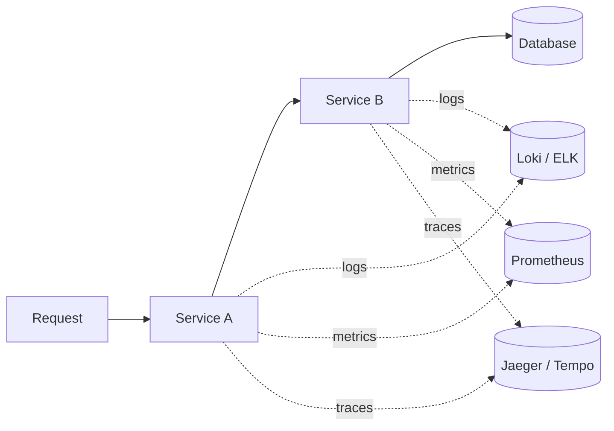

---
tags:
  - phase-1
  - logging
  - observability
  - fundamentals
difficulty: medium
status: written
---

# Logging & Observability

> **TL;DR:** Use structured (JSON) logs, propagate a correlation ID across services, log the right things at the right level, and treat logs as one of three observability pillars (alongside metrics and traces). Without observability, production is a black box.

## 📖 Concept Overview

Observability = how well you can ask questions about your running system from outside it. The three pillars:

1. **Logs** — discrete, timestamped events. "User U signed in at T."
2. **Metrics** — numeric aggregates over time. "Login rate: 130/s."
3. **Traces** — causally linked spans across a request. "Login took 220ms: auth=10ms, db=180ms, jwt=20ms."

Logging is the easiest to start with and the easiest to do badly. Most production-debugging pain comes from: too much volume, no structure (can't search), no correlation across services, mixed log levels.

## 🔍 Deep Dive

### Python's `logging` module — the basics

```python
import logging

logger = logging.getLogger(__name__)

# Configure at app startup, ONCE
logging.basicConfig(
    level=logging.INFO,
    format="%(asctime)s %(name)s %(levelname)s %(message)s",
)

logger.info("user signed in", extra={"user_id": "u1"})
logger.warning("retry attempt %d", 3)
logger.error("failed to connect", exc_info=True)  # includes traceback
```

Use `logging.getLogger(__name__)` per module — never `print`. Configure once at the entry point.

### Log levels — when to use each

| Level | When |
|---|---|
| `DEBUG` | Inner-loop detail. Off in prod. |
| `INFO` | Notable business events (signed in, order placed). |
| `WARNING` | Something unexpected but recoverable (retrying, fallback used). |
| `ERROR` | Operation failed; user-visible impact possible. |
| `CRITICAL` | The app itself is in trouble (out of memory, can't start). |

Default prod level: `INFO`. Set `WARNING` if `INFO` is too chatty after gaining experience.

### Structured logging (JSON)

Plain string logs are searchable but hard to aggregate. JSON logs are queryable.

```python
import json, logging, time

class JSONFormatter(logging.Formatter):
    def format(self, record):
        log = {
            "ts": time.strftime("%Y-%m-%dT%H:%M:%SZ", time.gmtime(record.created)),
            "level": record.levelname,
            "logger": record.name,
            "msg": record.getMessage(),
        }
        if record.exc_info:
            log["exc"] = self.formatException(record.exc_info)
        # merge extra fields
        for k, v in record.__dict__.items():
            if k not in vars(logging.LogRecord("", 0, "", 0, "", (), None)):
                log[k] = v
        return json.dumps(log)

handler = logging.StreamHandler()
handler.setFormatter(JSONFormatter())
logging.getLogger().addHandler(handler)

logger.info("order placed", extra={"order_id": "o123", "user_id": "u1", "total_cents": 4999})
# {"ts": "2024-...", "level": "INFO", "msg": "order placed", "order_id": "o123", "user_id": "u1", "total_cents": 4999}
```

Or use `structlog` — cleaner API, handles structured fields natively:

```python
import structlog
log = structlog.get_logger()
log.info("order_placed", order_id="o123", user_id="u1", total_cents=4999)
```

### Correlation IDs (request tracing)

Every request gets a unique ID; every log inside that request includes it. Across services, propagate via header (e.g., `X-Request-ID` or W3C Trace Context).

```python
import contextvars, uuid

request_id: contextvars.ContextVar[str] = contextvars.ContextVar("request_id", default="-")

class CorrelationFilter(logging.Filter):
    def filter(self, record):
        record.request_id = request_id.get()
        return True

logging.getLogger().addFilter(CorrelationFilter())

# in middleware
async def middleware(request, call_next):
    rid = request.headers.get("x-request-id", str(uuid.uuid4()))
    token = request_id.set(rid)
    try:
        response = await call_next(request)
        response.headers["x-request-id"] = rid
        return response
    finally:
        request_id.reset(token)
```

`contextvars` is async-safe — every coroutine sees its own request ID without the developer threading it through every function.

### Logging exceptions

```python
try:
    do_something()
except Exception:
    logger.exception("failed in do_something")  # includes traceback automatically
```

`logger.exception` is `logger.error(..., exc_info=True)`. Always call it from inside `except`, never elsewhere.

### Avoid these mistakes

```python
# ❌ String concat / f-strings — formatted even when level is filtered out
logger.debug(f"user data: {very_expensive_call()}")

# ✅ Lazy %-formatting
logger.debug("user data: %s", very_expensive_call())  # also formatted always; same problem
# better:
if logger.isEnabledFor(logging.DEBUG):
    logger.debug("user data: %s", very_expensive_call())
```

For structured loggers (`structlog`, `loguru`), the lazy-formatting concern is reduced — they handle it.

### The three pillars together



A single trace ID stitches the three pillars together. From a slow span in Jaeger, jump to the related logs (filter by trace ID), see the contemporaneous metrics. **Same trace ID, three views.**

### OpenTelemetry intro

OpenTelemetry (OTel) is the standard for emitting traces, metrics, and logs to any backend. One SDK, many destinations.

```python
from opentelemetry import trace
from opentelemetry.sdk.trace import TracerProvider
from opentelemetry.sdk.trace.export import BatchSpanProcessor
from opentelemetry.exporter.otlp.proto.grpc.trace_exporter import OTLPSpanExporter

trace.set_tracer_provider(TracerProvider())
trace.get_tracer_provider().add_span_processor(
    BatchSpanProcessor(OTLPSpanExporter(endpoint="http://otel-collector:4317"))
)

tracer = trace.get_tracer(__name__)

with tracer.start_as_current_span("place_order") as span:
    span.set_attribute("order_id", "o123")
    span.set_attribute("user_id", "u1")
    do_work()
```

Instrumentation libraries auto-trace common frameworks (FastAPI, requests, SQLAlchemy) — minimal code changes.

### What to log

| Always | Sometimes | Never |
|---|---|---|
| Notable business events (login, purchase, error) | Slow query details | Passwords, tokens, full credit cards |
| Error context (IDs, inputs sufficient to reproduce) | Debug traces | PII without redaction |
| Service start/stop | Metrics-quality counts (use metrics instead) | Each iteration of a hot loop |

Rule: would a future operator at 3am thank you for this log? If no, drop it.

## ⚖️ Trade-offs & Pitfalls

- ✅ **Use structured logs** — JSON, key/value fields. Plain strings won't scale to multi-service search.
- 🐛 **Common mistakes:**
    - `print()` instead of logging — no levels, no structure, no aggregation.
    - Logging in tight loops → cost dominates the work itself.
    - Catching exceptions and logging without re-raising → silent failure later.
    - Missing correlation IDs → debugging cross-service requests is grep-and-pray.
    - Logging request bodies that contain secrets / PII.
- 💡 **Rules of thumb:**
    - Configure logging once, at app startup.
    - JSON output to stdout. The infrastructure ships them.
    - One `logger = logging.getLogger(__name__)` per module.
    - Log at the boundary (request handler), not in every function.
    - Tag every log with: service, version, env, request_id.

## 🎯 Interview Questions

??? question "Q1: What are the three pillars of observability?"
    Logs (discrete events with context), metrics (aggregates over time, used for dashboards and alerts), traces (causally-linked spans across a request, often across services). Each answers different questions: logs = "what happened?", metrics = "how much / how often?", traces = "where did the time go?". A trace ID propagated everywhere stitches all three.

??? question "Q2: Why structured (JSON) logs over plain text?"
    Search: `level=ERROR AND user_id=u1` is a query, not a regex. Aggregation: count errors by endpoint without parsing. Field type preservation: durations stay numeric, not strings. Tooling: every log platform (ELK, Loki, Datadog) understands JSON. Once you've used structured logs in production, plain-text feels primitive.

??? question "Q3: How do you propagate a correlation ID across services?"
    Generate at the edge (load balancer, API gateway, or first service). Pass downstream in a header (`X-Request-ID` or W3C `traceparent`). Each service includes it in every log line and forwards it on. In Python, store it in `contextvars` so it's available without threading it through every function — async-safe and inheritance-friendly.

??? question "Q4: Logs vs metrics vs traces — when do you reach for each?"
    Metrics for dashboards and alerts (high cardinality is expensive — keep it bounded). Logs for forensic detail when you need full context. Traces for diagnosing latency: which step took the time? Anti-pattern: counting things in logs and grep-ing them later. Use metrics for counting; logs for context.

??? question "Q5: What's the difference between `logger.error('...')` and `logger.exception('...')`?"
    `exception()` is `error(exc_info=True)` — it includes the traceback. Only valid inside an `except:` block. `error()` without traceback is for "operation failed" reports where you don't have an exception object (or don't want the trace).

??? question "Q6: How would you redact PII before logging?"
    Several approaches: (1) Filter at the logger level — a `logging.Filter` that scans records for sensitive patterns and redacts. (2) Wrapper around the log call that redacts known fields. (3) Type-system enforced — use `Secret[str]` newtype that has a `__repr__` returning `***`. Layered defense: type-system + filter as a safety net. Never log entire request bodies without filtering.

## 🏗️ Scenarios

### Scenario: Tracing a slow request across three services

**Situation:** A user reports "checkout takes 8 seconds." Your stack: API Gateway → Order Service → Payment Service → DB. Each service has its own logs in different formats. You can't reproduce locally.

**Constraints:** No new infra immediately. Must instrument across services.

**Approach:** Add OpenTelemetry tracing across all services with auto-instrumentation. One trace per request. View in Jaeger.

**Solution:**

```python
# Each service: install otel auto-instrumentation
# pip install opentelemetry-distro opentelemetry-exporter-otlp opentelemetry-instrumentation-fastapi opentelemetry-instrumentation-httpx
# opentelemetry-bootstrap -a install

# main.py
from opentelemetry import trace
from opentelemetry.instrumentation.fastapi import FastAPIInstrumentor
from opentelemetry.instrumentation.httpx import HTTPXClientInstrumentor

app = FastAPI()
FastAPIInstrumentor.instrument_app(app)
HTTPXClientInstrumentor().instrument()

tracer = trace.get_tracer(__name__)

@app.post("/checkout")
async def checkout(order: Order):
    with tracer.start_as_current_span("validate_order"):
        validate(order)
    with tracer.start_as_current_span("call_payment"):
        await payment_client.charge(order.total)  # auto-traced; trace context propagated via headers
    return {"status": "ok"}
```

In Jaeger you'd see one trace with spans:
- `POST /checkout` — 8000ms
  - `validate_order` — 5ms
  - `call_payment` (HTTP) — 7950ms
    - `payment.charge` — 7900ms (in Payment Service)
      - `db.query` — 7800ms (slow query!)

**Trade-offs:** ~5% overhead from spans (configurable sampling). Massive debuggability win. The slow DB query was always the cause, but invisible until traces showed it. Once the bottleneck is found, fix is targeted (add index).

## 🔗 Related Topics

- [Error Handling](error-handling.md) — what to log when you catch
- [DevOps & Observability](../10-devops-observability/index.md) — broader Phase 10
- [API Reliability](../19-api-reliability-observability/index.md) — SLOs / SLIs
- [Distributed Systems](../15-distributed-systems/index.md) — why correlation IDs matter

## 📚 References

- [`logging` docs](https://docs.python.org/3/library/logging.html)
- [`structlog`](https://www.structlog.org/)
- [OpenTelemetry Python](https://opentelemetry.io/docs/instrumentation/python/)
- *Distributed Tracing in Practice* — Parker, Spoonhower, Mace, Sigelman, Isaacs
