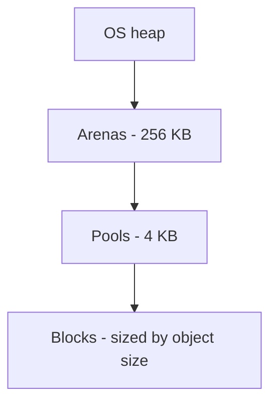

---
tags:
  - phase-1
  - memory
  - garbage-collection
  - fundamentals
difficulty: hard
status: written
---

# Memory Management & Garbage Collection

> **TL;DR:** Python frees objects with **reference counting** (immediate cleanup when refcount hits zero), with a backup **generational garbage collector** for cycles. Most leaks come from accidentally keeping references alive — caches, closures, registrations, observers. Tools: `tracemalloc`, `gc`, `weakref`, `__slots__`.

## 📖 Concept Overview

Python developers don't allocate or free memory manually, but they do decide *what stays alive*. Every object has a refcount; when it hits zero, the object is freed instantly. For objects that reference each other in cycles (refcount can never hit zero), a generational garbage collector kicks in periodically.

Why this matters: long-lived processes (web servers, workers) leak when something quietly keeps references alive — a global cache, an event subscription, a closure capturing a large dict. Diagnosing leaks is one of the harder skills.

## 🔍 Deep Dive

### Reference counting

```python
import sys
x = [1, 2, 3]
sys.getrefcount(x)   # 2 (x + the temporary in getrefcount)

y = x
sys.getrefcount(x)   # 3

del y
sys.getrefcount(x)   # 2

del x
# list is freed immediately; refcount went to zero
```

Pros: deterministic — when an object goes out of scope, it's freed. No GC pause for the common case.

Cons: every increment/decrement is bookkeeping (cost). And it can't detect cycles.

### The cycle problem

```python
class Node:
    def __init__(self):
        self.next = None

a = Node()
b = Node()
a.next = b
b.next = a   # cycle: a → b → a

del a, b
# refcount of each is 1 (held by the other) — never freed by refcount alone
```

The generational GC finds these cycles and frees them.

### Generational GC

Three generations: 0 (young), 1, 2 (old). New objects start in gen 0. The GC checks gen 0 frequently, gen 2 rarely. Survivors get promoted up. Rationale: most objects die young; old objects probably stay around.

```python
import gc
gc.get_threshold()    # (700, 10, 10) by default
gc.collect()          # force a full collection, returns count of unreachable objects
gc.disable()          # in some hot paths (rare)
```

When does the GC run? When gen 0 allocations exceed threshold (700 by default). Most apps don't tune this.

### Common leak sources

#### 1. Module-level mutable structures

```python
# ❌ unbounded
_cache = {}
def get_user(id):
    if id not in _cache:
        _cache[id] = fetch(id)
    return _cache[id]
```

`_cache` grows forever. Fix: bounded cache (`functools.lru_cache(maxsize=...)`), TTL, or Redis.

#### 2. Closures capturing large objects

```python
def make_handler(big_data):
    def handler(req):
        # uses just one field of big_data
        return big_data["field"]
    return handler

handler = make_handler(huge_dict)
# `huge_dict` stays alive for handler's lifetime
```

Fix: extract just what you need before the closure.

```python
def make_handler(big_data):
    field = big_data["field"]
    def handler(req): return field
    return handler
```

#### 3. Observer/subscriber leaks

```python
# subject keeps strong ref to subscribers
subject._listeners.append(self)
# subscriber goes out of scope elsewhere... but subject still holds it
```

Fix: `weakref.WeakSet` for observer lists, or explicit `unsubscribe()`.

#### 4. Long traceback objects

Unhandled exceptions hold the stack frames they came from. In some loops, this can pin large objects. Use `traceback.clear_frames(tb)` if you're storing tracebacks.

### `weakref` — references that don't count

```python
import weakref

class Cache:
    def __init__(self):
        self._cache = weakref.WeakValueDictionary()

    def set(self, k, v):
        self._cache[k] = v

    def get(self, k):
        return self._cache.get(k)

c = Cache()
class Big: pass
b = Big()
c.set("k", b)
print(c.get("k"))  # <Big>
del b
import gc; gc.collect()
print(c.get("k"))  # None — entry vanished when b was freed
```

`WeakValueDictionary` is a cache that doesn't *prevent* its values from being GC'd.

### `__slots__` — save memory per instance

```python
class Point:
    __slots__ = ("x", "y")
    def __init__(self, x, y): self.x = x; self.y = y

p = Point(1, 2)
# p.z = 3  # AttributeError — no __dict__
```

Without `__slots__`, every instance has a `__dict__` (~280 bytes for an empty dict). With `__slots__`, attributes are stored in a fixed array — for millions of small objects, this is huge.

### Diagnosing memory issues

```python
import tracemalloc
tracemalloc.start()

# ... run code ...

snapshot = tracemalloc.take_snapshot()
top = snapshot.statistics("lineno")[:10]
for stat in top:
    print(stat)
```

For more, `objgraph` and `memory_profiler` give different views. Production: `pyspy` to inspect a running process without restart.

### CPython memory layout



Small objects (<512 bytes) come from a custom allocator (`pymalloc`) that batches allocations into pools. Large objects go directly to the system allocator. Memory returned to pools may not return to the OS immediately — `RSS` after a peak can stay high.

## ⚖️ Trade-offs & Pitfalls

- ✅ **Use `__slots__` when:** instantiating millions of small objects.
- ✅ **Use `weakref` when:** caches, observer lists, parent pointers in tree structures.
- 🐛 **Common mistakes:**
    - "Memory leak" is often "growing-but-bounded data structure" — confirm growth is unbounded before chasing.
    - Holding a reference to a connection/file forever via a cache — fix lifecycle, not memory.
    - Forcing `gc.collect()` everywhere → masking issues, perf cost.
    - Using `__slots__` on classes you'll subclass — interaction with inheritance is fiddly.
- 💡 **Rules of thumb:**
    - Most leaks come from **caches**, **closures**, and **registrations**.
    - Use `tracemalloc` first to find *where* memory grows.
    - Don't over-engineer — a 100MB process is fine.

## 🎯 Interview Questions

<details>
<summary><strong>Q1: Why does Python need a GC if it has reference counting?</strong></summary>

Reference counting can't detect cycles: A holds B, B holds A — neither's refcount ever drops to zero. Without a cycle collector they'd leak forever. The generational GC's job is exclusively to find and free unreachable cycles. Refcount handles the easy 99% immediately; GC handles the cycles.

</details>
<details>
<summary><strong>Q2: How would you find a memory leak in a long-running service?</strong></summary>

1. Confirm growth: monitor RSS over time. 2. Snapshot with `tracemalloc.start()`; take snapshots at intervals; diff. 3. The diff shows where new allocations accumulated. 4. Check that line: is it appending to a global dict, registering a subscriber, caching without eviction? 5. Patch and re-measure. For production: `pyspy --memoryprofiler` against the live PID.

</details>
<details>
<summary><strong>Q3: When is `__slots__` worth using?</strong></summary>

When you create *millions* of similarly shaped objects (events, graph nodes, ML feature rows). Memory savings can be 30-50%, plus faster attribute access. Cost: no `__dict__` (can't dynamically add attributes), trickier inheritance (must declare in every subclass or `__dict__` reappears), no `weakref` unless you also list `__weakref__` in slots.

</details>
<details>
<summary><strong>Q4: Closures and memory — what's the gotcha?</strong></summary>

A closure captures the *enclosing scope's variables by reference*. If a local function is created inside `make_handler(big_data)`, the closure pins `big_data` in memory for as long as the function lives. Pull out only what you need before defining the inner function.

</details>
<details>
<summary><strong>Q5: What does `gc.collect()` actually do?</strong></summary>

Triggers a full cycle-collection pass: walks objects in tracked containers, identifies cycles unreachable from the root, frees them. It does *not* affect refcount-managed objects (those are already freed). Forcing it is rarely useful — let the GC trigger naturally; reach for it only when you know you've broken a big cycle and want immediate cleanup.

</details>
<details>
<summary><strong>Q6: Why does my Python process not give memory back to the OS?</strong></summary>

`pymalloc` batches small allocations into arenas. An arena returns to the OS only when *all* its pools are free. Fragmentation can leave a few used objects scattered across many arenas, pinning them. The Python *process* may show high RSS even though the heap has lots of free pools. Often nothing to do — restart cycles, or use a process manager that recycles workers periodically (gunicorn `--max-requests`).

</details>

## 🏗️ Scenarios

### Scenario: Worker process RSS grows from 200MB to 4GB over 24 hours

**Situation:** A Celery worker processes thousands of jobs per hour. RSS grows steadily. Eventually OOM-killed. Restarting clears it.

**Constraints:** Can't restart constantly in production. Need root cause.

**Approach:** Confirm steady growth (not just allocation peaks), use `tracemalloc` to find the growing allocation site, fix.

**Solution:**

```python
# Add to worker startup
import tracemalloc
tracemalloc.start(25)  # save 25 frames per allocation

# Periodically (e.g., every 1000 jobs)
def dump_stats():
    snap = tracemalloc.take_snapshot()
    top = snap.statistics("traceback")[:5]
    for stat in top:
        print(stat)
        for line in stat.traceback.format():
            print("  ", line)
```

In one real case: each job appended a row to a module-level `recent_jobs = []` "for diagnostics" — never trimmed. After 100k jobs, the list held 100k dicts, each holding the request payload.

**Fix:** Replace with a bounded `collections.deque(maxlen=1000)`.

**Trade-offs:** Diagnostics buffer is now bounded. Loss: very long history not in memory — log to disk if needed. As a safety net, also configure Celery `worker_max_tasks_per_child=10000` to recycle workers periodically.

## 🔗 Related Topics

- [Async & Concurrency](async-concurrency.md) — process model affects memory
- [Logging & Observability](logging-observability.md) — large log buffers leak too
- [Caching](../17-caching-optimization/index.md) — bounded caches prevent leaks

## 📚 References

- [`gc` module docs](https://docs.python.org/3/library/gc.html)
- [`tracemalloc` docs](https://docs.python.org/3/library/tracemalloc.html)
- [`weakref` docs](https://docs.python.org/3/library/weakref.html)
- *High Performance Python* — Gorelick & Ozsvald (memory chapters)
