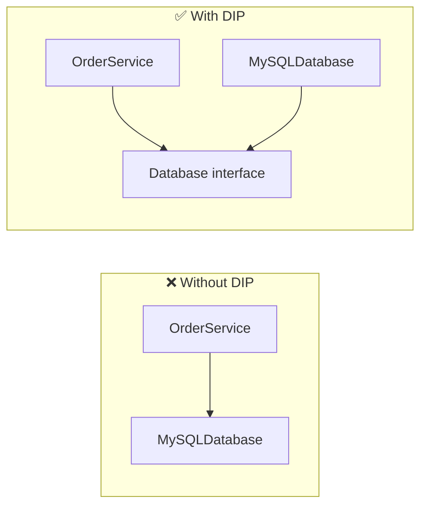

---
tags:
  - phase-1
  - oop
  - solid
  - fundamentals
difficulty: medium
status: written
---

# OOP & SOLID

> **TL;DR:** OOP organizes code around objects (state + behavior). SOLID is five rules that keep OO designs flexible: each class has one reason to change, is open to extension but closed to modification, subtypes don't break supertypes, interfaces stay focused, and code depends on abstractions not concretions.

## 📖 Concept Overview

Object-Oriented Programming binds **state** (data) and **behavior** (methods that operate on it) into objects. Four classical pillars: **encapsulation** (hide internals), **inheritance** (reuse via "is-a"), **polymorphism** (one interface, many implementations), **abstraction** (model only what matters).

OOP without discipline produces tangled inheritance trees. **SOLID** (Robert C. Martin) is the discipline: five principles that keep classes small, swappable, and testable. They're guidelines, not laws — but most "this code is hard to change" pain comes from violating one of them.

## 🔍 Deep Dive

### The four pillars

| Pillar | What | Python example |
|---|---|---|
| Encapsulation | Hide internals; expose intent | `_private` attr, `@property` |
| Inheritance | Reuse behavior via "is-a" | `class Dog(Animal)` |
| Polymorphism | Same call, different behavior | duck typing, ABCs |
| Abstraction | Model only what matters | `abc.ABC` interfaces |

```python
from abc import ABC, abstractmethod

class PaymentProcessor(ABC):
    @abstractmethod
    def charge(self, amount_cents: int) -> str: ...

class StripeProcessor(PaymentProcessor):
    def charge(self, amount_cents: int) -> str:
        return f"stripe-tx-{amount_cents}"

class PayPalProcessor(PaymentProcessor):
    def charge(self, amount_cents: int) -> str:
        return f"pp-tx-{amount_cents}"

def checkout(processor: PaymentProcessor, cents: int):
    return processor.charge(cents)  # polymorphism
```

### S — Single Responsibility Principle

> A class should have one, and only one, reason to change.

Bad: `User` class that loads itself from DB, validates, *and* sends emails. Three reasons to change (schema, validation rules, email template).

```python
# ❌ Three responsibilities
class User:
    def save_to_db(self): ...
    def validate(self): ...
    def send_welcome_email(self): ...

# ✅ Split
class User: ...
class UserRepository:
    def save(self, u: User): ...
class UserValidator:
    def validate(self, u: User): ...
class WelcomeEmailer:
    def send(self, u: User): ...
```

### O — Open/Closed Principle

> Open for extension, closed to modification.

Add a new behavior by writing a new class, not by editing existing classes.

```python
# ❌ Adding a new shape forces editing this function
def area(shape):
    if shape.kind == "circle": return 3.14 * shape.r ** 2
    if shape.kind == "square": return shape.side ** 2
    # adding triangle = edit here

# ✅ Each shape owns its area
class Shape(ABC):
    @abstractmethod
    def area(self) -> float: ...

class Circle(Shape):
    def __init__(self, r): self.r = r
    def area(self): return 3.14 * self.r ** 2

class Square(Shape):
    def __init__(self, side): self.side = side
    def area(self): return self.side ** 2

# Adding Triangle = new class, no edits to existing code
```

### L — Liskov Substitution Principle

> Subtypes must be substitutable for their base types without breaking correctness.

The classic violation:

```python
# ❌ Square IS-A Rectangle? Math says yes; LSP says no.
class Rectangle:
    def __init__(self, w, h): self.w, self.h = w, h
    def set_w(self, w): self.w = w
    def set_h(self, h): self.h = h
    def area(self): return self.w * self.h

class Square(Rectangle):
    def set_w(self, w): self.w = self.h = w  # surprise!
    def set_h(self, h): self.w = self.h = h

def stretch(r: Rectangle):
    r.set_w(5); r.set_h(4)
    assert r.area() == 20  # fails for Square — LSP violated
```

Fix: don't model Square as a Rectangle. Model both as `Shape`.

### I — Interface Segregation Principle

> Clients shouldn't depend on methods they don't use.

Prefer many small interfaces over one fat one.

```python
# ❌ Fat interface
class Worker(ABC):
    @abstractmethod
    def work(self): ...
    @abstractmethod
    def eat(self): ...  # robots don't eat

# ✅ Segregated
class Workable(ABC):
    @abstractmethod
    def work(self): ...

class Eatable(ABC):
    @abstractmethod
    def eat(self): ...

class Human(Workable, Eatable): ...
class Robot(Workable): ...  # not forced to implement eat()
```

### D — Dependency Inversion Principle

> Depend on abstractions, not concretions. High-level code should not depend on low-level details.

```python
# ❌ OrderService depends on a concrete MySQL implementation
class OrderService:
    def __init__(self):
        self.db = MySQLConnection(...)  # locked in

# ✅ Depends on abstraction; concrete passed in
class Database(ABC):
    @abstractmethod
    def save(self, order): ...

class OrderService:
    def __init__(self, db: Database):
        self.db = db
```

This is the foundation of [Dependency Injection](dependency-injection.md).

### Visualizing dependency direction



Both `OrderService` and `MySQLDatabase` depend on the *interface* — neither owns the other.

## ⚖️ Trade-offs & Pitfalls

- ✅ **Use OOP when:** modeling stateful entities (User, Order, Connection), building plugin-style extensibility.
- ❌ **Avoid heavy OOP when:** the problem is a pipeline of pure transformations (use [functional](functional-programming.md) instead).
- 🐛 **Common mistakes:**
    - Inheritance for code reuse → favor composition.
    - "God classes" with 30 methods → SRP violation.
    - Abstract base classes nobody else will implement → premature abstraction.
- 💡 **Rules of thumb:**
    - "Composition over inheritance" — almost always.
    - If a class has more than ~5 public methods, suspect SRP.
    - If you find yourself adding `if isinstance(...)` chains, you're missing polymorphism.

## 🎯 Interview Questions

??? question "Q1: Explain SOLID in one sentence each."
    - **S**RP: One reason to change per class.
    - **O**CP: Add behavior by writing new code, not editing old code.
    - **L**SP: Subtypes must honor the base type's contract.
    - **I**SP: Many small interfaces beat one fat interface.
    - **D**IP: Depend on abstractions, not concrete classes.

??? question "Q2: Composition vs inheritance — when do you use each?"
    Use **inheritance** for true *is-a* relationships where the subclass honors the parent's full contract (Liskov-safe). Use **composition** (HAS-A) for everything else: behavior reuse, mix-in features, swappable strategies. Modern guidance: prefer composition by default; reach for inheritance only when polymorphism through a base type genuinely simplifies callers. Inheritance creates tight coupling — you can't change the parent without breaking children.

??? question "Q3: Give a real LSP violation you've seen."
    Common one: a `ReadOnlyList` subclass of `List` that throws on `append`. Anywhere code does `list.append(x)` expecting it to work, passing a `ReadOnlyList` breaks the contract — LSP violated. Fix: don't subclass; model `ReadOnly` and `Mutable` as separate types or use composition.

??? question "Q4: How does Python's duck typing relate to ISP and DIP?"
    Duck typing makes ISP and DIP cheap: you don't need to declare formal interfaces. Any object with the right methods works. The downside: contracts are implicit. `typing.Protocol` (PEP 544) gives you the best of both — structural typing with type-checker-enforced contracts, no explicit `implements` clause needed.

??? question "Q5: Encapsulation in Python without `private` keywords?"
    Convention + `_underscore` (private by convention), `__double_underscore` (name-mangled), `@property` for read-only or computed access. Python trusts the developer ("we're all consenting adults") rather than enforcing access at the language level. Use `@dataclass(frozen=True)` for immutable records.

## 🏗️ Scenarios

### Scenario: Refactoring a notification system

**Situation:** A `Notifier` class sends email, SMS, and push notifications. Marketing wants to add Slack messages. The class is 500 lines with `if channel == "email"...` branches.

**Constraints:** Can't break existing callers. New channels added every quarter.

**Approach:** This is a classic **OCP** smell. Extract a `NotificationChannel` interface, implement one class per channel, register them in a dispatch map. `Notifier` becomes a thin orchestrator.

**Solution:**

```python
class Channel(ABC):
    @abstractmethod
    def send(self, recipient: str, message: str) -> None: ...

class EmailChannel(Channel):
    def send(self, recipient, message): ...

class SMSChannel(Channel):
    def send(self, recipient, message): ...

class SlackChannel(Channel):
    def send(self, recipient, message): ...

class Notifier:
    def __init__(self, channels: dict[str, Channel]):
        self.channels = channels
    def notify(self, channel: str, recipient: str, message: str):
        self.channels[channel].send(recipient, message)
```

Adding a new channel = new class + register. Zero edits to `Notifier`.

**Trade-offs:** Slightly more files. Worth it: each channel is independently testable, swappable in tests with a fake, and the dispatch map can be configured at runtime (feature flags per channel).

## 🔗 Related Topics

- [Design Patterns](design-patterns/index.md) — most patterns are SOLID applied
- [Dependency Injection](dependency-injection.md) — DIP in practice
- [Strategy Pattern](design-patterns/strategy.md) — OCP applied
- [Functional Programming](functional-programming.md) — orthogonal paradigm

## 📚 References

- *Clean Architecture* — Robert C. Martin
- *Design Patterns: Elements of Reusable Object-Oriented Software* — Gamma, Helm, Johnson, Vlissides
- [PEP 544 — Protocols (structural subtyping)](https://peps.python.org/pep-0544/)
