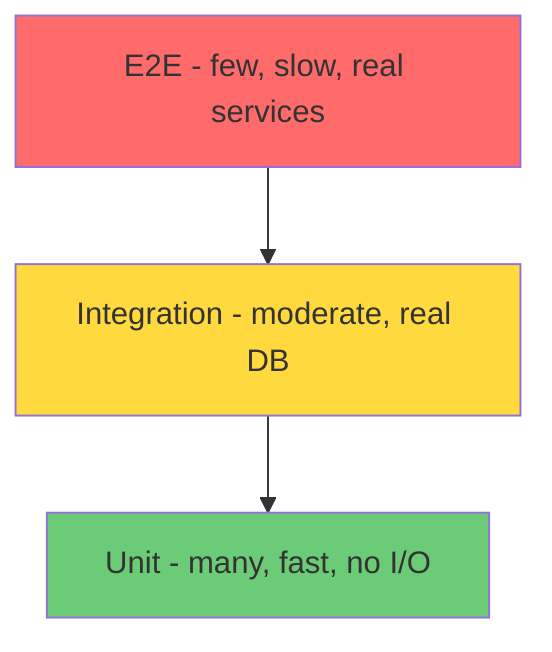

---
tags:
  - phase-1
  - testing
  - pytest
  - fundamentals
difficulty: medium
status: written
---

# Testing Frameworks

> **TL;DR:** Use `pytest`. Write tests as plain functions; share setup with fixtures; cover variations with `@parametrize`. Mock at boundaries, not internals. The test suite is your safety net for refactors and your specification of intended behavior.

## 📖 Concept Overview

Tests answer two questions: "Does this work?" and "Did I break anything?". A good test suite gives confidence to refactor, catch regressions, and document intended behavior. Bad tests slow you down — they're brittle, slow, opaque, or test the wrong thing.

In Python, `pytest` has won. It's lighter than `unittest`, more idiomatic, and richer in plugins. The patterns below assume pytest.

## 🔍 Deep Dive

### Test pyramid (visual)



Most tests are unit (fast, isolated). Some integration (real DB, real HTTP). Few end-to-end (whole stack).

### pytest basics

```python
# test_calc.py
def add(a, b): return a + b

def test_add():
    assert add(2, 3) == 5

def test_add_negative():
    assert add(-1, 1) == 0
```

Run: `pytest`. Discovery finds `test_*.py` and `Test*` classes; collects functions named `test_*`.

```bash
pytest                              # all
pytest tests/test_calc.py           # one file
pytest tests/test_calc.py::test_add # one test
pytest -k "add and not negative"    # by name pattern
pytest -m slow                      # by mark
pytest -x                           # stop on first failure
pytest --pdb                        # drop into debugger on failure
pytest -vv                          # verbose
pytest --lf                         # last-failed
```

### Fixtures — share setup

```python
import pytest

@pytest.fixture
def user():
    return {"id": "u1", "name": "alice"}

def test_user_name(user):
    assert user["name"] == "alice"

# scoped fixture: one per session, not per test
@pytest.fixture(scope="session")
def db():
    conn = create_test_db()
    yield conn
    conn.close()
```

Scopes: `function` (default), `class`, `module`, `package`, `session`. Use the *narrowest* scope that works — broader scope = faster but more shared state.

### `conftest.py` — fixture discovery

Fixtures in `conftest.py` are auto-available to all tests in that directory and below. No imports needed.

```
tests/
  conftest.py        # fixtures for all tests
  unit/
    conftest.py      # fixtures for unit tests
    test_calc.py
  integration/
    conftest.py      # fixtures for integration tests
    test_db.py
```

### Parametrize — one test, many cases

```python
@pytest.mark.parametrize("a,b,expected", [
    (2, 3, 5),
    (0, 0, 0),
    (-1, 1, 0),
    (10, -5, 5),
])
def test_add(a, b, expected):
    assert add(a, b) == expected
```

Each row becomes a separate test (with its own pass/fail). Far better than looping inside one test (which loses on first assertion).

Stack parametrizes for the cross product:

```python
@pytest.mark.parametrize("currency", ["USD", "EUR"])
@pytest.mark.parametrize("amount", [100, 1000, 10000])
def test_format_money(currency, amount):
    ...  # 2 × 3 = 6 tests
```

### Mocking — boundary substitution

`unittest.mock.patch` swaps a name with a Mock for the test's duration.

```python
from unittest.mock import patch

def fetch_user(id):
    import requests
    return requests.get(f"https://api/users/{id}").json()

def test_fetch_user():
    with patch("requests.get") as mock_get:
        mock_get.return_value.json.return_value = {"id": "u1"}
        result = fetch_user("u1")
        assert result == {"id": "u1"}
        mock_get.assert_called_once_with("https://api/users/u1")
```

Or as a decorator:

```python
@patch("mymodule.requests")
def test_fetch_user(mock_requests):
    mock_requests.get.return_value.json.return_value = {"id": "u1"}
    ...
```

**Patch where it's used, not where it's defined.** `@patch("mymodule.requests")`, not `@patch("requests")` — Python imported `requests` into `mymodule` and that's the binding the function looks up.

### Better: Dependency Injection beats mocks

Mocks are brittle — they couple tests to implementation details (call signatures, attribute access). Prefer fakes you can pass in:

```python
class FakeUserAPI:
    def __init__(self, users): self.users = users
    def get(self, id): return self.users.get(id)

def test_fetch_user():
    api = FakeUserAPI({"u1": {"id": "u1", "name": "alice"}})
    service = UserService(api=api)
    assert service.greet("u1") == "hello alice"
```

This requires [DI](dependency-injection.md) in your code — one more reason DI matters.

### Async tests

```python
import pytest
import asyncio

@pytest.mark.asyncio
async def test_async_thing():
    result = await async_function()
    assert result == 42
```

Requires `pytest-asyncio`. Or set `asyncio_mode = "auto"` in `pyproject.toml` to drop the marker.

### Marks — categorize tests

```python
@pytest.mark.slow
def test_huge_load(): ...

@pytest.mark.skipif(sys.platform == "win32", reason="Linux only")
def test_unix_only(): ...

@pytest.mark.xfail(reason="known bug, fix in PR-1234")
def test_pending(): ...
```

`pytest -m slow` runs slow tests; `pytest -m "not slow"` skips them. CI typically runs all; local dev runs fast subset.

### Coverage

```bash
pip install coverage pytest-cov
pytest --cov=mypackage --cov-report=term-missing --cov-report=html
```

Coverage shows *which lines ran*, not *whether they were tested correctly*. 100% coverage with `assert True` everywhere is meaningless. Treat coverage as a smoke detector: a steep drop signals untested code; a high number doesn't mean correct code.

### Property-based testing (intro)

Instead of giving examples, describe invariants. The library generates examples.

```python
from hypothesis import given, strategies as st

@given(a=st.integers(), b=st.integers())
def test_add_commutative(a, b):
    assert add(a, b) == add(b, a)
```

Hypothesis generates hundreds of `(a, b)` pairs, including edge cases (0, INT_MAX, negatives). When it finds a failure, it shrinks to the simplest failing input. Excellent for parsers, encoders, math-heavy code.

### Test doubles, named

| | Definition |
|---|---|
| **Dummy** | Passed but never used (placeholder) |
| **Stub** | Returns canned values |
| **Spy** | Stub + records calls for assertion |
| **Mock** | Pre-programmed with expectations; verifies them |
| **Fake** | Working but simplified (in-memory DB instead of Postgres) |

Pythonic preference: Fakes > Stubs/Spies > Mocks. Fakes are reusable across tests; Mocks are bespoke per test.

## ⚖️ Trade-offs & Pitfalls

- ✅ **Use fixtures for:** test data setup, resource lifecycle (DB, temp dir).
- ✅ **Use parametrize for:** the same logic across many inputs.
- ✅ **Use marks to:** skip slow tests locally, gate platform-specific tests.
- 🐛 **Common mistakes:**
    - Tests that depend on order — caused by shared global state or session fixtures with mutation. Fix: function-scoped fixtures, isolation.
    - Tests that mock everything → tests pass but real integration breaks. Fakes > mocks.
    - Tests that test the test framework (`assert mock.called == True`) — usually the wrong assertion to make.
    - One huge test asserting 20 things → first failure hides the rest.
    - `time.sleep` in tests → flaky and slow. Use freezegun, fake clocks, or `pytest-asyncio` for time control.
- 💡 **Rules of thumb:**
    - One assertion per test (or one *concept* per test).
    - Test names describe the behavior: `test_signup_with_existing_email_returns_409`.
    - Arrange / Act / Assert structure inside each test.
    - If a test breaks during refactor, the test was testing internals, not behavior.

## 🎯 Interview Questions

<details>
<summary><strong>Q1: TDD vs writing tests after — practical view?</strong></summary>

TDD (red → green → refactor) helps when you don't know the design yet — writing the test first forces you to design from the consumer's perspective. After-tests are fine when the design is obvious. The bigger win is *having tests at all* and writing them at the *right grain* (mostly unit, some integration). Whether they come before or after is less important than that they exist.

</details>
<details>
<summary><strong>Q2: When do you mock vs use a real dependency?</strong></summary>

Mock external systems (3rd-party APIs, paid services). Use real for things you own (your DB in integration tests, an in-memory fake of your DB in unit tests). Rule of thumb: mock at *system boundaries*, not internal interfaces. Mocking your own internal functions usually means tests are coupled to implementation.

</details>
<details>
<summary><strong>Q3: Why is `pytest.fixture(scope='session')` faster but riskier?</strong></summary>

Session-scoped fixtures are created once per pytest run, shared across all tests. Avoids repeated setup (e.g., DB connection). Risk: if a test mutates the fixture, later tests see the mutation — order dependence creeps in. Use session scope for *immutable* expensive resources; function scope for anything tests touch.

</details>
<details>
<summary><strong>Q4: Coverage doesn't measure quality — what does?</strong></summary>

Mutation testing (`mutmut`, `cosmic-ray`) — flips operators, deletes branches, runs tests. Surviving mutants = tests didn't catch the change = weak tests. Code review of tests. Asking "would this test fail if I broke X?" The discipline of test-first development. Coverage is a smoke detector, not a quality measure.

</details>
<details>
<summary><strong>Q5: How would you test a function that depends on the current time?</strong></summary>

Inject a clock: `def func(now=time.time)` — pass a stub in tests. Or use `freezegun` / `time-machine` to monkey-patch the clock for the test's duration. Worst option: `time.sleep` in tests to wait for transitions — slow and flaky.

</details>
<details>
<summary><strong>Q6: How do you make a flaky test reliable?</strong></summary>

Find the source of flakiness: (1) Order-dependence — isolate fixtures. (2) Timing — replace `sleep` with explicit synchronization (events, polling with timeout). (3) Randomness — seed it. (4) External services — replace with fake. (5) Concurrency races — actually fix the race. Quarantining flaky tests is a temporary hack; fix the root cause.

</details>

## 🏗️ Scenarios

### Scenario: Adding tests to a legacy untested module

**Situation:** A 2000-line module handles billing. No tests. Manager wants to refactor it but the team is afraid to touch it.

**Constraints:** Can't rewrite from scratch. Need to gain confidence to refactor incrementally.

**Approach:** Characterization tests first (lock current behavior), then refactor under that safety net.

**Solution:**

```python
# 1. Identify the module's public entry points (one or two functions)
# 2. Capture current outputs for representative inputs
# 3. Write tests that pin those outputs

import pytest
from billing import calculate_invoice

@pytest.mark.parametrize("input_,expected", [
    # captured by running production code on these inputs
    ({"plan": "basic", "users": 5}, {"total_cents": 4500, ...}),
    ({"plan": "pro", "users": 10}, {"total_cents": 18000, ...}),
    ({"plan": "pro", "users": 10, "discount": 0.1}, {"total_cents": 16200, ...}),
    # ... 20 more ...
])
def test_billing_characterization(input_, expected):
    assert calculate_invoice(input_) == expected
```

These tests don't say "this is the *right* answer" — they say "this is what the code does *today*." With them in place:

1. Refactor a small chunk.
2. Run tests — anything red? You changed observable behavior; revert or accept.
3. Once refactored, replace characterization tests with intent-revealing tests (`test_pro_plan_with_10_users_costs_180`).

**Trade-offs:** Characterization tests can lock in bugs (bug becomes "intended behavior"). Treat them as a safety net for refactoring, not a long-term spec. Replace as you understand the code better. The first 30 such tests buy enormous freedom.

## 🔗 Related Topics

- [Dependency Injection](dependency-injection.md) — DI is what makes unit testing easy
- [Functional Programming](functional-programming.md) — pure functions are dream tests
- [Testing & Quality](../11-testing-quality/index.md) — broader Phase 11 (TDD, BDD, integration, contract)
- [Error Handling](error-handling.md) — testing failure paths

## 📚 References

- [pytest docs](https://docs.pytest.org/)
- [Hypothesis docs](https://hypothesis.readthedocs.io/)
- *Working Effectively with Legacy Code* — Michael Feathers (characterization tests)
- *xUnit Test Patterns* — Gerard Meszaros (test-double terminology)
