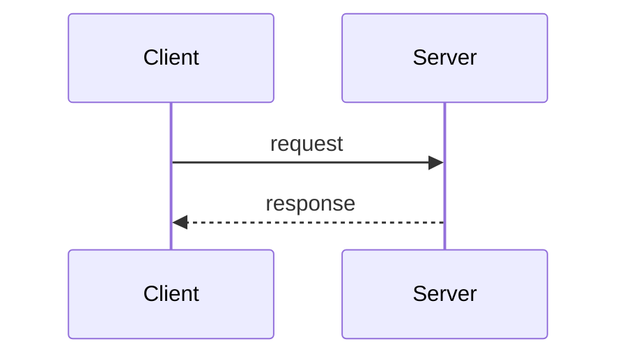

---
tags:
  - phase-X
  - your-tags-here
difficulty: easy | medium | hard
status: stub | in-progress | written
---

# [Topic Name]

> **TL;DR:** Two or three sentences. The version you'd give in an interview if you only had 30 seconds.

## 📖 Concept Overview

What it is, when it matters, why it exists. ~150 words. Aim for: a junior engineer should understand the gist; a senior should nod at the framing.

## 🔍 Deep Dive

The details. Use subsections, code, diagrams.

### Sub-topic 1

Explanation, then a Python example.

```python
# Concrete, runnable example
def example():
    pass
```

### Sub-topic 2

If a diagram clarifies, draw it:



## ⚖️ Trade-offs & Pitfalls

- ✅ **Use when:** ...
- ❌ **Avoid when:** ...
- 🐛 **Common mistakes:** ...
- 💡 **Rules of thumb:** ...

## 🎯 Interview Questions

<details>
<summary><strong>Q1: Walk me through how X works.</strong></summary>

Detailed answer with examples and edge cases. Include the "why" not just the "what."

</details>
<details>
<summary><strong>Q2: What's the difference between X and Y?</strong></summary>

Comparison table or bulleted contrast. Mention when each applies.

</details>
<details>
<summary><strong>Q3: How would you debug X in production?</strong></summary>

Step-by-step debugging approach. What metrics/logs you'd check first.

</details>
<details>
<summary><strong>Q4: Design a system that uses X at scale.</strong></summary>

System design walkthrough — constraints, components, trade-offs.

</details>

## 🏗️ Scenarios

### Scenario: [Realistic problem]

**Situation:** Describe the real-world setup.
**Constraints:** Latency budget, scale, team size, etc.
**Approach:** Step-by-step reasoning. Show your work.
**Solution:** Concrete answer with code or diagram.
**Trade-offs:** What you gave up. Alternatives considered.

## 🔗 Related Topics

- [Other Concept](../path/to/other.md)
- [Another Concept](../another/path.md)

## 📚 References

- *Book Title* — Author
- [Article title](https://example.com)
- [Official docs](https://docs.example.com)
