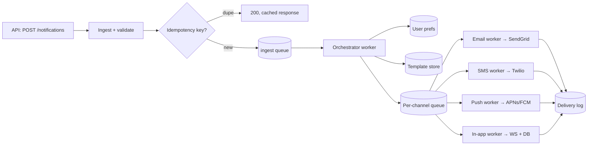
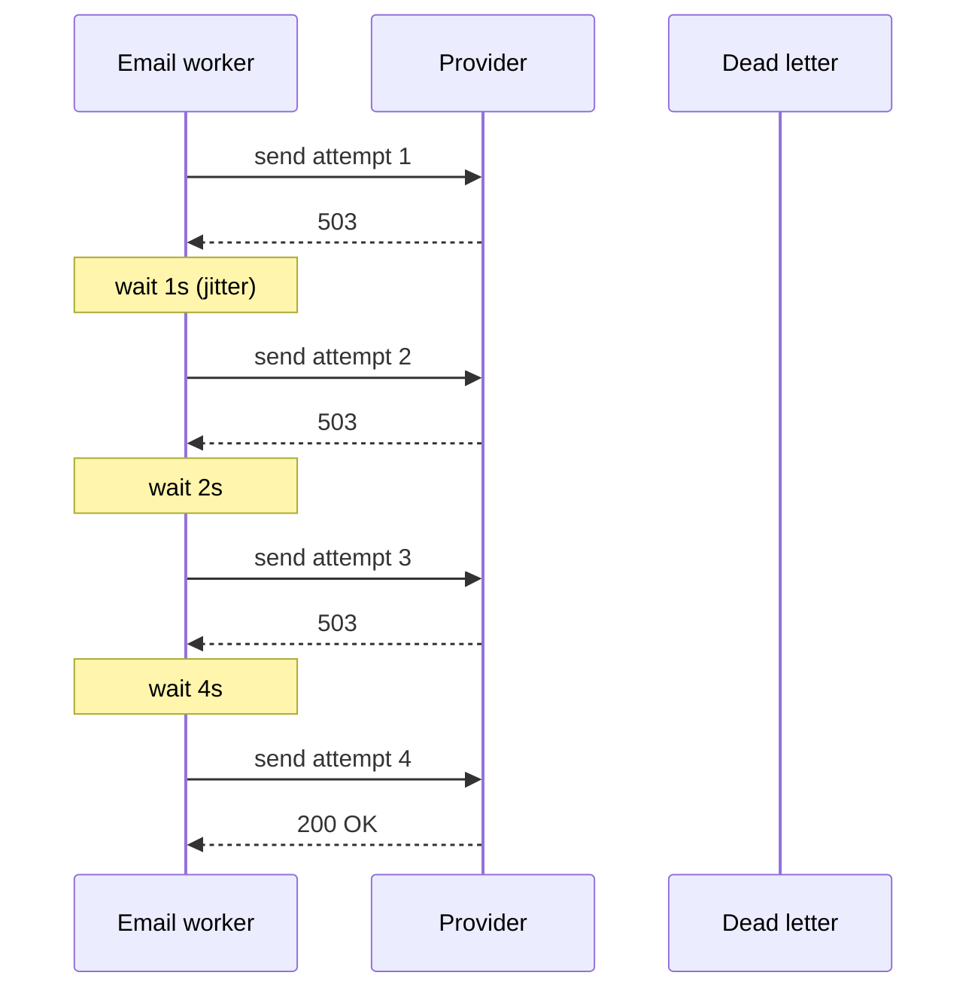

---
tags:
  - scenarios
  - system-design
  - messaging
  - fanout
difficulty: hard
status: written
---

# Design a Notifications Service

> A multi-channel notifications service (email, SMS, push, in-app) is the kind of "obvious until you think about it" problem that separates mid from senior system design. Idempotency, user preferences, delivery guarantees, retries, templating, and cross-team API design all land here.

## 📝 Situation

Design a shared service that any product team can use to send notifications. A team calls one API:

```http
POST /notifications
{
  "user_id": "u_123",
  "event": "order.shipped",
  "payload": {"order_id": "o_567", "tracking_url": "..."}
}
```

The service picks channels based on user preferences, renders templates, dispatches to providers (SendGrid, Twilio, APNs/FCM), and guarantees at-least-once delivery.

## 🎯 Constraints (clarify in interview)

| Question | Assumption |
|---|---|
| Scale | 10M notifications/day, peaks 2k/sec, spikes 50k/sec (marketing blasts) |
| Channels (v1) | email, SMS, push (iOS/Android), in-app feed |
| Latency | Transactional: send within 10s of API call. Marketing: within hours is fine |
| Delivery guarantee | At-least-once to provider; dedupe on the receiver side |
| Personalization | User preferences (opt-out per channel), language, timezone, quiet hours |
| Tenancy | Multi-product: orders, auth, marketing teams share the service |
| Observability | Per-notification delivery status queryable for 90 days |
| Cost sensitivity | SMS is expensive (~$0.01/msg) — don't duplicate |

## 🧠 Approach

Decompose into three clear stages. Each can fail independently and retry.



**Three stages:**

1. **Ingest** — accept + validate + idempotency check + enqueue. Hot path, fast.
2. **Orchestrate** — pick channels based on user prefs, render templates, fan out to per-channel queues.
3. **Deliver** — per-channel worker sends to provider, records status, retries on transient failure.

The separation matters: each stage has different latency, failure modes, and scale profile.

## 🏗️ Solution

### Schema (PostgreSQL)

```sql
CREATE TABLE notifications (
    id           UUID PRIMARY KEY,
    idempotency_key TEXT UNIQUE,            -- (tenant, key) nullable if not provided
    user_id      TEXT NOT NULL,
    event        TEXT NOT NULL,              -- e.g. "order.shipped"
    payload      JSONB NOT NULL,
    requested_at TIMESTAMPTZ NOT NULL,
    status       TEXT NOT NULL               -- pending|dispatching|done|failed
);

CREATE TABLE deliveries (
    id              UUID PRIMARY KEY,
    notification_id UUID REFERENCES notifications(id),
    channel         TEXT NOT NULL,           -- email|sms|push|in_app
    provider_id     TEXT,                    -- SendGrid msg id etc
    status          TEXT NOT NULL,           -- queued|sent|delivered|opened|failed
    attempt_count   INT  NOT NULL DEFAULT 0,
    last_error      TEXT,
    created_at      TIMESTAMPTZ NOT NULL DEFAULT NOW(),
    updated_at      TIMESTAMPTZ NOT NULL DEFAULT NOW()
);

CREATE INDEX ON deliveries (notification_id);
CREATE INDEX ON deliveries (user_id, created_at DESC);  -- for user history queries

CREATE TABLE user_prefs (
    user_id     TEXT PRIMARY KEY,
    email       TEXT,
    phone       TEXT,
    push_tokens JSONB,   -- [{platform, token}]
    channel_opts JSONB,  -- {"marketing.email": false, "order.sms": true, ...}
    locale      TEXT DEFAULT 'en',
    timezone    TEXT DEFAULT 'UTC',
    quiet_hours JSONB    -- {"start": "22:00", "end": "08:00"}
);
```

### Idempotency (mandatory)

Callers pass `Idempotency-Key` header. Unique constraint in DB catches duplicates; return the cached response.

```python
@app.post("/notifications")
async def create(req: NotifyRequest, idem_key: str = Header(alias="Idempotency-Key")):
    try:
        row = await db.insert_notification(
            idempotency_key=idem_key,
            user_id=req.user_id,
            event=req.event,
            payload=req.payload,
        )
    except UniqueViolation:
        row = await db.get_notification_by_key(idem_key)
        return {"id": row.id, "status": row.status, "deduplicated": True}

    await kafka.send("notifications.ingested", key=row.id, value=row)
    return {"id": row.id, "status": "pending"}
```

**Why Kafka (not just DB polling):** decouples ingest from orchestration, natural backpressure, replay on worker bugs, per-partition ordering.

### Orchestrator — channel selection

```python
async def orchestrate(notification):
    prefs = await prefs_cache.get(notification.user_id)
    channels = pick_channels(notification.event, prefs)  # honors opt-outs
    if in_quiet_hours(prefs) and not is_critical(notification.event):
        await schedule_after_quiet_hours(notification)
        return

    template = await templates.get(notification.event, prefs.locale)

    for channel in channels:
        content = render(template[channel], notification.payload, prefs)
        delivery_id = await db.insert_delivery(notification.id, channel, "queued")
        await kafka.send(
            f"deliveries.{channel}",
            key=notification.user_id,  # partition by user — in-order per user
            value={"delivery_id": delivery_id, "content": content, "to": prefs_address(prefs, channel)},
        )
```

### Per-channel worker — Email example

```python
async def email_worker(msg):
    delivery = await db.get_delivery(msg["delivery_id"])
    if delivery.status == "sent":
        return  # already sent; safe skip (idempotent)

    try:
        provider_id = await sendgrid.send(
            to=msg["to"],
            subject=msg["content"]["subject"],
            html=msg["content"]["html"],
        )
        await db.update_delivery(delivery.id, status="sent", provider_id=provider_id)
    except TransientError:
        raise   # Kafka/Celery retries with backoff
    except PermanentError as e:
        await db.update_delivery(delivery.id, status="failed", last_error=str(e))
        await dead_letter(delivery)  # surface to ops dashboard
```

### Retries, backoff, DLQ

- **Transient errors** (5xx from provider, timeout): exponential backoff via Celery's `autoretry_for` or Kafka consumer's retry topic.
- **Permanent errors** (4xx, invalid address): log, mark failed, don't retry.
- **DLQ**: after max attempts, move to dead-letter topic. Ops dashboard surfaces stuck deliveries for manual review.



### User preferences

Cached aggressively. Prefs change rarely (hours, not seconds). Cache with TTL; invalidate on write:

```python
async def get_prefs(user_id):
    cached = await redis.get(f"prefs:{user_id}")
    if cached: return cached
    row = await db.select_prefs(user_id)
    await redis.setex(f"prefs:{user_id}", 3600, row)
    return row

async def update_prefs(user_id, updates):
    await db.update_prefs(user_id, updates)
    await redis.delete(f"prefs:{user_id}")   # invalidate
```

### Templates

Versioned, stored in the DB (not code — non-engineers edit them). Jinja2 rendering:

```python
template = env.from_string("""
Hi {{ name }},

Your order {{ order_id }} has shipped! Track it: {{ tracking_url }}

— The Team
""")
rendered = template.render(name=user.first_name, **payload)
```

Marketing team has a separate UI to edit; editor saves a new version, templates table keeps history.

### Handling the marketing blast (50k/sec spike)

Don't let a marketing campaign starve transactional notifications.

- **Priority queues:** separate Kafka topics for `transactional` vs `marketing` per channel. Transactional workers scale first; marketing fills remaining capacity.
- **Per-tenant rate limits:** marketing team's traffic capped at N/sec — rate limiter in front of ingest.
- **Scheduled blasts:** ingest writes a "scheduled_at" column; a trickle-scheduler drip-feeds into the channel queues over minutes, not all at once.

### Observability

```python
# Per-stage metrics
notifications.ingested.count
notifications.orchestrated.count
deliveries.{channel}.sent.count
deliveries.{channel}.failed.count
deliveries.{channel}.latency_ms  # histogram
```

Distributed trace connects ingest → orchestrate → deliver with a single notification_id spanning ~5 services.

## ⚖️ Trade-offs

| Decision | Win | Cost |
|---|---|---|
| Per-channel queues | Channels fail/scale independently; email outage doesn't block SMS | More queues to manage |
| At-least-once delivery | Users don't miss critical messages | Rare duplicates; idempotent downstream handling |
| Idempotency keys mandatory | Safe retries from callers | API contract complexity |
| Templates in DB, not code | Non-eng can edit | Slower iteration; version control is less clean than git |
| Marketing/transactional separation | Transactional SLA protected | Two parallel pipelines to operate |
| Prefs cached 1h | Read-heavy load relieved | 1h window where opt-outs haven't propagated |

## 🔄 What changes at 10x scale?

- **Partition user prefs** across a cluster (Cassandra or sharded PG).
- **Multi-region** notification pipeline; route to nearest region based on user's locale/timezone.
- **Smart batching**: group multiple events for the same user into one email digest.
- **Streaming analytics** on delivery logs to detect provider issues (spike in failures for SES us-east-1) and fail over.

## 🔄 What changes at 1/100 scale?

- Skip Kafka; a single worker reading a simple DB queue is enough at 20 RPS.
- Skip Redis prefs cache; direct DB reads are fast enough.
- Providers can be synchronous SDK calls from the orchestrator — no per-channel workers.

## 🔗 Concepts touched

- **[Data Pipelines & Messaging](../12-data-pipelines-messaging/index.md)** — Kafka topics, DLQ, priority queues
- **[Database & Storage](../03-database-storage/index.md)** — schema, idempotency via UNIQUE constraint, JSONB
- **[Caching & Optimization](../17-caching-optimization/index.md)** — prefs cache
- **[Resilience & Fault Tolerance](../14-resilience-fault-tolerance/index.md)** — retries, DLQ, circuit breakers on providers
- **[API Lifecycle Management](../16-api-lifecycle/index.md)** — idempotency key contract
- **[Distributed Systems](../15-distributed-systems/index.md)** — at-least-once semantics, partitioning

## 🎯 Common follow-ups

- **"How do you prevent a user getting the same email 100 times if a worker crashes mid-send?"** The provider returns a stable message_id on success; the worker writes that to `deliveries.provider_id` BEFORE acknowledging the queue message. On retry, the worker checks the delivery row — if `provider_id` is set, skip. If the provider supports idempotency keys (SendGrid does), pass the delivery_id as the key — provider dedupes even if we call twice.

- **"How do you handle unsubscribe/GDPR right-to-erasure?"** Unsubscribe = preference update (set channel_opts to false for marketing events). Erasure = soft-delete user_prefs (set email/phone to NULL) and scrub deliveries older than retention window. Future orchestrations skip NULL addresses.

- **"How do you test this end-to-end?"** Integration test environment has fake providers (capture-only) that store what *would* have been sent. Tests assert on captured state. Load testing uses a replay harness that drains a recorded workload.

- **"What if a product team wants to send a notification type you haven't planned for?"** Events are strings; templates are data. A new event = register a template per channel + update the channel-selection rules. No code deploy needed for new notification types.

- **"Quiet hours — what if a 'your account was hacked' alert falls in quiet hours?"** Two tiers: `transactional_critical` (account security, payment failure) ignores quiet hours; everything else defers. Classification is part of the event registry.

- **"What happens if Twilio is down for 2 hours?"** Per-provider circuit breaker — open after N consecutive failures. While open, SMS deliveries park in a "retry-after" queue (or DLQ if urgent). Fallback: for critical messages, the SMS worker can emit an email fallback after timeout.

- **"Guarantee ordering? E.g., 'order.placed' before 'order.shipped' for the same user."** Partition Kafka by `user_id`. A single consumer per partition processes in order. If multiple channels, each channel partitions independently by user — within a channel for a user, order is preserved.
