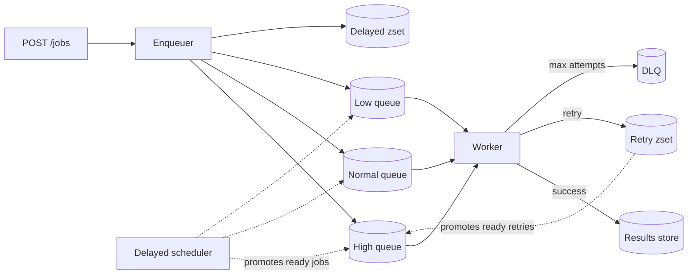

---
tags:
  - scenarios
  - system-design
  - messaging
  - concurrency
  - distributed-systems
difficulty: medium
status: written
---

# Design a Priority Job Queue

> A background-job system with priorities is the kind of infrastructure every product eventually builds — sometimes three times before getting it right. Good answers nail priority fairness, worker scaling, retry semantics, and the tension between "process fast" and "process in order."

## 📝 Situation

Design a service that accepts **jobs** from API callers and executes them asynchronously. Jobs vary in urgency:

- **High** — user-blocking (password reset email, invoice PDF generation).
- **Normal** — standard async work (thumbnail generation, webhook delivery).
- **Low** — bulk/batch jobs (nightly reports, data backfills).

Features needed:

- Multiple priorities (3 tiers minimum)
- Retries on failure with exponential backoff
- Delayed jobs (run at X time)
- Recurring jobs (cron-style)
- Dead-letter queue for permanently failing jobs
- At-least-once execution; idempotency is the caller's responsibility
- Per-job result fetch (via job_id)

## 🎯 Constraints (clarify in interview)

| Question | Assumption |
|---|---|
| Throughput | 10k jobs/sec avg, 100k peak, mix across priorities |
| Workers | 500 workers in a pool; elastically scale to 2000 on demand |
| Job payload | < 1 MB (anything bigger goes through S3; payload is just a pointer) |
| Max execution time | 5 minutes default; configurable per-job up to 1 hour |
| Delivery semantics | At-least-once (workers retry on crash; caller code must be idempotent) |
| Durability | Zero job loss once API returns 200 |
| Visibility | Callers can query job status; admins see queue depth + worker health |

## 🧠 Approach

The core question: **one queue or many?**

- **One queue with priority field** — simple, but workers must sort/skip, which doesn't scale.
- **Separate queue per priority** — clean separation, but risk of low-priority starvation.

**Pick:** separate queues per priority, with **weighted fair sampling** so low-priority jobs still make progress. Redis Streams or RabbitMQ handle this natively; Kafka can too with a partitioning scheme.



## 🏗️ Solution

### Job schema

```sql
CREATE TABLE jobs (
    id              UUID PRIMARY KEY,
    queue           TEXT NOT NULL,           -- 'high' | 'normal' | 'low'
    type            TEXT NOT NULL,           -- 'send_email' | 'generate_pdf' | ...
    payload         JSONB NOT NULL,
    priority        SMALLINT NOT NULL,       -- 0=high, 1=normal, 2=low
    status          TEXT NOT NULL,           -- queued | running | done | failed
    attempts        INT NOT NULL DEFAULT 0,
    max_attempts    INT NOT NULL DEFAULT 5,
    run_at          TIMESTAMPTZ NOT NULL,    -- when to execute (now or future)
    started_at      TIMESTAMPTZ,
    finished_at     TIMESTAMPTZ,
    last_error      TEXT,
    result          JSONB,
    created_at      TIMESTAMPTZ NOT NULL DEFAULT NOW()
);

CREATE INDEX ON jobs (status, run_at);
CREATE INDEX ON jobs (id);                   -- for direct lookup
```

**Why a DB table, not just Redis?**

- Source of truth for job state — Redis is the working queue, DB is the record.
- Admin queries ("show me all failed jobs of type X") need SQL.
- Job result retention survives Redis restarts.

### Enqueue path

```python
def enqueue(job_type: str, payload: dict, *, priority: str = "normal",
            delay_seconds: int = 0, max_attempts: int = 5) -> str:
    job_id = str(uuid4())
    run_at = now() + timedelta(seconds=delay_seconds)

    # 1. Durable write first
    db.insert_job(
        id=job_id, queue=priority, type=job_type, payload=payload,
        priority={"high": 0, "normal": 1, "low": 2}[priority],
        status="queued", run_at=run_at, max_attempts=max_attempts,
    )

    # 2. Enqueue to working queue
    if delay_seconds == 0:
        redis.lpush(f"queue:{priority}", job_id)
    else:
        redis.zadd("scheduled", {job_id: run_at.timestamp()})

    return job_id
```

### Scheduler (delayed job promoter)

One process (leader-elected; Redis SETNX-based lock) runs every second:

```python
def promote_due_jobs():
    now_ts = time.time()
    # Atomic: grab all due, remove, enqueue
    due = redis.zrangebyscore("scheduled", 0, now_ts, start=0, num=100)
    if not due:
        return
    pipe = redis.pipeline()
    for job_id in due:
        priority = db.get_job_priority(job_id)  # cache it
        pipe.lpush(f"queue:{priority}", job_id)
        pipe.zrem("scheduled", job_id)
    pipe.execute()
```

Same pattern for the retry sorted-set.

### Worker — weighted sampling

```python
# Worker polls all three queues with weights: high=5, normal=3, low=1.
# Each iteration: 5 chances to get a high, 3 for normal, 1 for low.
WEIGHTS = [("high", 5), ("normal", 3), ("low", 1)]

def fetch_next_job():
    # Shuffled weighted sample. BLPOP with timeout drops to next on empty.
    weighted_queues = []
    for q, w in WEIGHTS:
        weighted_queues.extend([f"queue:{q}"] * w)
    random.shuffle(weighted_queues)
    # BRPOP against multiple keys with short timeout — returns first non-empty.
    return redis.brpop(weighted_queues[:5], timeout=1)  # small sample per tick
```

**Why weighted sampling vs strict priority?** Strict priority starves low-priority jobs when high-priority traffic is continuous. Weighted gives high-priority >80% of capacity while guaranteeing low-priority still advances.

Pure-priority alternative (Python): `queue.PriorityQueue` — fine for single-process; doesn't survive restart.

### Worker — execute

```python
def run_worker():
    handlers = {"send_email": send_email, "generate_pdf": generate_pdf, ...}
    while not shutdown:
        queue, job_id = fetch_next_job()
        if not job_id:
            continue
        job = db.claim_job(job_id, status="running")  # with heartbeat
        try:
            fn = handlers[job.type]
            with timeout(seconds=300):   # per-job budget
                result = fn(**job.payload)
            db.complete_job(job_id, result=result)
        except RetryableError as e:
            handle_retry(job, e)
        except Exception as e:
            handle_fatal(job, e)
```

### Heartbeats (avoid stuck-job problem)

If a worker dies mid-execution, jobs get stuck in `status=running` forever. Fix:

```python
# Worker updates a heartbeat in Redis every 10s:
redis.setex(f"heartbeat:{job_id}", 30, worker_id)

# A reaper process scans `status=running` jobs whose heartbeat is missing.
# If missing > 30s, requeue (attempts++ ; back to queue).
```

### Retries with exponential backoff

```python
def handle_retry(job, error):
    attempts = job.attempts + 1
    if attempts >= job.max_attempts:
        db.update_job(job.id, status="failed", last_error=str(error))
        redis.lpush("dlq", job.id)
        return

    delay = min(3600, 2 ** attempts + random.uniform(0, 1))
    run_at = time.time() + delay
    db.update_job(job.id, status="queued", attempts=attempts,
                  run_at=datetime.fromtimestamp(run_at), last_error=str(error))
    redis.zadd("scheduled", {job.id: run_at})
```

Exponential: 2s, 4s, 8s, 16s… capped at 1hr. Jitter prevents thundering herd.

### Recurring jobs (cron)

Separate table + a dedicated scheduler:

```sql
CREATE TABLE recurring_jobs (
    id       UUID PRIMARY KEY,
    cron     TEXT NOT NULL,              -- "0 2 * * *"
    type     TEXT NOT NULL,
    payload  JSONB NOT NULL,
    priority SMALLINT NOT NULL,
    last_run TIMESTAMPTZ
);
```

Scheduler process runs `croniter` every minute, spawns regular jobs when `now >= next_run`. One recurring job = many "children" in the main table, each with its own status.

### Dead-letter queue

DLQ is just another queue (`dlq`). Jobs that hit `max_attempts` land here. Admin UI queries the `jobs` table `WHERE status='failed'` for visibility; admins can retry (move back to the main queue), archive, or investigate.

### Observability

```python
# Metrics emitted per job:
jobs.enqueued.count{queue}
jobs.started.count{queue, type}
jobs.completed.count{queue, type}
jobs.failed.count{queue, type}
jobs.duration_ms{queue, type}           # histogram
jobs.queue_depth{queue}                 # gauge, sampled each 10s
jobs.worker_count                       # gauge
```

Alert on: queue depth > threshold, DLQ non-zero, worker count dropped.

## ⚖️ Trade-offs

| Decision | Win | Cost |
|---|---|---|
| Queue-per-priority | Clean isolation; no sort overhead | More queues to watch |
| Weighted fair sampling | Low-priority never starves | High-priority isn't strictly first-in-first-out |
| DB + Redis (not just Redis) | Durable record, admin queries | Two systems to operate |
| At-least-once semantics | Zero loss on worker crash | Caller must be idempotent |
| Heartbeat-based stuck-job recovery | Self-healing | Reaper process is another moving part |
| Separate recurring-jobs table | Clear semantic, simple SQL | Extra scheduler to run |

## 🔄 Failure modes

### Worker crashes mid-execution
- Heartbeat stops. Reaper requeues after 30s.
- Job resumes on another worker. Caller sees at-least-once execution.

### Redis is down
- Enqueues fail fast → API returns 503.
- **No data loss** if caller retries (standard API behavior).
- In-flight jobs continue executing; they don't need Redis until completion.

### DB is down
- API blocks (enqueue is synchronous with DB write).
- Workers can't claim jobs → stall.
- Add PG replicas + failover for HA; in worst case, degraded = acceptable vs data loss.

### A bad job crashes workers repeatedly
- Retry with backoff gives it N chances.
- After max attempts, DLQ.
- Circuit-breaker pattern: if a job type has >N% failure rate in a window, auto-pause that type and alert.

## 🔄 What changes at 10x scale?

- **Partition the queues by hash(user_id or tenant)** — noisy tenants don't starve others.
- **Multiple Redis clusters**, sharded by queue type.
- **Dedicated worker pools per job type** — e.g., PDF workers scale independently from email workers.
- **Batched processing** — one worker fetches 10 jobs at a time for bulk types.

## 🔄 What changes at 1/100 scale?

- Skip Redis. Use Postgres `SELECT FOR UPDATE SKIP LOCKED` as the queue — works fine at 100 jobs/sec.
- One worker process with a thread pool. No distributed coordination.
- Celery + SQS or RQ + Redis are off-the-shelf solutions at this scale.

## 🔗 Concepts touched

- **[Data Pipelines & Messaging](../12-data-pipelines-messaging/index.md)** — queue patterns, DLQ, idempotency
- **[Concurrency & Async Systems](../06-concurrency-async/index.md)** — worker pools, locks, heartbeats
- **[Resilience & Fault Tolerance](../14-resilience-fault-tolerance/index.md)** — retries, backoff, stuck-job recovery
- **[Database & Storage](../03-database-storage/index.md)** — durable source of truth
- **[Distributed Systems](../15-distributed-systems/index.md)** — leader election for scheduler, at-least-once
- **[API Lifecycle Management](../16-api-lifecycle/index.md)** — idempotency keys on enqueue

## 🎯 Common follow-ups

- **"How do you prevent the same job from running twice simultaneously?"** Atomic claim via SQL: `UPDATE jobs SET status='running', worker_id=? WHERE id=? AND status='queued' RETURNING *;` — only one worker wins. Redis: `BLPOP` pops atomically; once popped, only that worker has it.

- **"Strict FIFO vs weighted — when does weighted fail?"** If the product promises "high-priority jobs always run first", weighted isn't FIFO. For hard SLAs (finance, medical), use strict priority with a separate low-priority quota window. For typical product work, weighted is the right default.

- **"A job takes 10 minutes, not 5 minutes (the timeout). What happens?"** Timeout fires → worker abandons → heartbeat stops → reaper requeues. The job tries again — and times out again. Breaks forever. **Mitigation:** reserve "long jobs" in a separate queue with longer timeouts, or checkpoint mid-job so retry resumes where it left off.

- **"How do you handle idempotency?"** Two layers. (1) Caller-provided idempotency key on enqueue; DB unique constraint dedupes. (2) At-least-once execution means the job handler must be idempotent — if it's "send email", the first delivery counts; a retry sends again. Use provider idempotency keys (SendGrid etc.) to dedupe the side effect.

- **"Backpressure — what if the producer is way faster than workers?"** Queue depth grows unboundedly. Options: reject at enqueue (API returns 429 when queue > threshold); drop low-priority enqueues first; auto-scale workers. Best combo: alert on queue depth growing + autoscale + configurable per-queue max depth.

- **"What's the smallest version — no Redis, no separate services?"** One Postgres table with `SELECT ... FOR UPDATE SKIP LOCKED LIMIT 1` is a complete job queue. Works at thousands of jobs/sec. Many production systems run on this for years before needing anything more.

- **"How do you cancel a running job?"** Add a `cancellation_requested` column. Worker polls it periodically (every few seconds, or at natural checkpoints). If true → abort gracefully. Cancel requests never interrupt mid-step; the job decides when to check.

- **"Ordered processing per entity — e.g., all jobs for user X in order?"** Partition by user_id: N shards, each with its own FIFO queue, one worker per shard. Throughput within a user is serial; across users is parallel. Same pattern as Kafka's partition-per-user.
