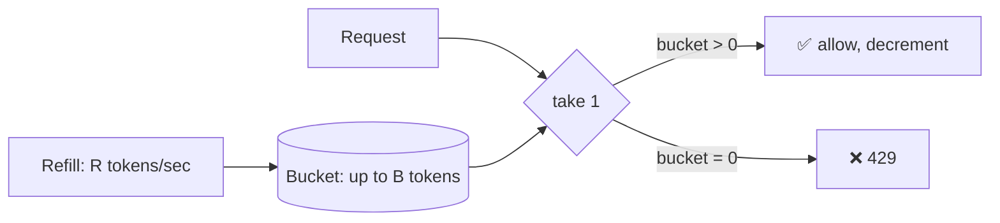
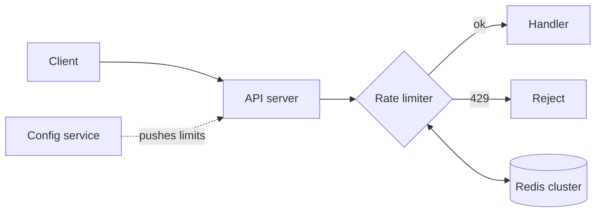

---
tags:
  - scenarios
  - system-design
  - rate-limiting
  - distributed-systems
difficulty: medium
status: written
---

# Design a Rate Limiter

> **"Design a rate limiter"** is a near-universal system-design interview question. It looks trivial ("just count requests") but unpacks quickly — algorithms, distributed state, fairness, and graceful failure all matter.

## 📝 Situation

Design a service that decides, for every incoming API request, whether to allow it or reject it with `429 Too Many Requests` based on pre-configured limits.

- Per-user limit (e.g., 1000 req/hour for authenticated users)
- Per-IP limit (e.g., 100 req/min for anonymous)
- Per-endpoint overrides (e.g., `POST /auth/login` → 5 req/min per IP)
- Tenant-level limits for multi-tenant APIs

## 🎯 Constraints (clarify in interview)

| Question | Assumption |
|---|---|
| Scale | 100k QPS peak, 20k RPS sustained |
| Latency budget | Limiter adds < 5ms to p99 |
| Accuracy | Exact counting per bucket preferred; slight over-serving on burst is acceptable |
| Deployment | Deployed as a library (sidecar) in every service, or centralized? |
| Failure mode | If the limiter itself is down, fail open or closed? |
| Limits update frequency | Dynamic per-tenant; must pick up config changes within ~1min |
| Key design | Identity source of truth — JWT subject, API key, IP, or composite? |

**Key calls to make:**
- **Fail-open vs fail-closed on limiter outage** — most APIs fail open (don't break the whole site because the limiter died).
- **Centralized (one limiter service) vs distributed (each app calls Redis)** — I'd pick distributed with Redis for the hot path.

## 🧠 Approach

The core decision is the **algorithm**. Three main choices:

### 1. Fixed Window

Count requests per wall-clock window. At 2:00:00 reset to 0; reject when count > N.

```mermaid
gantt
    title Fixed window — boundary burst problem
    dateFormat X
    axisFormat %s
    section 2:00 window
    100 reqs at 1:59:59 :0, 1
    section 2:01 window
    100 reqs at 2:00:00 :1, 1
```

**Problem:** A client sending 100 reqs at 1:59:59 and another 100 at 2:00:00 sends 200 reqs in 1 second — twice the intended limit. Bursty.

### 2. Sliding Window

Smoother: calculate a "window that slides" rather than snapping to the clock. Track a weighted blend of current and previous window.

```
allowed(now) = prev_count × (1 - elapsed_in_current/window) + current_count < LIMIT
```

Less memory than logging every request; no boundary burst. **My default choice.**

### 3. Token Bucket

Each identity has a bucket that fills at rate R tokens/sec up to capacity B. Each request consumes a token. Empty bucket → reject.



**Great when bursts are acceptable up to B** (e.g., a burst of 20 then steady 5/sec).

### 4. Leaky Bucket

Variant of token bucket — requests enter a queue that drains at fixed rate. Excess overflows. More useful for smoothing downstream load than for pure limiting.

### Which to pick?

| Need | Pick |
|---|---|
| Simple, approximate, tiny memory | Fixed window |
| Fair, smooth, precise | **Sliding window** (default for most APIs) |
| Allow bursts up to a ceiling | Token bucket |
| Smooth downstream spikes | Leaky bucket |

## 🏗️ Solution

### Architecture



- Limiter is **in-process** in every API server — a library / middleware, not a separate service on the request path.
- State lives in **Redis cluster** (sharded by identity key).
- **Config** is pushed to API servers from a central store; each server caches for ~1min.

### Sliding-window Redis implementation

Lua script is atomic — the whole check-and-increment happens on the Redis node, no race.

```python
# sliding_window.lua
LUA = """
local key = KEYS[1]
local now = tonumber(ARGV[1])
local window_ms = tonumber(ARGV[2])
local limit = tonumber(ARGV[3])

-- Drop entries outside the window
redis.call('ZREMRANGEBYSCORE', key, 0, now - window_ms)

local count = redis.call('ZCARD', key)
if count < limit then
    redis.call('ZADD', key, now, now)
    redis.call('PEXPIRE', key, window_ms)
    return {1, limit - count - 1}  -- allowed, remaining
else
    return {0, 0}  -- rejected
end
"""

class SlidingWindowLimiter:
    def __init__(self, redis, limit: int, window_ms: int):
        self.redis = redis
        self.limit = limit
        self.window_ms = window_ms
        self.script = redis.register_script(LUA)

    def allow(self, identity: str) -> tuple[bool, int]:
        now_ms = int(time.time() * 1000)
        key = f"rl:{identity}"
        allowed, remaining = self.script(keys=[key], args=[now_ms, self.window_ms, self.limit])
        return bool(allowed), remaining

# usage in middleware
async def rate_limit_middleware(request, call_next):
    identity = extract_identity(request)  # user_id / ip / composite
    allowed, remaining = limiter.allow(identity)
    if not allowed:
        return Response(
            status_code=429,
            headers={"Retry-After": "60", "X-RateLimit-Remaining": "0"},
        )
    response = await call_next(request)
    response.headers["X-RateLimit-Remaining"] = str(remaining)
    return response
```

The ZSET stores one entry per request within the window. At 1000 req/hour per user, you carry ≤1000 entries per key — bounded. TTL cleanup handles idle users.

### Token-bucket variant (even cheaper)

For simpler use cases, track just two values per identity:

```python
# token_bucket.lua
LUA = """
local key = KEYS[1]
local now = tonumber(ARGV[1])
local rate = tonumber(ARGV[2])       -- tokens per ms
local capacity = tonumber(ARGV[3])

local state = redis.call('HMGET', key, 'tokens', 'ts')
local tokens = tonumber(state[1]) or capacity
local last_ts = tonumber(state[2]) or now

-- Refill based on elapsed time
tokens = math.min(capacity, tokens + (now - last_ts) * rate)

if tokens >= 1 then
    tokens = tokens - 1
    redis.call('HMSET', key, 'tokens', tokens, 'ts', now)
    redis.call('PEXPIRE', key, capacity / rate * 2)
    return 1
else
    redis.call('HMSET', key, 'tokens', tokens, 'ts', now)
    return 0
end
"""
```

Two numbers per key — ultra-compact.

### Identity key strategy

```python
def extract_identity(request) -> str:
    # Precedence: authenticated user > API key > IP
    if user_id := request.jwt_claims.get("sub"):
        return f"user:{user_id}"
    if api_key := request.headers.get("x-api-key"):
        return f"key:{api_key}"
    return f"ip:{client_ip(request)}"
```

Composite keys for per-endpoint limits:

```python
key = f"user:{user_id}:endpoint:POST_/auth/login"
```

### Response headers (API contract)

Always return rate-limit headers on every response — clients can self-regulate:

```
X-RateLimit-Limit: 1000
X-RateLimit-Remaining: 847
X-RateLimit-Reset: 1713876000
Retry-After: 42   # only on 429
```

### Fail-open on limiter outage

```python
def allow(identity):
    try:
        return self._allow_via_redis(identity)
    except RedisError:
        metrics.inc("rate_limit.fail_open")
        return True, -1   # let request through — better than whole-site outage
```

Log and alert when fail-opens spike — that's a sign Redis is down, and without the limiter you're exposed.

## ⚖️ Trade-offs

| Decision | Win | Cost |
|---|---|---|
| Sliding window (ZSET) | Smooth, precise | Memory = one entry per request-in-window |
| In-process limiter + Redis | No extra network hop; horizontal scale | Must handle Redis failure gracefully |
| Fail open | Availability > strictness | Bad actors briefly unthrottled during outage |
| Lua script for atomicity | No race conditions | Logic lives in Redis scripts (harder to test) |
| Per-process cached config | Low hot-path cost | ~1min staleness on limit changes |

## 🔄 What changes at 10x scale?

- **Shard Redis by identity hash.** Consistent hashing — add nodes without remapping everything.
- **Two-tier:** local in-memory approximate counter that flushes to Redis every N ms. Accepts a bit of over-serving for massive QPS.
- **Edge limiting at CDN:** Cloudflare/Fastly for coarse IP-based limits; Redis-based limiter handles authenticated tiers.

## 🔄 What changes at 1/100 scale?

- Skip Redis. In-process dict + lock is fine at 100 QPS on one box.
- `cachetools.TTLCache` or a plain `dict` with periodic cleanup.

## 🔗 Concepts touched

- **[Networking & Communication](../05-networking-communication/index.md)** — API gateway / edge
- **[Caching & Optimization](../17-caching-optimization/index.md)** — Redis data structures
- **[Resilience & Fault Tolerance](../14-resilience-fault-tolerance/index.md)** — fail-open behavior, graceful degradation
- **[Distributed Systems](../15-distributed-systems/index.md)** — shared state, consistency under partitions
- **[Security](../08-security/index.md)** — abuse prevention, login brute-force

## 🎯 Common follow-ups

- **"How do you handle burst traffic legitimately?"** Token bucket with generous burst capacity (B = 2× steady rate). Or a second tier that absorbs bursts into a queue with shed load policy.
- **"What if the rate limiter itself becomes a bottleneck?"** Add local caching: probabilistically allow without hitting Redis when your local counter is well under the limit. Check Redis only when close to the ceiling.
- **"How do you prevent the thundering herd at window boundary?"** Sliding window already solves fixed-window's boundary burst. Additionally, stagger clients by jittering retry delays on `Retry-After`.
- **"Multi-region — each region's Redis has its own state. Is that OK?"** For most APIs: yes, per-region limits are fine. For strict global limits, you'd need a global Redis or eventually-consistent counter (CRDT) with some over-serving tolerance.
- **"Distinguish abuse from legit traffic?"** Limiter is one layer; also need behavioral analysis (request patterns), CAPTCHA for borderline cases, and WAF for known-bad IPs.
- **"Which status code for soft vs hard limit?"** 429 for "try again later" (soft). 403 for permanent ban. Always include `Retry-After` on 429 — accurate seconds, not round numbers.
