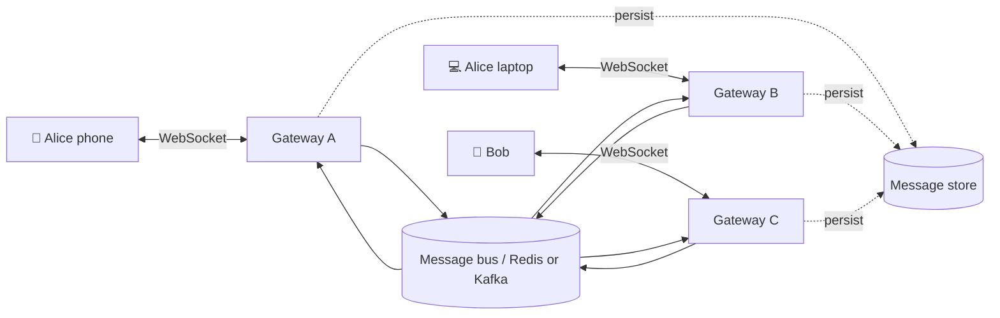
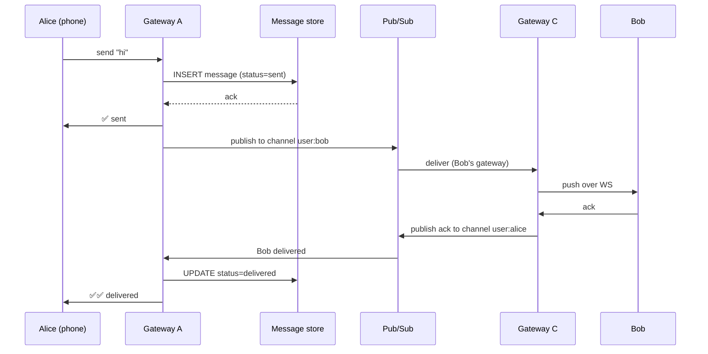

---
tags:
  - scenarios
  - system-design
  - websockets
  - pub-sub
  - distributed-systems
difficulty: hard
status: written
---

# Design a Real-Time Chat System

> **"Design WhatsApp/Slack/Discord"** — one of the most information-dense system-design questions. WebSockets vs long-polling, connection-level fan-out, message persistence, presence, read receipts, and horizontal scaling all collide. Strong answers decouple connection-handling from message-handling from storage.

## 📝 Situation

Design a messaging system that supports:

- **1:1 chat** and **group chat** (up to 500 members/group)
- **Real-time delivery** — messages appear within 1 second
- **Delivery guarantees** — at-least-once; sender sees "sent → delivered → read"
- **Offline support** — messages arrive when the recipient reconnects
- **History** — full message history, searchable
- **Presence** — online / away / offline indicators
- **Typing indicators** (nice-to-have)

## 🎯 Constraints (clarify in interview)

| Question | Assumption |
|---|---|
| Users | 50M registered, 10M DAU, 2M concurrent WebSocket connections at peak |
| Messages | 1B/day, 12k/sec avg, 100k/sec peaks |
| Max message size | 8 KB (text); attachments go through a separate upload → link flow |
| Multi-device | Yes — user logged in on phone + laptop; both get every message |
| Media | Images/files via signed URLs; out of scope here beyond references |
| E2E encryption | Out of scope for this walkthrough (Signal protocol is a book on its own) |
| Retention | Unlimited history for users; free tier maybe 6-month window |
| Multi-region | Yes — users worldwide, < 500ms p99 for cross-region chats |

## 🧠 Approach

Three distinct sub-systems. Trying to unify them at the interview level is the #1 mistake.

### 1. Connection layer (stateful, sticky)
- Users hold **long-lived WebSocket** connections to *gateway* servers.
- Gateway is **stateful** — it knows which users it holds connections for.
- Pinned by load balancer via user_id consistent hash.

### 2. Messaging layer (stateless, fan-out)
- When a message arrives, find all recipients' gateway servers → forward.
- This is a **pub/sub problem**: each user subscribes to their own "inbox" channel. Senders publish to recipient channels.

### 3. Persistence layer
- Every message written durably to a database *before* "delivered" ack.
- History queries go directly to the DB (cache hot threads).



## 🏗️ Solution

### WebSocket gateway

Each gateway server accepts WebSocket connections and maintains an in-memory map:

```python
# Gateway server state
connections: dict[tuple[str, str], WebSocket] = {}  # (user_id, device_id) -> ws
```

On connect: register the (user, device) pair. On disconnect: remove. Use heartbeat (ping every 20s) to detect dead clients.

**Sticky routing:** a load balancer consistent-hashes by user_id so the same user usually hits the same gateway. But don't *rely* on stickiness — the pub/sub layer handles the case where a user's devices are on different gateways.

### Message flow (Alice → Bob, both online)



### Message persistence

Message schema (single table, partitioned by conversation_id):

```sql
CREATE TABLE messages (
    id              UUID PRIMARY KEY,
    conversation_id UUID NOT NULL,
    sender_id       TEXT NOT NULL,
    body            TEXT NOT NULL,         -- 8KB soft limit
    created_at      TIMESTAMPTZ NOT NULL DEFAULT NOW(),
    status          TEXT NOT NULL          -- sent | delivered | read
) PARTITION BY HASH (conversation_id);

CREATE INDEX ON messages (conversation_id, created_at DESC);
```

For scale, use a write-optimized store:
- **Cassandra / Scylla** — excellent for time-series writes, easy sharding by conversation_id.
- **DynamoDB** — partition key = conversation_id, sort key = created_at.
- **Postgres with Citus** — works up to ~100TB with careful schema.

Hot threads cache in Redis (last 50 messages per conversation — most reads are recent).

### Pub/sub layer

Two options:

| | Redis Pub/Sub | Kafka |
|---|---|---|
| Latency | ~ms | ~ms (similar with tuning) |
| Persistence | None — at-most-once (missed while offline = lost) | Durable — replay on reconnect |
| Use case | Real-time fan-out only (DB is source of truth) | Also acts as the message log |

**Choice:** Redis for live fan-out, DB for durability. On reconnect, client sends `since=<last_seq>`; gateway queries DB for missed messages.

Channel model: `user:<user_id>` per user. Each gateway subscribes to `user:<U>` for every user U it has a connection for. A message to user U publishes to `user:U`; every gateway holding a connection for U receives it.

Presence: separate channel `presence:<user_id>`; clients subscribe to see friends' status.

### Offline delivery

```
1. Bob disconnects.
2. Messages arrive → persisted → pub/sub emits → no gateway holds Bob → dropped from bus.
   (But DB has them, with status=sent, not delivered.)
3. Bob reconnects.
4. Client sends {"after": last_seen_message_id}.
5. Gateway queries DB for conversations where Bob has messages after that ID.
6. Gateway pushes them, updates status=delivered.
```

**Critical detail:** client tracks `last_seen_message_id` per conversation. On reconnect, server knows what's missing; no duplicate delivery, no message loss.

### Group chats

Group membership lives in a separate table:

```sql
CREATE TABLE group_members (
    group_id UUID,
    user_id  TEXT,
    joined_at TIMESTAMPTZ,
    PRIMARY KEY (group_id, user_id)
);
```

On send to group G: look up members, fan out to each member's `user:M` channel. For large groups (500 members), fan-out is 500 pub/sub publishes — fine at pub/sub's scale.

### Multi-device

Each device registers a separate (user_id, device_id) in the connections map. The pub/sub channel is `user:<user_id>` — all devices receive. No special handling needed; the "my own message should appear on my other devices" problem falls out naturally.

### Read receipts

Client emits "read" event when user views a message:

```json
{"type": "read", "conversation_id": "c_1", "up_to_message_id": "m_100"}
```

Server updates `status=read` for all messages up to that ID, publishes to sender's channel → sender UI updates ✓✓ → ✓✓ (blue).

### Typing indicators

Ephemeral, lower-stakes. Client emits `typing` events (debounced ~500ms). Gateway forwards via pub/sub to the conversation's other members. **Never persisted** — typing events flood the system otherwise.

## ⚖️ Trade-offs

| Decision | Win | Cost |
|---|---|---|
| WebSockets (vs long-poll) | True push, low latency | Stateful gateways; complex reconnection logic |
| Redis pub/sub + DB persistence | Fast fan-out + durable history | Two systems to operate |
| Partition by conversation_id | Hot conversations stay on one shard | Cross-shard queries for user's inbox list |
| Sticky load balancing | Better cache locality | Gateway failure = mass reconnect |
| Consistent-hash routing | Graceful node addition | Some session migration on resize |
| Separate typing channel (ephemeral) | Doesn't bloat DB | Lost if recipient just came online |

## 🔄 Failure modes

### Gateway dies
- All WebSockets on it drop.
- Clients reconnect (LB routes to another gateway within seconds).
- On reconnect, client sends `since=<last_id>` → missed messages replayed from DB.
- **No data loss** because persistence happened before ack.

### Pub/sub is down
- Messages still persist to DB.
- Gateways can't fan out in real time → recipients see the message on their next app action (connection re-establishes, poll for updates).
- Degraded but not broken.

### Database write slow
- Gateway queues writes with short bounded queue.
- If queue full, 503 to client → retry with backoff.
- Avoid dropping messages; prefer user-visible "couldn't send, tap to retry".

## 🔄 What changes at 10x scale?

- Message store shards on conversation_id hash; add shards as needed.
- Pub/sub moves to Kafka with topic-per-region; cross-region traffic is more expensive.
- Gateways regionalized; user's "home region" is determined at login. Cross-region messaging hops through two regional buses.
- Read replicas for history queries (most reads are old threads — can be eventually consistent).
- CDN for attachment delivery (not in scope for message path, but relevant).

## 🔄 What changes at 1/100 scale?

- Skip pub/sub. One gateway process (say, a single Python server) holds all connections; in-process dict for routing.
- SQLite or single Postgres for persistence.
- No Redis. No horizontal scale. Works up to maybe 5-10k concurrent connections on one box.

## 🔗 Concepts touched

- **[Networking & Communication](../05-networking-communication/index.md)** — WebSockets, long-polling, load balancing
- **[Concurrency & Async Systems](../06-concurrency-async/index.md)** — gateway handles thousands of concurrent connections (asyncio-shaped problem)
- **[Database & Storage](../03-database-storage/index.md)** — schema partitioning, time-series writes
- **[Data Pipelines & Messaging](../12-data-pipelines-messaging/index.md)** — pub/sub patterns
- **[Distributed Systems](../15-distributed-systems/index.md)** — sticky sessions vs stateless, delivery guarantees
- **[Caching & Optimization](../17-caching-optimization/index.md)** — hot-thread cache
- **[Resilience & Fault Tolerance](../14-resilience-fault-tolerance/index.md)** — graceful reconnect, offline message replay

## 🎯 Common follow-ups

- **"Why WebSockets over Server-Sent Events or long polling?"** WebSockets are bidirectional (client sends messages AND receives) over a single connection. SSE is server→client only. Long polling is bidirectional but creates N connections/sec of overhead. WebSocket is the right fit once the feature is truly interactive.

- **"How do you handle a user with spotty mobile connectivity?"** Client library hides reconnect logic with exponential backoff. On every reconnect, send `since=<last_id>`. Outgoing messages queued locally and retried after reconnect. UI shows "sending…" until acked.

- **"How do you prevent abuse — spam / flooding a group?"** Per-user, per-conversation rate limit at the gateway (see [Rate Limiter scenario](design-rate-limiter.md)). Token bucket: 30 msgs/min per user. Large-group broadcasts throttled separately.

- **"Messages arrive out of order — what do you do?"** Client renders by `created_at`, but networks reorder. Use server-assigned monotonic IDs per conversation (Snowflake-style: timestamp + sequence). Client sorts by ID before display.

- **"E2E encryption — rough sketch?"** Signal Protocol / Double Ratchet: each pair has a shared ratchet state; each message is encrypted with a new key derived from the ratchet. Server stores only ciphertext, has no message-reading capability. Group chats: each member encrypts for every other member (expensive — why WhatsApp groups have 256-member limits).

- **"How do you search history?"** Separate Elasticsearch index, populated via the message outbox. Queries hit ES for full-text; message body itself stays in the durable store. Per-user permissions filter: you only search your own conversations.

- **"Presence — how do you know when someone is truly offline vs flaky network?"** TCP doesn't tell you. Heartbeat (client pings every 20s). No ping in 45s → mark "away". No reconnect in 5min → mark "offline". Don't tell friends "offline" instantly — false negatives during brief disconnects annoy users.

- **"What if the message bus drops a message during fan-out?"** DB is the source of truth — if Bob's gateway missed the pub/sub event but reconnects, the "since" query will replay. Pub/sub only needs to be best-effort live delivery; correctness doesn't depend on it.
