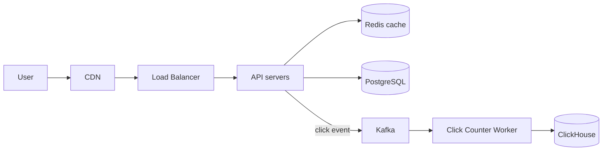
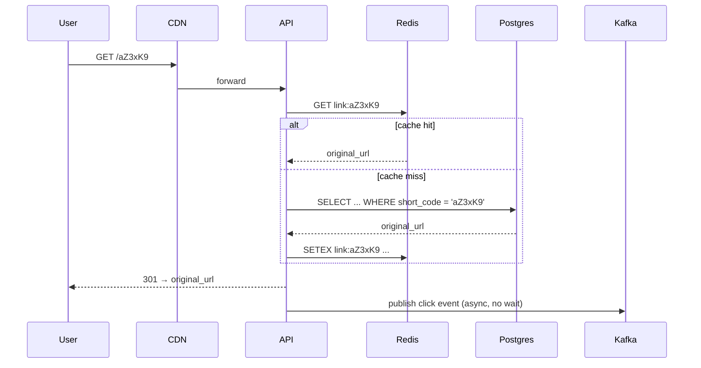

---
tags:
  - scenarios
  - system-design
  - caching
  - sharding
difficulty: medium
status: written
---

# Design a URL Shortener

> **Classic "design X" interview question.** Touches storage modeling, ID generation, caching, rate limiting, and analytics. Answers separate juniors from seniors by *what they ask before designing*.

## 📝 Situation

Build a service like bit.ly:

- `POST /shorten { url }` → `{ short_url: "https://sho.rt/aZ3xK9" }`
- `GET /aZ3xK9` → `301 Location: https://original.example.com/very/long/path?...`
- Optional analytics: per-link click counts.

## 🎯 Constraints (clarify in interview)

| Question | Assumption |
|---|---|
| Scale | 100M new links / month, 10B redirects / month (≈4k QPS, peaks 40k) |
| Read/write ratio | ~100:1 (redirects vastly outnumber creations) |
| Latency target | p99 redirect < 50ms |
| Custom aliases? | Yes (premium feature) |
| Link expiry? | Optional per-link |
| Analytics? | Aggregate counts, not per-user click trails (separate scope) |
| Multi-region? | Eventually; v1 = single region |

These constraints decide the architecture. Don't skip clarifying.

## 🧠 Approach

The system is essentially a **read-heavy KV store** with two write paths (create + click counting). Reads dominate → cache aggressively. ID generation is the only "interesting" algorithm.

Key design decisions:

1. **ID scheme** — hash vs counter vs random.
2. **Storage** — relational vs KV.
3. **Cache** — in-process vs distributed.
4. **Click counting** — synchronous vs async.
5. **Rate limiting** — protect creation endpoint.

## 🏗️ Solution

### High-level architecture



### ID generation

Three options, ranked:

1. **Base62-encoded counter** — `1, 2, 3 → 1, 2, 3` then `→ aZ3xK9`. Sequential, but predictable (enumeration risk).
2. **Random base62 (8 chars)** — 62⁸ ≈ 2×10¹⁴ slots. Collision check on insert.
3. **Hash of URL (truncated)** — same URL → same short. Sometimes desired (dedupe), sometimes not (analytics per-link broken).

**Pick:** random 7-char base62 (62⁷ ≈ 3.5 × 10¹², plenty for years). On collision (rare), retry. Use a `UNIQUE` constraint on the `short_code` column — collision = transaction failure → retry.

For high write volume, pre-allocate IDs: a coordinator hands batches of 10k IDs to API workers. Each worker picks from its batch without DB roundtrip.

### Storage schema

```sql
CREATE TABLE links (
    short_code  CHAR(7) PRIMARY KEY,
    original_url TEXT NOT NULL,
    created_at  TIMESTAMPTZ NOT NULL DEFAULT NOW(),
    expires_at  TIMESTAMPTZ NULL,
    user_id     UUID NULL  -- nullable for anon
);
CREATE INDEX idx_user_created ON links (user_id, created_at DESC);
```

For 100M links/month → 1.2B/year. Single Postgres can handle this for a few years. Beyond that: **shard by `short_code`** (consistent hashing on the code prefix).

### Cache strategy

Cache pattern: **read-through with TTL**.

```python
def get_url(code):
    cached = redis.get(f"link:{code}")
    if cached: return cached
    url = db.fetch_url(code)
    if url:
        redis.setex(f"link:{code}", ttl=86400, value=url)
    return url
```

Cache hit ratio target: 95%+ (Pareto: 5% of links get 95% of clicks). 4k QPS × 5% miss = 200 QPS to DB — well under what one Postgres can do.

Cache eviction: LRU. Hot links stay; cold links re-fetch on demand.

### Click counting

**Don't increment a DB counter on every redirect** — turns reads into writes, kills throughput.

Instead: API server emits a click event to Kafka per redirect (fire-and-forget), worker consumer aggregates per-minute counts and writes to ClickHouse:

```python
# API server (hot path)
def redirect(code):
    url = get_url(code)
    if url:
        kafka_producer.send("clicks", {"code": code, "ts": now(), ...})
        return Response(301, location=url)
    return 404
```

Worker batches inserts: 1 row per (code, minute) instead of 1 per click. Analytics queries aggregate from there.

### Rate limiting

`POST /shorten` is the abuse vector — spammers, bots. Apply per-IP and per-API-key limits at the gateway:

- Anonymous: 10 / hour / IP.
- Authenticated: 1000 / hour / API key.

Implementation: Redis sliding window (`INCR` + `EXPIRE`).

`GET /<code>` doesn't need user-level limits but does need DDoS protection — handled at CDN/WAF layer.

### Putting it all together



## ⚖️ Trade-offs

| Decision | Win | Cost |
|---|---|---|
| Random codes vs sequential | Unguessable; no enumeration | Tiny chance of collision, retry on insert |
| Cache with TTL (vs cache-aside event-invalidation) | Simple; near-zero invalidation logic | Stale on URL update for ≤TTL |
| Async click counting | Hot path stays fast | Counts lag by ~1min, Kafka overhead |
| Single Postgres v1 | Operational simplicity | Re-architect at ~5B rows |
| Rate limit at gateway | Centralized policy | Edge needs Redis access |

## 🔄 What changes at 10x scale?

- Postgres → **shard by short_code prefix** (or move to a KV store like ScyllaDB).
- Redis → cluster with consistent hashing.
- Multi-region: replicate Postgres async, edge caches stay regional. Click events written to regional Kafka, aggregated centrally.
- Click events at 400k QPS → batch at the producer (10ms windows).

## 🔄 What changes at 1/100 scale?

- Drop Kafka — synchronous DB increment is fine at 40 QPS.
- Drop Redis — Postgres handles 40 QPS easily.
- One server. SQLite even. Most of the scale-out machinery is wasted at small scale.

## 🔗 Concepts touched

- **[Caching strategies](../17-caching-optimization/index.md)** — read-through with TTL
- **[Database & Storage](../03-database-storage/index.md)** — schema, indexes, sharding
- **[Resilience](../14-resilience-fault-tolerance/index.md)** — Kafka decouples hot path
- **[Scalability & Performance](../09-scalability-performance/index.md)** — read/write ratio drives architecture
- **[Networking](../05-networking-communication/index.md)** — CDN at edge

## 🎯 Common follow-ups

- **"How would you handle custom aliases?"** Same `links` table; UNIQUE on `short_code`. User picks; collision = re-prompt.
- **"How do you prevent malicious URLs?"** URL screening at create time (Google Safe Browsing API). Periodic re-scan.
- **"What if a customer wants a vanity domain?"** Multi-tenant: `domain` column on `links`; CNAME their domain to your edge; route by Host header.
- **"How do you delete expired links?"** Background job, batch DELETE WHERE expires_at < NOW(). Or partition by month and DROP PARTITION (much faster).
